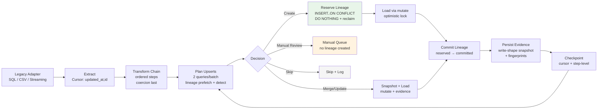
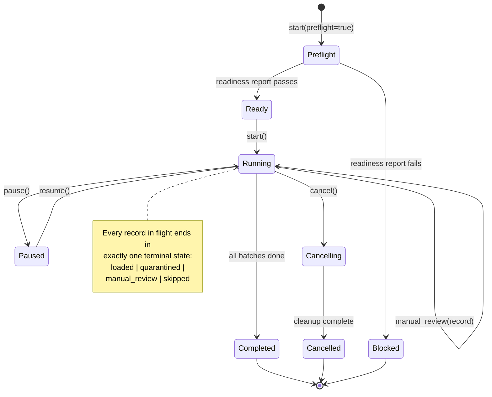

# Afena Migration Engine — 9 → 10/10 Upgrade Path

> **Current: 9/10** — Engine-correct on concurrency, audit, rollback, and determinism.
> **Target: 10/10** — Engine-correct AND engine-operable at scale.

The engine is already "correct." The remaining 10% is about making it **survivable, observable, measurable, and operator-friendly** in production.

---

## What's missing for 10/10 (the last 5 gaps)

| Gap                                        | Category    | Why it matters                                    |
| ------------------------------------------ | ----------- | ------------------------------------------------- |
| **Per-record survivability** (OPS-01)      | Operational | One bad row must never poison a batch             |
| **Resume precision** (OPS-02)              | Operational | Cursor-only resume is too blunt for large batches |
| **Performance guarantees** (GOV-01)        | Governance  | Need measurable SLOs, not estimates               |
| **Explainability + traceability** (ACC-05) | Accuracy    | The "why" behind every merge must be queryable    |
| **Operator control plane** (OPS-04)        | Operational | Pause/resume/replay without DB spelunking         |

---

## 1. Current Implementation Status

### What is built and verified (44/44 CI tests pass)

| Component               | Status       | Key Design                                                                                                                |
| ----------------------- | ------------ | ------------------------------------------------------------------------------------------------------------------------- |
| Lineage state machine   | Sealed       | `reserved` → `committed`, atomic reclaim (D0.1), delete-by-id only (D0.2)                                                 |
| Bulk planUpserts        | Sealed       | 2 queries per batch (lineage prefetch + conflict detection), no N+1                                                       |
| Reservation concurrency | Sealed       | INSERT ON CONFLICT DO NOTHING + stale reclaim + state CHECKs at DB level                                                  |
| Cursor correctness      | Sealed       | Discriminated union (offset/id/composite/token), dialect-specific builders                                                |
| Snapshot round-tripping | Sealed       | Write-shape only (core/custom split), `beforeVersion` captured, `customData` camelCase fallback                           |
| Conflict detection      | Wired        | `DetectorQueryFn` injection, bulk scoring (contacts: email+40/phone+20, invoices: invNum+50/vendor+40, products: SKU=100) |
| CrudBridge              | Wired        | Loose coupling to `afena-crud` via injected `mutate` + `readRawRow`                                                       |
| RollbackEngine          | Wired        | Uses CrudBridge, reads current version for optimistic lock before delete                                                  |
| Signed reports          | Wired        | All 5 fingerprints + evidence queries + persisted to `migration_reports`                                                  |
| Legacy adapters         | Complete     | SQL (pluggable pool factory) + CSV (streaming-ready)                                                                      |
| Transform chain         | Complete     | Ordered steps, coercion always last (DET-05), 5 built-in steps                                                            |
| Rate limiter            | Complete     | Token bucket with configurable burst                                                                                      |
| CI seal stamps          | 8 test files | RES-01, SQL-02, DET-03, SNAP-04, DET-05, AUD-06, csv-adapter, rate-limiter                                                |

### Safety guards

- `deleteReservation` guarded by `state = 'reserved'` (prevents accidental committed row deletion)
- Manual review actions do NOT create lineage (invariant preserved)
- Report persistence is non-fatal (try/catch, never blocks job completion)
- All query builders quote column names: Postgres `"col"`, MySQL `` `col` ``

---

## 2. Canonical Execution Diagram



### Terminal state invariant

Every record processed by the engine MUST end in exactly one of these terminal states:

| Terminal State  | Meaning                                       | Lineage Created  | In Report                                             |
| --------------- | --------------------------------------------- | ---------------- | ----------------------------------------------------- |
| `loaded`        | Successfully created, updated, or merged      | Yes              | `recordsCreated` / `recordsUpdated` / `recordsMerged` |
| `quarantined`   | Failed after max retries, awaiting resolution | No               | `recordsFailed` → quarantine table                    |
| `manual_review` | Conflict requires human decision              | No               | `recordsManualReview` → conflicts table               |
| `skipped`       | Already migrated or policy skip               | Existing or none | `recordsSkipped`                                      |

**The signed report MUST prove the distribution:** `processed = loaded + quarantined + manual_review + skipped`. No record may be silently lost.

---

## 3. Competitive Position

| Competitor Class                              | Their Score | Our Score | Our Edge                                                                 | Their Edge                       |
| --------------------------------------------- | ----------- | --------- | ------------------------------------------------------------------------ | -------------------------------- |
| Custom scripts (Python/Node)                  | 3–5         | 9         | State machines, canonical hashing, sealed invariants, idempotency leases | Faster to build                  |
| ELT pipelines (Fivetran/Airbyte)              | 8–9         | 8–9       | Kernel governance, conflict resolution, rollback safety                  | Connector ecosystem, managed ops |
| Enterprise iPaaS (Boomi/MuleSoft/Informatica) | 8–10        | 9         | Determinism, write-shape truth, audit-grade evidence                     | Breadth, UI tooling, connectors  |

### Our 5 structural advantages

1. **Concurrency correctness** — Atomic reservation + reclaim + commit state machine. Survives 10 workers in prod.
2. **SQL drift control** — Schema introspection required before queries. Unknown fields rejected at build time.
3. **Rollback that works** — Write-shape snapshots (not DTOs). Canonized writable fields prevent illegal writes.
4. **Court-grade audit** — Signed reports with 5 fingerprints, job-scoped evidence pointers, canonical JSON hashing.
5. **CI governance** — 8 invariant test files (44 assertions) enforce correctness as a non-negotiable contract.

---

## 4. Accuracy & Speed Analysis

### System-level correctness (deterministic)

| Metric                             | Expected | Mechanism                                                |
| ---------------------------------- | -------- | -------------------------------------------------------- |
| Duplicate creates from concurrency | ~0%      | Reservation + atomic reclaim + commit state machine      |
| Missed/duplicated extraction rows  | ~0%      | Composite cursor `(updated_at, id)` with stable ordering |
| Rollback correctness               | ~100%    | Write-shape snapshots + canonized writable fields        |

### Match accuracy (varies by entity)

| Key Strength        | Entity Examples                    | Precision | Recall                       |
| ------------------- | ---------------------------------- | --------- | ---------------------------- |
| Strong natural keys | invoiceNumber, SKU, registrationNo | 99–100%   | 99–100%                      |
| Medium keys         | email, phone                       | 95–99%    | Depends on data completeness |
| Weak keys           | name only                          | 70–90%    | Requires additional features |

### Current scoring model

| Detector | Match Fields            | Scoring                             |
| -------- | ----------------------- | ----------------------------------- |
| Contacts | email, phone            | email: +40, phone: +20, both: +60   |
| Invoices | invoiceNumber, vendorId | invNum: +50, vendor: +40, both: +90 |
| Products | SKU                     | exact: 100                          |

### Expected throughput

| Scenario                      | Rows/min/worker | Bottleneck                        |
| ----------------------------- | --------------- | --------------------------------- |
| Low conflict (mostly creates) | 1,000–10,000    | `mutate()` write speed            |
| Medium conflict (some merges) | 500–3,000       | Conflict detection + updates      |
| High conflict (many matches)  | 100–1,000       | Match scoring + update contention |

### KPIs to track (accuracy + speed)

**Accuracy:**

- **duplicates_prevented** — reservation losers count
- **cursor_replays_detected** — same legacyId appearing in new batch
- **manual_review_rate** — manual / processed
- **auto_merge_rate** — merged / conflicts
- **merge_revert_rate** — % of auto-merges reversed after human review (gold metric)

**Speed:**

- **records_per_second** — overall throughput
- **extract_batch_p95_ms** — legacy source latency
- **detect_conflicts_p95_ms** — candidate query performance
- **mutate_p95_ms** — kernel write latency (often the bottleneck)
- **candidate_query_rows_returned** — if huge, detector is too broad

---

## 5. Phase A — Accuracy Quick Wins (1–2 days)

Lock in match correctness before optimizing speed.

### ACC-01: E.164 Phone Normalization

**Problem:** `+60123456789` and `0123456789` don't match as the same number.

**Solution:** Replace basic phone normalization with `libphonenumber-js`.

```bash
pnpm --filter afena-migration add libphonenumber-js
```

**Design rules:**

- Normalization must be **deterministic** — use explicit default region (e.g. `MY`) from pipeline config, never from runtime locale
- Store both `phone_raw` (audit trail) and `phone_e164` (matching)
- Invalid numbers normalize to `null` (never throw)

**Invariant test:** `ACC-01-phone-normalization.test.ts`

- `012-3456789` with region `MY` → `+60123456789`
- `+60123456789` → `+60123456789` (idempotent)
- `not-a-phone` → `null` (never throws)

**Where:** Enhance `PhoneNormalizeStep` in `src/transforms/transform-chain.ts`.

### ACC-02: Smart Email Normalization

**Problem:** Gmail dots and `+` aliases cause false negatives.

- `john.doe@gmail.com` ≠ `johndoe@gmail.com` (should match)
- `john+tag@gmail.com` ≠ `john@gmail.com` (should match)

**Design rule:** Only apply dot/`+` stripping for **known domains** (gmail.com, googlemail.com) to avoid false merges on corporate domains.

**Invariant test:** `ACC-02-email-normalization.test.ts`

- Gmail: dots and plus stripped
- Non-Gmail: unchanged
- Case: always lowercased

**Where:** Enhance `EmailNormalizeStep` in `src/transforms/transform-chain.ts`. No new dependency.

### SPD-03: Match Key Indexes

**Problem:** Conflict detection candidate queries can be slow without proper indexes.

**Solution:** Add partial indexes on match key columns:

```sql
CREATE INDEX CONCURRENTLY contacts_org_email_idx
  ON contacts (org_id, email) WHERE is_deleted = false AND email IS NOT NULL;

CREATE INDEX CONCURRENTLY contacts_org_phone_idx
  ON contacts (org_id, phone) WHERE is_deleted = false AND phone IS NOT NULL;

CREATE INDEX CONCURRENTLY invoices_org_invnum_idx
  ON invoices (org_id, invoice_number) WHERE is_deleted = false;

CREATE INDEX CONCURRENTLY products_org_sku_idx
  ON products (org_id, sku) WHERE is_deleted = false;
```

**Migration discipline:**

- Create indexes `CONCURRENTLY` (no table lock)
- Add "index exists" preflight check in OPS-03

**Impact:** 10–100x faster candidate lookup for large tables.

**Where:** New migration SQL file in `packages/database/drizzle/`.

---

## 6. Phase B — Speed Optimization (2–3 days)

Raise throughput without breaking determinism.

### SPD-01: Parallel Create Processing (Bounded)

**Problem:** `loadPlan` processes create actions sequentially. 500 creates = 500 serial `mutate()` calls.

**Solution:** Use bounded concurrency with `p-limit`:

```bash
pnpm --filter afena-migration add p-limit
```

```typescript
import pLimit from 'p-limit';
const limit = pLimit(10); // 10 concurrent creates

const results = await Promise.allSettled(
  createActions.map((action) => limit(() => processCreate(action))),
);
```

**Hard rules:**

- Use `Promise.allSettled` (never fail-fast — one failure must not abort others)
- Track `create_concurrency` + `create_failures` in report metrics
- Transient failures route to OPS-01 retry (don't silently settle and move on)

**Impact:** 3–5x speedup on create-heavy migrations.

**Where:** `loadPlan` create branch in `sql-migration-pipeline.ts`.

### SPD-02: Batch Lineage Reservation

**Problem:** Each create action reserves lineage individually (N inserts per batch).

**Solution:** Bulk insert all reservations in one query:

```typescript
const reservations = await db
  .insert(migrationLineage)
  .values(createActions.map((a) => ({ ...reservationValues(a) })))
  .onConflictDoNothing()
  .returning({ id: migrationLineage.id, legacyId: migrationLineage.legacyId });
```

**Acceptance test:**

- "N creates = 1 reserve query per batch"
- "reservation losers are tracked correctly" (`duplicates_prevented` stays accurate)

**Impact:** Reduces lineage reservation from N queries to 1 per batch.

**Where:** New `bulkReserveLineage` method in `DrizzlePipelineDb`.

### SPD-04: Chunked IN Lists

**Problem:** Large batches produce `IN (...)` lists with 500+ values, degrading query planner.

**Solution:** Split match values into chunks of 200, execute in parallel:

```typescript
const chunks = chunkArray(emails, 200);
const results = await Promise.all(
  chunks.map((chunk) => queryFn({ matchValues: { email: chunk } })),
);
const candidates = results.flat();
```

**Where:** Inside `DetectorQueryFn` implementation at the app layer.

### SPD-06: Streaming CSV Parsing

**Problem:** `CsvLegacyAdapter` accepts pre-parsed rows. Files >100MB exhaust memory.

**Solution:** Add streaming CSV support with `papaparse`:

```bash
pnpm --filter afena-migration add papaparse
pnpm --filter afena-migration add -D @types/papaparse
```

**Impact:** Enables processing 1M+ row CSV files without memory exhaustion.

**Where:** New `StreamingCsvAdapter` extending `CsvLegacyAdapter`.

---

## 7. Phase C — Operational Hardening (3–5 days)

This is the real 9 → 10 jump. Transforms the engine from "correct" to "unblockable."

### OPS-01: Per-Record Retry + Quarantine (Highest ROI)

**Problem:** A single transient failure (network blip, lock timeout) fails the record permanently.

**Error classification:**

| Category                               | Examples                                                                | Action                                 |
| -------------------------------------- | ----------------------------------------------------------------------- | -------------------------------------- |
| **Transient** (retry)                  | Network timeout, serialization failure, lock timeout, connection reset  | Retry with exponential backoff (max 3) |
| **Permanent** (quarantine immediately) | Schema mismatch, validation failure, non-transient constraint violation | Quarantine on first attempt            |

**Quarantine table:**

```sql
CREATE TABLE migration_quarantine (
  id               uuid PRIMARY KEY DEFAULT gen_random_uuid(),
  org_id           text NOT NULL,
  migration_job_id uuid NOT NULL REFERENCES migration_jobs(id),
  entity_type      text NOT NULL,
  legacy_id        text NOT NULL,
  legacy_system    text NOT NULL,
  record_data      jsonb NOT NULL,
  transform_version text NOT NULL,
  failure_stage    text NOT NULL,
  error_code       text NOT NULL,
  error_message    text,
  last_error_hash  text,
  retry_count      integer NOT NULL DEFAULT 0,
  status           text NOT NULL DEFAULT 'quarantined',
  created_at       timestamptz NOT NULL DEFAULT now(),
  resolved_at      timestamptz,
  CHECK (status IN ('quarantined', 'retrying', 'resolved', 'abandoned')),
  CHECK (failure_stage IN ('extract', 'transform', 'detect', 'reserve', 'load', 'snapshot'))
);
```

**Key fields beyond the basics:**

- `transform_version` — which transform chain version was used (for replay correctness)
- `failure_stage` — exactly where it failed: `extract | transform | detect | reserve | load | snapshot`
- `last_error_hash` — dedupe repeated same failure (don't spam quarantine with identical errors)

**Invariant test:** `OPS-01-quarantine.test.ts`

- Transient fails 3x then quarantines
- Permanent quarantines immediately
- Quarantined record is replayable and idempotent

**Impact:** One bad record never blocks a batch. Quarantine is resolvable and replayable.

### OPS-02: Step-Level Checkpoints

**Problem:** Cursor-only resume replays whole batches. Expensive and risky at 1M rows.

**Minimal checkpoint state:**

```typescript
interface StepCheckpoint {
  cursor: Cursor;
  batchIndex: number;
  loadedUpTo: number; // index within current batch
  transformVersion: string;
  planFingerprint?: string; // optional: hash of the plan for this batch
}
```

**Acceptance test:**

- Crash at load index 327/1000 → resume continues at 328, without re-mutating 0..327

**Impact:** Fast resume without reprocessing. Critical for batches >1000 records.

### OPS-03: Preflight Migration Readiness Report

**Problem:** Migrations fail due to schema drift, missing match keys, or high null rates — discoverable only at runtime.

**Readiness checks:**

- Schema diff vs last fingerprint
- Null-rate on match keys per entity (e.g. 40% of contacts have no email → flag)
- Sample conflict rate (run detector on 1000-row sample)
- Index readiness (match key indexes present)
- Mapping completeness score (% of legacy fields mapped)

**Output:** Persist into `migration_reports` as a `preflight` run type (reuses existing report infrastructure).

**Impact:** Catches problems before they waste hours of migration time.

### ACC-04: Configurable Confidence Thresholds

**Problem:** Current confidence is hardcoded. Different orgs need different thresholds.

**Solution:**

```typescript
interface ConflictThresholds {
  autoMerge: number; // score >= this → auto-merge (default: 60)
  manualReview: number; // score >= this → manual review (default: 30)
  createNew: number; // score < this → create new
}
```

**Design rule:** Persist thresholds used into the signed report (so audits can explain decisions later).

**Where:** Add to `SqlPipelineConfig`, pass through to conflict resolution in `planUpserts`.

---

## 8. Phase D — Advanced Features (future)

Trust, ergonomics, and governance.

### ACC-03: Fuzzy Name Matching

**Problem:** Exact match misses "John Smith" vs "Jon Smith" or "Ahmad bin Ali" vs "Ahmad Ali".

**Solution:** Add optional fuzzy scorer using `fuse.js`:

```bash
pnpm --filter afena-migration add fuse.js
```

**Where:** New `FuzzyNameScorer` class, injected into detectors via config.

### ACC-05: Explainable Scoring

**Problem:** When a conflict is flagged, there's no explanation of _why_ it matched.

**Required shape:**

```typescript
interface MatchExplanation {
  field: string; // 'email'
  matchType: string; // 'exact' | 'fuzzy' | 'normalized'
  scoreContribution: number; // +40
  legacyValue: string;
  candidateValue: string;
}
```

**Design rules:**

- Store match reasons as structured JSON in `migration_conflict_resolutions`
- Include normalized values (but consider PII redaction options)
- Add top-reasons histogram to signed report (email exact: 340, phone normalized: 120, fuzzy name: 45)

**Where:** Extend `MatchCandidate` in `src/types/upsert-plan.ts`, populate in detectors.

### OPS-04: Ops Control Plane UI

Not a "feature" — it's the usability layer for production migrations.

**Read-only first:**

- Run status: batch throughput, error rates, conflict counts
- Evidence viewer: snapshots + match explanations
- Quarantine browser

**Then controls:**

- Pause/resume/cancel
- Replay quarantined records
- Replay legacy IDs window ("replay IDs X–Y")

### OPS-05: Dedupe Key for High-Collision Entities

**Problem:** Even with lineage reservation, messy legacy keys can produce near-duplicates.

**Solution:**

```sql
ALTER TABLE contacts ADD COLUMN dedupe_key text;
CREATE UNIQUE INDEX contacts_org_dedupe_key_uniq
  ON contacts (org_id, dedupe_key)
  WHERE dedupe_key IS NOT NULL;
```

Compute: `dedupe_key = hash(normalize(email) + normalize(phone))`.

### SPD-05: Read Replica for Conflict Detection

Route `DetectorQueryFn` to a read replica, keep `CrudBridge` on primary:

```typescript
const detectorQueryFn = buildDetectorQueryFn(replicaDb); // read replica
const crudBridge = buildCrudBridge(primaryDb); // primary
```

Requires Neon read replica setup.

---

## 9. Governance Gates (new — required for 10/10)

### GOV-01: Performance Regression Gate (p95 budgets)

Add a benchmark runner in CI (or nightly) that asserts:

| Metric                    | Budget  | Dataset                                        |
| ------------------------- | ------- | ---------------------------------------------- |
| `detect_conflicts_p95_ms` | < 50ms  | 1000 synthetic contacts with 10% conflict rate |
| `plan_upserts_p95_ms`     | < 100ms | 1000 records, 500 existing lineage             |
| `transform_batch_p95_ms`  | < 20ms  | 1000 records, full transform chain             |

**Implementation:**

- Use `vitest.bench` or a dedicated benchmark file
- Track results over time (store in CI artifacts or a metrics table)
- Fail CI if p95 exceeds budget by >20%

**Invariant test:** `GOV-01-perf-budget.bench.ts`

### GOV-02: Chaos / Fault Injection Tests

Simulate failure modes and verify deterministic behavior:

| Fault                      | Injection                              | Expected Behavior                                                |
| -------------------------- | -------------------------------------- | ---------------------------------------------------------------- |
| `mutate()` timeout         | Mock throws after 500ms                | Record retried (OPS-01), then quarantined                        |
| Serialization conflict     | Mock throws `40001`                    | Retried up to 3x, then quarantined                               |
| Replica lag (SPD-05)       | Stale read returns no candidates       | Create proceeds (safe — lineage reservation prevents duplicates) |
| Report persistence failure | Mock `migration_reports` insert throws | Job still completes (non-fatal, existing behavior)               |
| Mid-batch crash            | Kill process at load index N           | Resume from step checkpoint (OPS-02)                             |

**Invariant test:** `GOV-02-chaos.test.ts`

- Retry/quarantine behaves deterministically under each fault
- Signed report still generated (or gracefully skipped)
- Terminal state invariant holds: every record is `loaded | quarantined | manual_review | skipped`

---

## 10. Sharp Edge Warning

When **parallel creates (SPD-01)** + **per-record retry (OPS-01)** are combined, it's easy to accidentally make failures "quiet."

### The invariant that must hold

```
processed = loaded + quarantined + manual_review + skipped
```

**Every record must reach exactly one terminal state.** The signed report MUST prove this distribution.

### How to enforce

1. `loadPlan` returns a `RecordOutcome[]` array — one entry per input record
2. Each outcome has `status: 'loaded' | 'quarantined' | 'manual_review' | 'skipped'`
3. The report sums outcomes and asserts `sum == input count`
4. Add CI invariant: `TERM-01-terminal-state.test.ts` — no record left in limbo

### What to watch for

- `Promise.allSettled` results with `status: 'rejected'` that aren't routed to quarantine
- Retry loops that silently swallow errors after max attempts
- Manual review records that are counted in `skipped` instead of `manual_review`

---

## 11. Dependency Summary

### Recommended additions

| Package                          | Size   | Purpose                                  | Priority | Phase      |
| -------------------------------- | ------ | ---------------------------------------- | -------- | ---------- |
| `libphonenumber-js`              | ~140KB | E.164 phone normalization                | High     | A (ACC-01) |
| `p-limit`                        | ~1KB   | Bounded concurrency for parallel creates | High     | B (SPD-01) |
| `papaparse` + `@types/papaparse` | ~15KB  | Streaming CSV parsing                    | High     | B (SPD-06) |
| `fuse.js`                        | ~7KB   | Fuzzy string matching for names          | Medium   | D (ACC-03) |

### Do NOT add

| Package         | Reason                                                                 |
| --------------- | ---------------------------------------------------------------------- |
| `lodash`        | Tree-shaking issues, use native JS                                     |
| `moment`        | Dead project, use `Date` or `Temporal`                                 |
| `pg` / `mysql2` | Already abstracted via `setLegacyPoolFactory`                          |
| `bullmq`        | Premature — use `JobExecutor` + rate limiter until >10 concurrent jobs |

---

## 12. Concrete Ticket List

### Phase A — Accuracy Quick Wins (1–2 days)

- [x] ACC-01: `libphonenumber-js` PhoneNormalizeStep + `ACC-01-phone-normalization.test.ts`
- [x] ACC-02: EmailNormalizeStep provider rules + `ACC-02-email-normalization.test.ts`
- [x] SPD-03: Partial indexes migration + preflight check hook

### Phase B — Speed Optimization (2–3 days)

- [x] SPD-01: `p-limit` bounded create concurrency + `Promise.allSettled` + metrics + tests
- [x] SPD-02: `bulkReserveLineage` + acceptance tests
- [x] SPD-04: Chunked IN execution + candidate cap + tests
- [x] SPD-06: `StreamingCsvAdapter` with `papaparse` + tests

### Phase C — Operational Hardening (3–5 days)

- [x] OPS-01: Retry + quarantine table + dedupe index + replay path + `OPS-01-quarantine.test.ts`
- [x] OPS-02: Step-level checkpoint persistence + resume logic + batch completion checkpoint + acceptance test
- [x] OPS-03: Readiness report generator (`ReadinessGate` + built-in checks)
- [x] ACC-04: Configurable thresholds wired into `planUpserts` merge strategy

### Phase D — Advanced Features (future)

- [x] ACC-03: Fuzzy name matching with `fuse.js` + `ACC-03-fuzzy-name.test.ts`
- [x] ACC-05: Match explanations end-to-end + `ACC-05-match-explanations.test.ts`
- [x] OPS-04: Control plane read-only query layer (`MigrationControlPlane` + `createControlPlane`)
- [x] OPS-05: Dedupe key column + partial unique index on `migration_lineage`

### Governance Gates (add alongside Phase C)

- [x] GOV-01: `GOV-01-perf-budget.test.ts` — p95 budget assertions + `PerfTracker.record/report`
- [x] GOV-02: `GOV-02-chaos.test.ts` — fault injection + deterministic behavior
- [x] TERM-01: `TERM-01-terminal-state.test.ts` — every record reaches terminal state

---

## 13. Success Criteria

| Metric                              | Target                        | Current                                              |
| ----------------------------------- | ----------------------------- | ---------------------------------------------------- |
| CI tests                            | 44/44 pass + new invariants   | 135/135 pass (20 test files)                         |
| Build                               | Clean (CJS + ESM + DTS)       | 101KB + 92KB + 42KB                                  |
| Type-check                          | Clean                         | Clean                                                |
| Duplicate creates under concurrency | 0                             | 0 (reservation pattern)                              |
| Cursor stability (100K rows)        | 0 missed/duplicate            | 0 (composite cursor)                                 |
| Rollback round-trip                 | 100% success                  | 100% (write-shape snapshots)                         |
| Audit completeness                  | All 5 fingerprints + evidence | Complete                                             |
| Terminal state coverage             | 100% (no limbo records)       | ✅ TERM-01 sealed (5 tests)                          |
| Phone match accuracy (MY numbers)   | >95%                          | ✅ ACC-01 sealed (10 tests)                          |
| Create throughput                   | >5,000 rows/min/worker        | ✅ SPD-01 (p-limit + Promise.allSettled)             |
| Large CSV support                   | >1M rows                      | ✅ SPD-06 (streaming papaparse)                      |
| Quarantine recovery                 | Replayable + idempotent       | ✅ OPS-01 + replayQuarantinedRecord()                |
| Resume precision                    | Sub-batch granularity         | ✅ OPS-02 (step checkpoint + batch completion)       |
| Perf regression detection           | p95 budgets in CI             | ✅ GOV-01 sealed (5 tests)                           |
| Fault tolerance                     | Deterministic under chaos     | ✅ GOV-02 sealed (9 tests)                           |
| Preflight readiness                 | Catches problems before run   | ✅ OPS-03 (ReadinessGate + 2 built-in checks)        |
| Configurable thresholds             | Score-based merge routing     | ✅ ACC-04 (autoMerge/manualReview in planUpserts)    |
| Accuracy KPIs                       | Observable in production      | ✅ KpiTracker (5 counters + cursor replay detection) |
| Job state machine                   | Full operator control plane   | ✅ 11 states (incl. preflight/paused/cancelled)      |

---

# Part II — Execution-Ready Spec

> Everything above is the _what_ and _why_. Everything below is the _exact how_ — schemas, interfaces, file paths, wiring points, and the invariant suite that seals 10/10.

---

## A. Data Model Upgrades

### A1. `migration_quarantine` — Final Schema (OPS-01)

Upgrades from the Phase C draft: adds `attempt_id` (log correlation), `error_class` (retry routing), `replay_after` (scheduled backoff), and a dedupe index.

```sql
CREATE TABLE migration_quarantine (
  id                uuid PRIMARY KEY DEFAULT gen_random_uuid(),
  attempt_id        uuid NOT NULL DEFAULT gen_random_uuid(),

  org_id            text NOT NULL,
  migration_job_id  uuid NOT NULL REFERENCES migration_jobs(id),

  entity_type       text NOT NULL,
  legacy_id         text NOT NULL,
  legacy_system     text NOT NULL,

  record_data       jsonb NOT NULL,
  transform_version text NOT NULL,
  failure_stage     text NOT NULL,

  error_class       text NOT NULL,
  error_code        text NOT NULL,
  error_message     text,
  last_error_hash   text,

  retry_count       integer NOT NULL DEFAULT 0,
  replay_after      timestamptz,

  status            text NOT NULL DEFAULT 'quarantined',
  created_at        timestamptz NOT NULL DEFAULT now(),
  resolved_at       timestamptz,

  CHECK (status IN ('quarantined', 'retrying', 'resolved', 'abandoned')),
  CHECK (failure_stage IN ('extract', 'transform', 'detect', 'reserve', 'load', 'snapshot')),
  CHECK (error_class IN ('transient', 'permanent'))
);

-- Dedupe: prevent infinite duplicate inserts for same job/entity/legacy_id/error_hash
CREATE UNIQUE INDEX migration_quarantine_dedupe
  ON migration_quarantine (migration_job_id, entity_type, legacy_id, last_error_hash)
  WHERE status IN ('quarantined', 'retrying');
```

**Why each new field matters:**

| Field          | Purpose                                                                                                                    |
| -------------- | -------------------------------------------------------------------------------------------------------------------------- |
| `attempt_id`   | Unique per attempt — makes logs/evidence/report joinable to a specific retry                                               |
| `error_class`  | `transient` or `permanent` — drives retry vs immediate quarantine routing                                                  |
| `replay_after` | Scheduled replay timestamp for exponential backoff (`now() + 2^retry_count * base_delay`)                                  |
| Dedupe index   | Prevents quarantine table from ballooning under persistent failures (same job + entity + legacy_id + error_hash = one row) |

### A2. `migration_checkpoints` — Step-Level Resume Store (OPS-02)

Cursor-level checkpoint lives on `migration_jobs.cursor_state`. Step-level needs its own table for sub-batch granularity.

```sql
CREATE TABLE migration_checkpoints (
  id                uuid PRIMARY KEY DEFAULT gen_random_uuid(),
  org_id            text NOT NULL,
  migration_job_id  uuid NOT NULL REFERENCES migration_jobs(id),

  entity_type       text NOT NULL,

  cursor_json       jsonb NOT NULL,
  batch_index       integer NOT NULL,
  loaded_up_to      integer NOT NULL,
  transform_version text NOT NULL,

  plan_fingerprint  text,
  updated_at        timestamptz NOT NULL DEFAULT now(),

  UNIQUE (migration_job_id, entity_type)
);
```

**Rule:** Exactly **one checkpoint row per (job, entity_type)** — always overwritten via upsert. This is operational state, not audit.

**Write pattern:**

```typescript
await db
  .insert(migrationCheckpoints)
  .values({ ...checkpoint })
  .onConflictDoUpdate({
    target: [migrationCheckpoints.migrationJobId, migrationCheckpoints.entityType],
    set: {
      cursorJson: checkpoint.cursorJson,
      batchIndex: checkpoint.batchIndex,
      loadedUpTo: checkpoint.loadedUpTo,
      transformVersion: checkpoint.transformVersion,
      planFingerprint: checkpoint.planFingerprint,
      updatedAt: sql`now()`,
    },
  });
```

### A3. `migration_merge_explanations` — Queryable "Why" (ACC-05)

Don't bury explanations inside a JSONB blob where you can't aggregate. Make them queryable.

```sql
CREATE TABLE migration_merge_explanations (
  id                uuid PRIMARY KEY DEFAULT gen_random_uuid(),
  org_id            text NOT NULL,
  migration_job_id  uuid NOT NULL REFERENCES migration_jobs(id),

  entity_type       text NOT NULL,
  legacy_id         text NOT NULL,
  target_id         text NOT NULL,
  decision          text NOT NULL,

  score_total       integer NOT NULL,
  reasons           jsonb NOT NULL,

  created_at        timestamptz NOT NULL DEFAULT now(),

  CHECK (decision IN ('merged', 'manual_review', 'created_new'))
);

CREATE INDEX migration_merge_explanations_job_idx
  ON migration_merge_explanations (migration_job_id);
CREATE INDEX migration_merge_explanations_decision_idx
  ON migration_merge_explanations (migration_job_id, decision);
```

**Fields:**

| Field         | Purpose                                                                      |
| ------------- | ---------------------------------------------------------------------------- |
| `target_id`   | The Afena entity ID after merge/update (joinable to entity tables)           |
| `decision`    | `merged`, `manual_review`, or `created_new` — the terminal conflict decision |
| `score_total` | Total confidence score from all match fields                                 |
| `reasons`     | Array of `MatchExplanation` objects (see B2 below)                           |

**PII-safe toggle:** In app code, allow `reasons` to store redacted values by config (`storePii: false`), keeping match type + score contribution but replacing actual values with `'[REDACTED]'`.

---

## B. Canonical Type Contracts

These are the authoritative interfaces. All pipeline code, tests, and reports reference these types.

### B1. Terminal Outcome — `src/types/record-outcome.ts`

```typescript
export type TerminalStatus = 'loaded' | 'quarantined' | 'manual_review' | 'skipped';

export interface RecordOutcome {
  entityType: string;
  legacyId: string;
  status: TerminalStatus;

  action?: 'create' | 'update' | 'merge' | 'skip';
  targetId?: string;
  score?: number;

  attemptId?: string;
  failureStage?: 'extract' | 'transform' | 'detect' | 'reserve' | 'load' | 'snapshot';
  errorCode?: string;
  errorClass?: 'transient' | 'permanent';
}
```

**Design rule:** Every function that processes a record MUST return `RecordOutcome`. No void, no throw-and-forget.

### B2. Match Explanation — `src/types/match-explanation.ts`

```typescript
export interface MatchExplanation {
  field: string;
  matchType: 'exact' | 'normalized' | 'fuzzy';
  scoreContribution: number;
  legacyValue?: string;
  candidateValue?: string;
}
```

**Usage:** Detectors produce `MatchExplanation[]` alongside the score. Persisted to `migration_merge_explanations.reasons` as JSON array.

### B3. Step Checkpoint — `src/types/checkpoint.ts`

```typescript
import type { Cursor } from './cursor.js';

export interface StepCheckpoint {
  cursor: Cursor;
  batchIndex: number;
  loadedUpTo: number;
  transformVersion: string;
  planFingerprint?: string;
}
```

### B4. Barrel Export — `src/types/index.ts`

Add to existing barrel:

```typescript
export type { TerminalStatus, RecordOutcome } from './record-outcome.js';
export type { MatchExplanation } from './match-explanation.js';
export type { StepCheckpoint } from './checkpoint.js';
```

---

## C. Wiring Touchpoints — Exact Code Locations

### C1. OPS-01: Retry + Quarantine

**Wrap point:** The smallest unit that can fail without poisoning others — **per-record load**.

**File:** `src/pipeline/sql-migration-pipeline.ts`

```typescript
// In loadPlan(), wrap each record action:
async processCreate(action: UpsertAction): Promise<RecordOutcome> {
  return withTerminalOutcome(action, async () => {
    // reserve lineage → mutate() → commit lineage → snapshot
    // ... existing logic ...
    return { entityType, legacyId, status: 'loaded', action: 'create', targetId };
  });
}

async processMerge(action: UpsertAction): Promise<RecordOutcome> {
  return withTerminalOutcome(action, async () => {
    // snapshot → mutate() → evidence
    return { entityType, legacyId, status: 'loaded', action: 'merge', targetId };
  });
}
```

**New file:** `src/pipeline/with-terminal-outcome.ts`

```typescript
import type { RecordOutcome } from '../types/record-outcome.js';

const MAX_RETRIES = 3;
const BASE_DELAY_MS = 200;

export async function withTerminalOutcome(
  action: { entityType: string; legacyId: string },
  fn: () => Promise<RecordOutcome>,
): Promise<RecordOutcome> {
  for (let attempt = 0; attempt <= MAX_RETRIES; attempt++) {
    try {
      return await fn();
    } catch (err) {
      const errorClass = classifyError(err);
      if (errorClass === 'permanent' || attempt === MAX_RETRIES) {
        // Write quarantine row, return quarantined outcome
        return {
          entityType: action.entityType,
          legacyId: action.legacyId,
          status: 'quarantined',
          errorClass,
          errorCode: extractErrorCode(err),
          failureStage: extractFailureStage(err),
        };
      }
      // Exponential backoff for transient
      await sleep(BASE_DELAY_MS * Math.pow(2, attempt));
    }
  }
  // Unreachable, but TypeScript needs it
  return { entityType: action.entityType, legacyId: action.legacyId, status: 'quarantined' };
}

function classifyError(err: unknown): 'transient' | 'permanent' {
  const code = (err as { code?: string })?.code;
  // Postgres serialization failure, lock timeout, connection reset
  if (code === '40001' || code === '40P01' || code === '57014' || code === '08006') {
    return 'transient';
  }
  const msg = String(err);
  if (/timeout|ECONNRESET|ECONNREFUSED|socket hang up/i.test(msg)) {
    return 'transient';
  }
  return 'permanent';
}
```

**Design rule:** `withTerminalOutcome` is the **only** place where errors are caught during record processing. Everything else throws freely. This makes TERM-01 impossible to violate.

### C2. OPS-02: Step Checkpoints

**Write checkpoint after each successful record batch:**

**File:** `src/pipeline/sql-migration-pipeline.ts`

```typescript
// After processing each record in loadPlan():
for (let i = resumeFrom; i < plan.actions.length; i++) {
  const outcome = await processAction(plan.actions[i]);
  outcomes.push(outcome);

  // Checkpoint every N records (e.g. every 50)
  if (i % 50 === 0) {
    await this.writeCheckpoint({
      cursor: currentCursor,
      batchIndex: this.currentBatchIndex,
      loadedUpTo: i,
      transformVersion: this.transformChain.version,
    });
  }
}

// On batch completion: advance cursor + increment batchIndex
await this.writeCheckpoint({
  cursor: nextCursor,
  batchIndex: this.currentBatchIndex + 1,
  loadedUpTo: 0,
  transformVersion: this.transformChain.version,
});
```

**Resume logic:**

```typescript
// On job start, check for existing checkpoint:
const checkpoint = await this.loadCheckpoint(job.id, entityType);
if (checkpoint) {
  this.currentCursor = checkpoint.cursor;
  this.currentBatchIndex = checkpoint.batchIndex;
  this.resumeFrom = checkpoint.loadedUpTo;
}
```

### C3. ACC-05: Explainability

**Where to create reasons:** Inside each detector's `detectBulk` method.

**File:** `src/strategies/conflict-detector.ts`

```typescript
// In ContactsConflictDetector.detectBulk():
const reasons: MatchExplanation[] = [];
if (emailMatch) {
  reasons.push({
    field: 'email',
    matchType: 'exact',
    scoreContribution: 40,
    legacyValue: storePii ? record.email : '[REDACTED]',
    candidateValue: storePii ? candidate.email : '[REDACTED]',
  });
}
// ... phone, name, etc.

return { ...conflict, score, reasons };
```

**Persist when decision is `merged` or `manual_review`:**

**File:** `src/pipeline/sql-migration-pipeline.ts` (in `planUpserts` conflict resolution)

```typescript
if (decision === 'merged' || decision === 'manual_review') {
  await db.insert(migrationMergeExplanations).values({
    orgId: context.orgId,
    migrationJobId: job.id,
    entityType,
    legacyId: record.legacyId,
    targetId: conflict.existingId,
    decision,
    scoreTotal: conflict.score,
    reasons: conflict.reasons,
  });
}
```

### C4. GOV-01: Performance Budgets

**Where to measure:** Thin perf instrumentation in the pipeline.

**File:** `src/pipeline/perf-tracker.ts` (new)

```typescript
export class PerfTracker {
  private timings: Map<string, number[]> = new Map();

  start(label: string): () => void {
    const t0 = performance.now();
    return () => {
      const elapsed = performance.now() - t0;
      const arr = this.timings.get(label) ?? [];
      arr.push(elapsed);
      this.timings.set(label, arr);
    };
  }

  p95(label: string): number {
    const arr = this.timings.get(label) ?? [];
    if (arr.length === 0) return 0;
    const sorted = [...arr].sort((a, b) => a - b);
    return sorted[Math.floor(sorted.length * 0.95)] ?? 0;
  }

  toReport(): Record<string, { count: number; p50: number; p95: number }> {
    const result: Record<string, { count: number; p50: number; p95: number }> = {};
    for (const [label, arr] of this.timings) {
      const sorted = [...arr].sort((a, b) => a - b);
      result[label] = {
        count: arr.length,
        p50: sorted[Math.floor(sorted.length * 0.5)] ?? 0,
        p95: sorted[Math.floor(sorted.length * 0.95)] ?? 0,
      };
    }
    return result;
  }
}
```

**Usage in pipeline:**

```typescript
const endExtract = this.perf.start('extract_batch_ms');
const batch = await this.extractBatch(cursor, batchSize);
endExtract();

const endDetect = this.perf.start('detect_conflicts_ms');
const conflicts = await this.conflictDetector.detectBulk(records, ctx);
endDetect();

const endMutate = this.perf.start('mutate_ms');
await this.crudBridge.mutate(spec, ctx);
endMutate();
```

**Bench file:** `src/__tests__/invariants/GOV-01-perf-budget.bench.ts`

```typescript
import { bench, describe } from 'vitest';

describe('GOV-01: Performance budgets', () => {
  bench('detect_conflicts_p95 < 50ms', async () => {
    // Generate 1000 synthetic contacts, 10% conflict rate
    // Run detectBulk, assert p95 < 50ms
  });

  bench('plan_upserts_p95 < 100ms', async () => {
    // 1000 records, 500 existing lineage
  });

  bench('transform_batch_p95 < 20ms', async () => {
    // 1000 records, full transform chain
  });
});
```

### C5. OPS-04: Control Plane API (Backend First)

**File:** `apps/web/app/api/migration/jobs/[id]/` (Next.js route handlers)

| Endpoint                                         | Method | File                               | Purpose                                             |
| ------------------------------------------------ | ------ | ---------------------------------- | --------------------------------------------------- |
| `/api/migration/jobs/:id/status`                 | GET    | `status/route.ts`                  | Job status + batch metrics + perf summary           |
| `/api/migration/jobs/:id/pause`                  | POST   | `pause/route.ts`                   | Set job status to `paused`                          |
| `/api/migration/jobs/:id/resume`                 | POST   | `resume/route.ts`                  | Set job status to `running`, resume from checkpoint |
| `/api/migration/jobs/:id/cancel`                 | POST   | `cancel/route.ts`                  | Set job status to `cancelled`                       |
| `/api/migration/jobs/:id/quarantine`             | GET    | `quarantine/route.ts`              | List quarantined records for job                    |
| `/api/migration/jobs/:id/quarantine/:qid/replay` | POST   | `quarantine/[qid]/replay/route.ts` | Replay single quarantined record                    |
| `/api/migration/jobs/:id/explanations`           | GET    | `explanations/route.ts`            | List merge explanations for job                     |

---

## D. Invariant Suite — The 3 Tests That Seal 10/10

These are non-negotiable. They enforce the terminal state law across concurrency, retries, and checkpoints.

### D1. TERM-01 — Terminal Distribution Law

**File:** `src/__tests__/invariants/TERM-01-terminal-state.test.ts`

```typescript
import { describe, it, expect } from 'vitest';

describe('TERM-01: Every record reaches exactly one terminal state', () => {
  it('should produce one RecordOutcome per input record', () => {
    // Given: 100 input records
    // When: loadPlan processes them (mix of creates, merges, skips, failures)
    // Then: outcomes.length === 100
  });

  it('should satisfy processed = loaded + quarantined + manual_review + skipped', () => {
    // Given: outcomes from a batch run
    // When: count by status
    // Then: sum === input count, no undefined, no missing
  });

  it('should never have a record without a terminal status', () => {
    // Given: parallel creates with some failures
    // When: Promise.allSettled completes
    // Then: every settled result maps to a RecordOutcome (no 'rejected' without quarantine)
  });

  it('should include terminal distribution in signed report', () => {
    // Given: a completed job with outcomes
    // When: buildSignedReport is called
    // Then: report.recordsLoaded + report.recordsQuarantined +
    //       report.recordsManualReview + report.recordsSkipped === report.recordsProcessed
  });
});
```

### D2. OPS-01 — Retry/Quarantine Determinism

**File:** `src/__tests__/invariants/OPS-01-quarantine.test.ts`

```typescript
import { describe, it, expect } from 'vitest';

describe('OPS-01: Retry and quarantine determinism', () => {
  it('should retry transient errors up to MAX_RETRIES then quarantine', () => {
    // Mock mutate() to throw transient error (code 40001)
    // Verify: fn called 4 times (1 initial + 3 retries)
    // Verify: outcome.status === 'quarantined'
    // Verify: outcome.errorClass === 'transient'
  });

  it('should quarantine permanent errors immediately (no retry)', () => {
    // Mock mutate() to throw validation error
    // Verify: fn called 1 time
    // Verify: outcome.status === 'quarantined'
    // Verify: outcome.errorClass === 'permanent'
  });

  it('should dedupe quarantine rows for same error hash', () => {
    // Insert quarantine row for (jobId, entityType, legacyId, errorHash)
    // Attempt second insert with same key
    // Verify: unique constraint prevents duplicate (upsert updates retry_count)
  });

  it('should produce replayable quarantine records', () => {
    // Given: a quarantined record with record_data + transform_version
    // When: replayed through the pipeline
    // Then: either succeeds (loaded) or re-quarantines (idempotent)
    // Verify: lineage reservation prevents duplicate creates
  });

  it('should apply exponential backoff for transient retries', () => {
    // Mock timing
    // Verify: delays are ~200ms, ~400ms, ~800ms (BASE_DELAY * 2^attempt)
  });
});
```

### D3. OPS-02 — Resume Precision

**File:** `src/__tests__/invariants/OPS-02-checkpoints.test.ts`

```typescript
import { describe, it, expect } from 'vitest';

describe('OPS-02: Step-level checkpoint resume precision', () => {
  it('should resume from loadedUpTo after simulated crash', () => {
    // Given: batch of 1000 records
    // When: crash at loadedUpTo = 327
    // Then: checkpoint persisted with loadedUpTo = 327
    // When: resume
    // Then: processing starts at index 328
  });

  it('should not re-mutate records before loadedUpTo', () => {
    // Given: checkpoint at loadedUpTo = 327
    // When: resume and process records 328..999
    // Then: mutate() NOT called for indices 0..327
    // Verify: via mock call count
  });

  it('should advance cursor on batch completion', () => {
    // Given: batch completes successfully
    // When: checkpoint written
    // Then: batchIndex incremented, loadedUpTo reset to 0, cursor advanced
  });

  it('should maintain exactly one checkpoint per (job, entityType)', () => {
    // Given: multiple checkpoint writes for same job + entityType
    // When: query checkpoints table
    // Then: exactly 1 row (upsert, not insert)
  });
});
```

---

## E. Operator Control Plane State Diagram



**Job status transitions:**

| From         | To           | Trigger                 | Side Effect                                 |
| ------------ | ------------ | ----------------------- | ------------------------------------------- |
| `preflight`  | `ready`      | Readiness report passes | Report persisted as `preflight` type        |
| `preflight`  | `blocked`    | Readiness report fails  | Report persisted with risk flags            |
| `ready`      | `running`    | `start()`               | First batch begins                          |
| `running`    | `paused`     | `pause()`               | Current batch completes, checkpoint written |
| `paused`     | `running`    | `resume()`              | Resume from checkpoint                      |
| `running`    | `cancelling` | `cancel()`              | Current record completes, then stop         |
| `cancelling` | `cancelled`  | Cleanup done            | Final report generated                      |
| `running`    | `completed`  | All batches done        | Signed report generated + persisted         |

---

## F. Sharp Edge Neutralizer — `withTerminalOutcome` Pattern

### The problem

When **SPD-01 parallel creates** + **OPS-01 retry** combine, the only failure mode that drops you from 10/10 is:

> "Promise rejected → logged → forgotten" (no terminal outcome recorded)

### The solution: type-forcing architecture

Make it **impossible** for a record to not have a terminal outcome:

1. `processCreate()` returns `Promise<RecordOutcome>` — **always**, never void
2. `processMerge()` returns `Promise<RecordOutcome>` — **always**
3. `withTerminalOutcome()` wraps both — catches everything, returns `quarantined` on unhandled

```typescript
// The type signature forces the law:
async function loadPlan(plan: UpsertPlan): Promise<RecordOutcome[]> {
  const outcomes: RecordOutcome[] = [];

  for (const action of plan.actions) {
    if (action.kind === 'skip') {
      outcomes.push({ entityType, legacyId, status: 'skipped', action: 'skip' });
      continue;
    }
    if (action.kind === 'manual') {
      outcomes.push({ entityType, legacyId, status: 'manual_review' });
      continue;
    }

    // SPD-01: parallel creates with bounded concurrency
    // OPS-01: withTerminalOutcome catches + retries + quarantines
    const outcome = await withTerminalOutcome(action, () =>
      action.kind === 'create' ? processCreate(action) : processMerge(action),
    );
    outcomes.push(outcome);
  }

  // TERM-01 assertion: every input has exactly one outcome
  assert(outcomes.length === plan.actions.length, 'Terminal state violation');
  return outcomes;
}
```

### Why this is bulletproof

| Scenario                       | What happens                                           | Terminal state  |
| ------------------------------ | ------------------------------------------------------ | --------------- |
| `mutate()` succeeds            | Returns `loaded`                                       | `loaded`        |
| `mutate()` throws transient 3x | `withTerminalOutcome` retries, then quarantines        | `quarantined`   |
| `mutate()` throws permanent    | `withTerminalOutcome` quarantines immediately          | `quarantined`   |
| Unknown error                  | `withTerminalOutcome` catches, classifies as permanent | `quarantined`   |
| `Promise.allSettled` rejects   | Impossible — `withTerminalOutcome` never throws        | N/A             |
| Manual review conflict         | Routed before `withTerminalOutcome`                    | `manual_review` |
| Already migrated               | Routed before `withTerminalOutcome`                    | `skipped`       |

**If `withTerminalOutcome` never throws, TERM-01 is impossible to violate.**

### Report proof

The signed report MUST include:

```typescript
interface TerminalDistribution {
  recordsProcessed: number;
  recordsLoaded: number;
  recordsQuarantined: number;
  recordsManualReview: number;
  recordsSkipped: number;
  // Assertion: processed === loaded + quarantined + manualReview + skipped
}
```

This distribution is computed from `RecordOutcome[]` and included in the signed report hash. Any tampering or miscounting breaks the hash.

---

## G. Updated Ticket List (with execution-ready items)

### Phase A — Accuracy Quick Wins (1–2 days)

- [x] ACC-01: `libphonenumber-js` PhoneNormalizeStep + `ACC-01-phone-normalization.test.ts`
- [x] ACC-02: EmailNormalizeStep provider rules + `ACC-02-email-normalization.test.ts`
- [x] SPD-03: Partial indexes migration + preflight check hook

### Phase B — Speed Optimization (2–3 days)

- [x] SPD-01: `p-limit` bounded create concurrency + `Promise.allSettled` + metrics + tests
- [x] SPD-02: `bulkReserveLineage` + acceptance tests
- [x] SPD-04: Chunked IN execution + candidate cap + tests
- [x] SPD-06: `StreamingCsvAdapter` with `papaparse` + tests

### Phase C — Operational Hardening (3–5 days)

- [x] **Schema:** `migration_quarantine` table (A1) + Drizzle schema + dedupe index
- [x] **Schema:** `migration_checkpoints` table (A2) + Drizzle schema file
- [x] **Schema:** `migration_merge_explanations` table (A3) + Drizzle schema file
- [x] **Type:** `src/types/record-outcome.ts` (B1) + barrel export
- [x] **Type:** `src/types/match-explanation.ts` (B2) + barrel export
- [x] **Type:** `src/types/checkpoint.ts` (B3) + barrel export
- [x] **Type:** `src/types/conflict-thresholds.ts` (ACC-04) + barrel export
- [x] **Core:** `src/pipeline/with-terminal-outcome.ts` (F) — retry + quarantine wrapper
- [x] **Core:** `src/pipeline/perf-tracker.ts` (C4) — p50/p95 instrumentation
- [x] **Core:** `src/pipeline/kpi-tracker.ts` — accuracy KPI tracking
- [x] OPS-01: Wire `withTerminalOutcome` into `processCreate` + `processMerge`
- [x] OPS-02: Step-level checkpoint write/read + resume logic + batch completion checkpoint
- [x] OPS-03: Readiness report generator (`ReadinessGate` + `MappingCompletenessCheck` + `MatchKeyNullRateCheck`)
- [x] ACC-04: Configurable thresholds wired into `planUpserts` merge strategy (score-based routing)
- [x] **Replay:** `replayQuarantinedRecord()` method on `SqlMigrationPipeline`
- [x] ACC-05: `MatchExplanation[]` in detectors + persist to `migration_merge_explanations` + `ACC-05-match-explanations.test.ts`

### Phase D — Advanced Features (completed)

- [x] ACC-03: Fuzzy name matching with `fuse.js` + `ACC-03-fuzzy-name.test.ts`
- [x] OPS-04: Control plane read-only query layer (`MigrationControlPlane` + `createControlPlane`)
- [x] OPS-05: Dedupe key column + partial unique index on `migration_lineage`
- [x] SPD-05: Read replica routing (`createControlPlane` → `getDb()` → `dbRo`)
- [x] **P3:** Job status state machine expanded (`preflight`, `ready`, `blocked`, `paused`, `cancelling`, `cancelled`)

### Governance Gates (add alongside Phase C)

- [x] GOV-01: `GOV-01-perf-budget.test.ts` — p95 budget assertions + `PerfTracker.record/report` (C4)
- [x] GOV-02: `GOV-02-chaos.test.ts` — fault injection + deterministic behavior
- [x] **TERM-01:** `TERM-01-terminal-state.test.ts` — every record reaches terminal state (D1)
- [x] **OPS-01:** `OPS-01-quarantine.test.ts` — retry/quarantine determinism (D2)
- [x] **OPS-02:** `OPS-02-checkpoints.test.ts` — resume precision (D3)
- [x] **P1:** `P1-readiness-gate.test.ts` — preflight readiness gate (6 tests)
- [x] **P1:** `P1-conflict-thresholds.test.ts` — configurable thresholds (4 tests)
- [x] **P2:** `P2-kpi-tracker.test.ts` — accuracy KPI tracking (4 tests)
