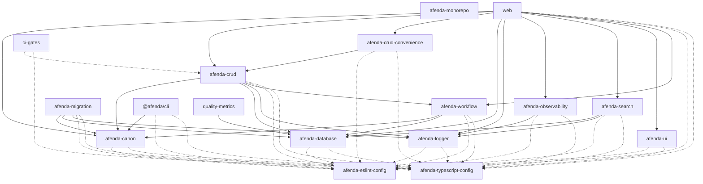

# Capability Flow Diagrams

> Generated at 2026-02-22T03:14:33.560Z

## Capability Coverage

```mermaid
flowchart LR

  subgraph mutation["MUTATION"]
    contacts_create["✅ contacts.create"]
    contacts_update["✅ contacts.update"]
    contacts_delete["✅ contacts.delete"]
    contacts_restore["✅ contacts.restore"]
    companies_create["✅ companies.create"]
    companies_update["✅ companies.update"]
    companies_delete["✅ companies.delete"]
    companies_restore["✅ companies.restore"]
  end

  subgraph read["READ"]
    contacts_read["✅ contacts.read"]
    contacts_list["✅ contacts.list"]
    contacts_versions["✅ contacts.versions"]
    contacts_audit["✅ contacts.audit"]
    custom_fields_read["✅ custom_fields.read"]
    views_read["✅ views.read"]
    system_health_read["✅ system.health.read"]
    companies_read["✅ companies.read"]
    companies_list["✅ companies.list"]
    companies_versions["✅ companies.versions"]
    companies_audit["✅ companies.audit"]
  end

  subgraph search["SEARCH"]
    contacts_search["✅ contacts.search"]
    search_global["✅ search.global"]
  end

  subgraph admin["ADMIN"]
    admin_custom_fields_define["⚠️ admin.custom_fields.define"]
    admin_custom_fields_sync["⚠️ admin.custom_fields.sync"]
    admin_aliases_resolve["⚠️ admin.aliases.resolve"]
    admin_roles_manage["✅ admin.roles.manage"]
    admin_views_manage["✅ admin.views.manage"]
    system_workflows_manage["✅ system.workflows.manage"]
  end

  subgraph system["SYSTEM"]
    system_workflows_evaluate["⚠️ system.workflows.evaluate"]
  end

  subgraph auth["AUTH"]
    auth_sign_in["✅ auth.sign_in"]
    auth_sign_out["✅ auth.sign_out"]
  end

  subgraph storage["STORAGE"]
    storage_files_upload["🛡️ storage.files.upload"]
    storage_files_metadata["✅ storage.files.metadata"]
    storage_files_save["🛡️ storage.files.save"]
  end

  apps_web_app_actions_contacts_capabilities_ts[/"contacts.capabilities.ts"/]
  apps_web_app_actions_contacts_capabilities_ts --> contacts_create
  packages_crud_src_handlers_contacts_ts[/"contacts.ts"/]
  packages_crud_src_handlers_contacts_ts --> contacts_create
  apps_web_app_actions_contacts_capabilities_ts --> contacts_update
  packages_crud_src_handlers_contacts_ts --> contacts_update
  apps_web_app_actions_contacts_capabilities_ts --> contacts_delete
  packages_crud_src_handlers_contacts_ts --> contacts_delete
  apps_web_app_actions_contacts_capabilities_ts --> contacts_restore
  packages_crud_src_handlers_contacts_ts --> contacts_restore
  apps_web_app_actions_contacts_capabilities_ts --> contacts_read
  apps_web_app_actions_contacts_capabilities_ts --> contacts_list
  apps_web_app_actions_contacts_capabilities_ts --> contacts_versions
  apps_web_app_actions_contacts_capabilities_ts --> contacts_audit
  apps_web_app_api_search_route_ts[/"route.ts"/]
  apps_web_app_api_search_route_ts --> contacts_search
  apps_web_app_api_search_route_ts --> search_global
  apps_web_app_api_internal_search_lag_route_ts[/"route.ts"/]
  apps_web_app_api_internal_search_lag_route_ts --> search_global
  apps_web_app_api_internal_search_health_route_ts[/"route.ts"/]
  apps_web_app_api_internal_search_health_route_ts --> search_global
  apps_web_app_api_custom_fields__entityType__route_ts[/"route.ts"/]
  apps_web_app_api_custom_fields__entityType__route_ts --> custom_fields_read
  apps_web_app_api_views__entityType__route_ts[/"route.ts"/]
  apps_web_app_api_views__entityType__route_ts --> views_read
  apps_web_app_actions_roles_ts[/"roles.ts"/]
  apps_web_app_actions_roles_ts --> admin_roles_manage
  apps_web_app_api_meta_capabilities_route_ts[/"route.ts"/]
  apps_web_app_api_meta_capabilities_route_ts --> admin_views_manage
  apps_web_app_api_meta_capabilities_flags_route_ts[/"route.ts"/]
  apps_web_app_api_meta_capabilities_flags_route_ts --> admin_views_manage
  apps_web_app_actions_workflows_ts[/"workflows.ts"/]
  apps_web_app_actions_workflows_ts --> system_workflows_manage
  apps_web_app_api_health_route_ts[/"route.ts"/]
  apps_web_app_api_health_route_ts --> system_health_read
  apps_web_app_api_ready_route_ts[/"route.ts"/]
  apps_web_app_api_ready_route_ts --> system_health_read
  apps_web_app_api_auth_____path__route_ts[/"route.ts"/]
  apps_web_app_api_auth_____path__route_ts --> auth_sign_in
  apps_web_app_api_auth_____path__route_ts --> auth_sign_out
  apps_web_app_api_storage_presign_route_ts[/"route.ts"/]
  apps_web_app_api_storage_presign_route_ts --> storage_files_upload
  apps_web_app_api_storage_metadata_route_ts[/"route.ts"/]
  apps_web_app_api_storage_metadata_route_ts --> storage_files_metadata
  apps_web_app_api_storage_metadata_route_ts --> storage_files_save
  apps_web_app_actions_companies_capabilities_ts[/"companies.capabilities.ts"/]
  apps_web_app_actions_companies_capabilities_ts --> companies_create
  packages_crud_src_handlers_companies_ts[/"companies.ts"/]
  packages_crud_src_handlers_companies_ts --> companies_create
  apps_web_app_actions_companies_capabilities_ts --> companies_update
  packages_crud_src_handlers_companies_ts --> companies_update
  apps_web_app_actions_companies_capabilities_ts --> companies_delete
  packages_crud_src_handlers_companies_ts --> companies_delete
  apps_web_app_actions_companies_capabilities_ts --> companies_restore
  packages_crud_src_handlers_companies_ts --> companies_restore
  apps_web_app_actions_companies_capabilities_ts --> companies_read
  apps_web_app_actions_companies_capabilities_ts --> companies_list
  apps_web_app_actions_companies_capabilities_ts --> companies_versions
  apps_web_app_actions_companies_capabilities_ts --> companies_audit
```

## Package Dependencies

```mermaid
flowchart TD

  afenda_monorepo["afenda-monorepo"]
  web["web"]
  afenda_crud["afenda-crud"]
  afenda_crud_convenience["afenda-crud-convenience"]
  afenda_canon["afenda-canon"]
  afenda_eslint_config["afenda-eslint-config"]
  afenda_database["afenda-database"]
  afenda_logger["afenda-logger"]
  afenda_observability["afenda-observability"]
  afenda_search["afenda-search"]
  afenda_typescript_config["afenda-typescript-config"]
  afenda_ui["afenda-ui"]
  afenda_migration["afenda-migration"]
  afenda_workflow["afenda-workflow"]
  _afenda_cli["@afenda/cli"]
  ci_gates["ci-gates"]
  quality_metrics["quality-metrics"]

  web --> afenda_canon
  web --> afenda_crud
  web --> afenda_crud_convenience
  web --> afenda_database
  web --> afenda_logger
  web --> afenda_observability
  web --> afenda_search
  web --> afenda_ui
  web --> afenda_workflow
  web -.-> afenda_eslint_config
  web -.-> afenda_typescript_config
  afenda_crud --> afenda_canon
  afenda_crud --> afenda_database
  afenda_crud --> afenda_logger
  afenda_crud --> afenda_workflow
  afenda_crud -.-> afenda_eslint_config
  afenda_crud -.-> afenda_typescript_config
  afenda_crud_convenience --> afenda_crud
  afenda_crud_convenience -.-> afenda_eslint_config
  afenda_crud_convenience -.-> afenda_typescript_config
  afenda_canon -.-> afenda_eslint_config
  afenda_canon -.-> afenda_typescript_config
  afenda_database -.-> afenda_eslint_config
  afenda_database -.-> afenda_typescript_config
  afenda_logger -.-> afenda_eslint_config
  afenda_logger -.-> afenda_typescript_config
  afenda_observability --> afenda_logger
  afenda_observability -.-> afenda_eslint_config
  afenda_observability -.-> afenda_typescript_config
  afenda_search --> afenda_database
  afenda_search --> afenda_logger
  afenda_search -.-> afenda_eslint_config
  afenda_search -.-> afenda_typescript_config
  afenda_ui -.-> afenda_eslint_config
  afenda_ui -.-> afenda_typescript_config
  afenda_migration --> afenda_canon
  afenda_migration --> afenda_database
  afenda_migration --> afenda_logger
  afenda_migration -.-> afenda_eslint_config
  afenda_migration -.-> afenda_typescript_config
  afenda_workflow --> afenda_canon
  afenda_workflow --> afenda_database
  afenda_workflow -.-> afenda_eslint_config
  afenda_workflow -.-> afenda_typescript_config
  _afenda_cli --> afenda_canon
  _afenda_cli -.-> afenda_eslint_config
  _afenda_cli -.-> afenda_typescript_config
  ci_gates -.-> afenda_crud
  ci_gates -.-> afenda_typescript_config
  quality_metrics --> afenda_database
```
