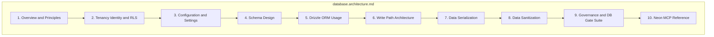
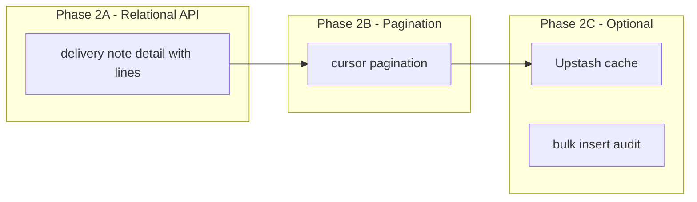

# DB Architecture Consolidation Plan

*Incorporates findings from GitHub research (drizzle-team/drizzle-orm, neondatabase/drizzle-overview, cloudflare-drizzle-neon, guide-neon-drizzle).*

## Ratification Metadata (Contract)


| Field                  | Value                                                                                |
| ---------------------- | ------------------------------------------------------------------------------------ |
| `architecture_version` | 1                                                                                    |
| `last_ratified`        | 2026-02-15 *(date the closure PR merged)*                                            |
| `ratified_by`          | Gap closure 2026-02 *(PR approver / arch owner)*                                     |
| **Change process**     | PR label `arch-change`; required reviewers; CI gates (Gate 0, schema-lint) must pass |


---

## Document Status

| Field | Value |
|-------|-------|
| **Status** | Ratified — all GAP-DB-001..009 closed |
| **As of** | 2026-02-15 |
| **Implementation** | Gate 0–7 enforced; schema-driven registry shipped |
| **Next focus** | Relational API adoption; cursor pagination; optional cache |

---

## Design Principle: Contract Over Prose

The consolidated doc must be:

- **SSOT spec** — what must be true, not aspirational guidance
- **Machine-checkable** — CI can fail on violations
- **Mapped to code** — every invariant has a source file and validation path

Every section ends with four mandatory subparts:

1. **Invariants** — stable IDs (e.g. RLS-01, SER-01)
2. **Source of truth** — which file defines it
3. **Validated by** — which test/lint checks it
4. **Exceptions** — with stable IDs (e.g. EX-DB-003)

---

## Current State Summary

- **All gaps GAP-DB-001 through GAP-DB-009 are closed** as of **2026-02-15**; validation summary reflects implementation.
- **DB Gate Suite** is enforced via `schema-lint` (Gate 2 warnings; Gate 3 FK coverage errors). **Gate 5** (REVOKE consistency) and **Gate 6** (projection tables no app writes) are implemented and validated.
- **Search maintenance path** (bootstrap + drain/outbox) is **implemented and shipped** (GAP-DB-004 closed).
- **Entity generator** acceptance test passes (15/15); schema barrel includes `@entity-gen:schema-barrel` marker; idempotent test allows schema barrel regen as maintenance output.
- **Gate 7:** TABLE_REGISTRY, RLS_TABLES, REVOKE generated from schema + config; `pnpm db:barrel` produces barrel + manifest + registry; CI diff gate enforces freshness.
- **Sprint 2026-02 (done):** entity-new `--kind` flag; Migration NOT VALID docs; Read path guidance (§3/§6); `batch()` API exported.
- **Sprint 2026-02 (Batch API):** policy-engine RTT 1 `batch([user_roles, user_scopes])` + RTT 2 `role_permissions` with `inArray`; `listEntities` `includeCount` via `batch()` (or `Promise.all` when `forcePrimary`); `orgId` filter (DRIZ-01); canon envelope `meta.totalCount`; entity-actions `includeCount`/`orgId`; tests: `read.test.ts`, `policy-engine-resolve.test.ts`, `list-entities.integration.test.ts`.
- Remaining items in this doc are **documentation clarity** and **explicit exceptions**, not missing systems.

---

## Deliverable: Single Consolidated Document

**Target file:** `.architecture/database.architecture.md` (replace auto-generated content)

**Structure (reordered for engineer workflow — tenancy/write-path before serialization):**




---

## Ratification Gap Register (Mandatory, Near Top)

Add a first-class table immediately after Overview. This is the anti-drift ledger.


| Gap ID     | Current State                          | Target Contract                                        | Risk           | Fix Phase | Validation to Add     | Exit Criteria                                                                                  |
| ---------- | -------------------------------------- | ------------------------------------------------------ | -------------- | --------- | --------------------- | ---------------------------------------------------------------------------------------------- |
| GAP-DB-001 | ~~PK (id) only~~                       | ✅ PK (org_id, id) for truth tables (migration 0051)   | —              | —         | schema-lint           | Closed 2026-02-15 — composite PK applied; schema-lint passes                                  |
| GAP-DB-002 | ~~FKs sparse on domain~~               | ✅ Every *_id has FK unless whitelisted                | —              | —         | find-missing-fks.ts   | Closed 2026-02-15 — all *_id have FK; schema-lint passes                                      |
| GAP-DB-003 | ~~stock_balances writable~~            | ✅ REVOKE UPDATE/DELETE; projection-only                | —              | —         | RLS test              | Closed 2026-02-14 — REVOKE in migration 0044/0050                                             |
| GAP-DB-004 | ~~No outbox + search_documents~~       | ✅ Outbox + incremental search worker                  | —              | —         | drain/health/lag      | Closed 2026-02-15 — search_outbox, search_documents, chunked backfill, drain, Vercel cron, SEARCH_WORKER_DATABASE_URL |
| GAP-DB-005 | ~~RLS_TABLES hand-maintained~~         | ✅ Generated from _registry                            | —              | —         | cross-tenant-rls.test | Closed 2026-02-14                                                                             |
| GAP-DB-006 | ~~No data serialization layer~~        | ✅ coerceMutationInput (SER-01)                        | —              | —         | serialization.test.ts | Closed 2026-02-15 — canon serialization + tests                                               |
| GAP-DB-007 | ~~No schema-derived allowlist~~        | ✅ pickWritable; entity-new uses schema                | —              | —         | sanitize.test.ts      | Closed 2026-02-15 — handlers use pickWritable; entity-new template updated                   |
| GAP-DB-008 | ~~doc_postings lacks doc_version~~     | ✅ doc_version + unique (migration 0050)              | —              | —         | migration             | Closed 2026-02-14                                                                             |
| GAP-DB-009 | ~~No prepared statements~~             | ✅ Documented (neon-http; batch/cache fallback)       | —              | —         | DRIZ-03b              | Closed 2026-02-14 — neon-http stateless; use batch/cache                                      |


**Phase key:** P0 = IDs + skeleton; P1 = consolidated doc; P2 = serialization/sanitization + schema-driven; P3 = deprecations + generator changes

**FK whitelist authority (GAP-DB-002):** `schema-lint.config.ts` contains `FK_EXEMPT_COLUMNS` or `FK_EXEMPT_TABLES` with stable IDs (e.g. EX-FK-001). No ad-hoc whitelisting by comment.

Once these IDs exist, every future change can reference them. Add new gaps here; remove when fixed.

---

## Validation Summary (Codebase vs Architecture)

*Last validated: 2026-02-15*

| Section | Contract | Codebase Status | Notes |
|---------|----------|-----------------|-------|
| **Gap Register** | All GAP-DB-001..009 closed | ✅ All closed | GAP-DB-004 closed 2026-02-15 |
| **§2 Tenancy/RLS** | RLS-01, RLS-02; tenantPolicy | ✅ | tenant-policy.ts; cross-tenant-rls.test.ts |
| **§3 Config** | CFG-01, CFG-02; db/dbRo/dbSearchWorker | ✅ | db.ts; SEARCH_WORKER_DATABASE_URL |
| **§4 Schema** | SCH-03a/03b; TABLE_REGISTRY | ✅ | _registry.ts; search_outbox, search_documents registered |
| **§5 Drizzle** | DRIZ-01..05, DRIZ-03b | ✅ | neon-http; module-level db |
| **§6 Write Path** | WP-01..05; mutate + outbox | ✅ | mutate.ts; enqueueSearchOutboxEvent in TX |
| **§7 Serialization** | SER-01..05; coerceMutationInput | ✅ | canon/serialization; serialization.test.ts |
| **§8 Sanitization** | SAN-01..03; pickWritable | ✅ | writable-columns.ts; sanitize.test.ts |
| **§9 Governance** | GOV-00..07; schema-lint | ✅ | schema-lint; Gate 0–7 in CI; Gate 5 runGate5, Gate 6 cross-tenant-rls, Gate 7 db:barrel → diff |
| **Gate 7** | schema-driven registry; CI db:barrel + diff | ✅ | table-registry.config.ts, revoke.config.ts; generate-table-registry.ts; handler-registry-invariant.test.ts |
| **GAP-DB-004** | Outbox + search worker | ✅ | drain, bootstrap, lag, health; chunked backfill |
| **Batch API** | DRIZ-03b batch adoption (batch in read paths) | ✅ | policy-engine 2 RTT; `listEntities` `includeCount` + `forcePrimary`; DRIZ-01 `orgId` filter |

**GAP-DB-004 implementation verified:**
- `search_outbox`, `search_documents`, `search_backfill_state` (migrations 0052, 0053)
- Gate 6: `search_documents` REVOKE INSERT/UPDATE/DELETE (migration 0054)
- `enqueueSearchOutboxEvent()` in mutate TX (search-outbox.ts)
- `drainSearchOutbox()`, `backfillSearchDocumentsChunk()` (afena-search)
- `/api/internal/search/drain`, `/bootstrap`, `/lag`, `/health`
- `dbSearchWorker` (SEARCH_WORKER_DATABASE_URL)
- Vercel cron; poke (direct call)

---

## Invariant Index


| ID                                       | Section             |
| ---------------------------------------- | ------------------- |
| P0, P1, P2, P3                           | Overview            |
| RLS-01, RLS-02                           | Tenancy/RLS         |
| CFG-01, CFG-02                           | Config              |
| SCH-01..05, SCH-03a, SCH-03b             | Schema Design       |
| DRIZ-01..05, DRIZ-03, DRIZ-03a, DRIZ-03b | Drizzle ORM         |
| WP-01..05                                | Write Path          |
| SER-01..05                               | Serialization       |
| ZOD-01..03                               | Serialization (Zod) |
| SAN-01, SAN-01a, SAN-01b, SAN-02, SAN-03 | Sanitization        |
| GOV-00..07                               | Governance          |


---

## Exception Index


| ID             | Scope                                 |
| -------------- | ------------------------------------- |
| EX-RLS-001     | users, r2_files (authUid)             |
| EX-CFG-001     | Edge env fallbacks                    |
| EX-SCH-001..*  | Tables exempt from registry           |
| EX-DRIZ-001    | Migration scripts (raw SQL)           |
| EX-DRIZ-002    | Edge routes (no prepare)              |
| EX-WP-001..003 | Migration/seed, system/auth, workflow |
| EX-SER-001     | custom_data                           |
| EX-SAN-001     | system columns                        |
| EX-GOV-*       | Per-gate whitelists                   |
| EX-FK-001..*   | FK whitelist entries                  |


---

## Section-by-Section Plan (Contract Format)

Each section ends with: **Invariants** | **Source of truth** | **Validated by** | **Exceptions**

---

### 1. Overview and Principles

- 4-layer model (Kernel, Control, Projection, Evidence)
- Non-negotiable principles (P0–P3)
- Key design decisions
- **Ratification Gap Register** (table above) — first-class, near top
- **Invariant index** — consolidated doc must list all invariant IDs (RLS-*, CFG-*, DRIZ-*, SER-*, SAN-*, WP-*, GOV-*)
- **Exception index** — consolidated doc must list all exception IDs (EX-*)
- Ratification metadata: architecture_version, last_ratified, ratified_by, change process (Gate 0)

**Invariants:** P0 (Truth in Postgres), P1 (Tenant structural), P2 (One write brain), P3 (Projections rebuildable)

**Source of truth:** This document

**Validated by:** Gap Register completeness; alignment scorecard in CI (future)

**Exceptions:** Document any principle exceptions with EX-* IDs

---

### 2. Tenancy, Identity, and RLS (moved earlier — foundational)

- `org_id` convention: `org_id uuid NOT NULL DEFAULT auth.require_org_id()`. Optional sentinel guard: `CHECK (org_id <> '00000000-0000-0000-0000-000000000000'::uuid)`. Neon Auth patterns use UUID.
- `auth.org_id()`, `auth.require_org_id()`, `auth.user_id()` — granted to authenticated
- tenantPolicy, ownerPolicy, crudPolicy patterns
- RLS_TABLES (current: hand-maintained; target: schema-generated)
- Cross-tenant isolation tests

**Invariants:** RLS-01 (every domain table has org_id + RLS + tenantPolicy), RLS-02 (auth.org_id() NULL → zero rows)

**Source of truth:** [packages/database/src/helpers/tenant-policy.ts](packages/database/src/helpers/tenant-policy.ts), [packages/crud/src/**tests**/cross-tenant-rls.test.ts](packages/crud/src/__tests__/cross-tenant-rls.test.ts)

**Validated by:** schema-lint has-tenant-policy, cross-tenant-rls.test.ts

**Exceptions:** EX-RLS-001: users, r2_files use authUid (user-scoped)

---

### 3. Configuration and Settings

**Env vars:**

- `DATABASE_URL` — RW compute (required)
- `DATABASE_URL_RO` — RO compute (optional; falls back to DATABASE_URL)
- `DATABASE_URL_MIGRATIONS` — for drizzle-kit migrate (optional; falls back to DATABASE_URL)

**Connection setup ([packages/database/src/db.ts](packages/database/src/db.ts)):**

- `drizzle-orm/neon-http` + `neon()` — HTTP driver, serverless-optimized (fetch per query)
- Pass `schema` for relational API (`db.query.*`)
- `logger: isDev` — SQL logging in development only
- Module-level declaration — enables connection/prepared reuse in serverless

**Driver choice (Neon) — [official Drizzle docs](https://orm.drizzle.team/docs/connect-neon):**

- **HTTP (current):** `drizzle-orm/neon-http` — short-lived, stateless; ideal for Vercel/Lambda/Next.js. Low latency per query. AFENDA-NEXUS uses this correctly.
- **WebSocket (Pool):** `drizzle-orm/neon-serverless` + `Pool` — for Cloudflare Workers or long-running Node servers; supports interactive transactions.

**Connection string (Neon MCP verified):**

- Use pooled URL (`-pooler` in hostname) for serverless — nexuscanon-axis already correct
- Add `sslnegotiation=direct` (PG17) to reduce cold-start: `?sslmode=require&channel_binding=require&sslnegotiation=direct`
- Avoid double pooling: HTTP driver has no client pool; let Neon PgBouncer handle

**Retry logic:** Implement exponential backoff for transient connection drops (Neon serverless driver). Use `async-retry` or equivalent in critical paths.

**RW vs RO routing:** mutate → db; list/read → dbRo; read-after-write → getDb({ forcePrimary: true })

**Write safety:** Export naming (dbRo), ESLint INVARIANT-RO, DB role (SELECT only for DATABASE_URL_RO)

**Invariants:** CFG-01 (DATABASE_URL required), CFG-02 (dbRo never used for insert/update/delete)

**Source of truth:** [packages/database/src/db.ts](packages/database/src/db.ts)

**Validated by:** ESLint no-restricted-syntax for dbRo writes

**Exceptions:** None

---

### 4. Schema Design

- Column helpers: baseEntityColumns, erpEntityColumns, docEntityColumns, postingColumns
- Field types: moneyMinor, currencyCode, qty, statusColumn, etc.
- Custom fields: Data type catalog, custom_data JSONB, custom_field_values typed index
- org_id: `uuid NOT NULL DEFAULT auth.require_org_id()` (redundant CHECK removed). Optional: `CHECK (org_id <> '00000000-0000-0000-0000-000000000000'::uuid)` for sentinel rejection.

**Table taxonomy (powers Gate 2/3/4):**


| table_kind  | Layer      | Description                            |
| ----------- | ---------- | -------------------------------------- |
| truth       | Kernel     | Domain entities; identity rule applies |
| control     | Control    | Workflow, outbox, posting state        |
| projection  | Projection | Rebuildable views, materialized        |
| evidence    | Evidence   | Audit, versions, immutable             |
| link        | Link       | Junction tables; may lack version      |
| system/auth | System     | users, r2_files, api_keys, roles       |


- **SCH-03a:** Every table MUST be registered with `table_kind` (truth/control/projection/evidence/link/system).
- **SCH-03b:** schema-lint MUST fail if a table exists without a registry entry (except EX-SCH-* list).
- **SCH-04:** Truth tables MUST use the identity rule (GAP-DB-001 target: PK (org_id, id)).

**Invariants:** SCH-01 (base columns via helpers), SCH-02 (org_id uuid NOT NULL + optional sentinel), SCH-03a/03b (table_kind registry), SCH-04 (truth tables use identity rule)

**Source of truth:** [packages/database/src/schema/_registry.ts](packages/database/src/schema/_registry.ts) (or similar) for table_kind; [packages/database/src/helpers/](packages/database/src/helpers/), [packages/database/src/schema/](packages/database/src/schema/)

**Validated by:** schema-lint has-base-columns, has-org-id (uuid semantics; NOT NULL + optional sentinel)

**Exceptions:** EX-SCH-001: link tables without version (document which)

---

### 5. Drizzle ORM Usage and Performance Optimization

**Core usage:**

- Schema as SSOT: barrel (`db:barrel`), schema-lint config
- Connection: `drizzle-orm/neon-http` + `@neondatabase/serverless` neon() — HTTP driver for serverless (Vercel, Lambda)
- Pass `schema` to drizzle() for relational queries (`db.query.X.findMany`)
- Migrations: `drizzle-kit generate` → `drizzle-kit migrate`
- Neon branching: DATABASE_URL per branch for dev/preview/prod

**Performance optimizations (from Drizzle + Neon docs):**


| Optimization            | Current          | Target                                                           | Reference                                                    |
| ----------------------- | ---------------- | ---------------------------------------------------------------- | ------------------------------------------------------------ |
| **Prepared statements** | Not used         | `.prepare('name')` for hot queries; declare outside handler      | [perf-queries](https://orm.drizzle.team/docs/perf-queries)   |
| **Batch API**           | Done             | policy-engine, `listEntities` (`includeCount`); `forcePrimary` uses `Promise.all` on primary | [batch-api](https://orm.drizzle.team/docs/batch-api)         |
| **Bulk insert**         | Per-row possible | `insert(table).values([...])` — single statement                 | Neon AI rules                                                |
| **Relational Queries**  | Partial          | `db.query.X.findMany({ with: { Y: true } })` — single SQL output | Drizzle overview                                             |
| **Read replicas**       | Manual db/dbRo   | Keep; neon-http has no withReplicas; manual split correct        | [read-replicas](https://orm.drizzle.team/docs/read-replicas) |
| **Cache**               | None             | Optional Upstash; `.$withCache()` opt-in for read-heavy          | [cache](https://orm.drizzle.team/docs/cache)                 |


**Hot-path optimisation (DRIZ-03):**

- **DRIZ-03:** Hot paths MUST use one of: prepare (when supported) OR batch OR cache, with benchmark proof.
- **DRIZ-03a:** Prepared statements are required where supported by the driver/runtime.
- **DRIZ-03b:** If the driver does not persist prepares (e.g. neon-http per-request), use: query-shape optimisation + batching + caching instead.
- Declare `db` and prepared queries **outside handler scope** — serverless functions (Lambda, Vercel) can live 15 mins and reuse
- Edge functions clean up after each invocation → little benefit; prefer serverless for hot paths
- Use `sql.placeholder('id')` for dynamic values; `.execute({ id: value })`
- **neon-http caveat:** HTTP-based drivers may not persist prepares across requests; pooling/proxy layers can change behaviour. Verify before relying on `.prepare()` for hot paths.
- Target: `readEntity` by id, `listEntities` with org filter

**Driver vs runtime optimisation support:**


| Runtime                         | Driver               | Prepared                                        | Batch | Interactive tx |
| ------------------------------- | -------------------- | ----------------------------------------------- | ----- | -------------- |
| Node serverless (Vercel/Lambda) | neon-http            | May not persist                                 | Yes   | No             |
| Long-running Node               | neon-serverless Pool | Driver/runtime dependent; verify with benchmark | Yes   | Yes            |
| Edge (Workers)                  | neon-serverless Pool | Driver/runtime dependent; verify with benchmark | Yes   | Yes            |


**Batch API (Neon-supported):**

- `db.batch([stmt1, stmt2, ...])` — multiple statements in one round trip
- Use for: multiple selects in one request; avoid N+1 without transaction
- For mutations: keep `db.transaction()` — batch is sequential, transaction gives atomicity

**Postgres-native usage (Neon serverless):**

- **Query shape (DRIZ-01):** Filter by org_id early; standard indexes: (org_id, doc_no), (org_id, created_at), (org_id, status), (org_id, *_id)
- **Transaction boundaries (DRIZ-02):** Single transaction per mutation; outbox in same tx; avoid long-running tx (Neon compute sleep)
- **Connection scope (DRIZ-04):** db declared at module level — correct for Next.js serverless

**Module-level db (DRIZ-05):**

- DB instance MUST be declared at module level; never create `drizzle()` inside request handlers.
- Per-request db creation wastes connections and prevents prepared-statement reuse.

**Migration options:**

- **Option A (current):** `drizzle-kit migrate` — CLI, run in CI/deploy.
- **Option B:** Programmatic `migrate(db, { migrationsFolder })` via `drizzle-orm/neon-http/migrator` — useful for serverless deploy hooks.

**Relational API:** Use `db.query.X.findMany({ with: { Y: true } })` — single SQL output per query. Pass `schema` to `drizzle()` for this to work.

**drizzle.config.ts optimizations:**

- `schema: ['./src/schema/*.ts']` — glob for all schema files
- `tablesFilter: ['!_neon*', '!__drizzle*']` — exclude Neon internal tables
- Use `DATABASE_URL_MIGRATIONS` for migration runs (can point to different branch)

**Migration SQL patterns:**

- `--> statement-breakpoint` between statements
- FK add with idempotent block: `DO $$ BEGIN ... EXCEPTION WHEN duplicate_object THEN null; END $$`

**Invariants:** DRIZ-01 (query shape), DRIZ-02 (transaction boundaries), DRIZ-03/03a/03b (hot-path: prepare OR batch OR cache with proof), DRIZ-04 (connection outside handler), DRIZ-05 (module-level db only; never per-request)

**Source of truth:** [packages/database/src/db.ts](packages/database/src/db.ts), [packages/database/drizzle.config.ts](packages/database/drizzle.config.ts)

**Validated by:** schema-lint, ESLint INVARIANT-01, code review (no `drizzle()` inside handlers)

**Exceptions:** EX-DRIZ-001: migration scripts may use raw SQL; EX-DRIZ-002: Edge routes may skip prepared (no reuse benefit)

---

### 6. Write Path Architecture (target contract, even if out of scope)

Document the *target* architecture to prevent truth leakage:

- mutate() → single write brain
- Posting worker → journals, stock_moves only via doc_postings
- Outbox → workflow/outbox; future: search outbox
- No UI scripts, random SQL, or app code inserting journal lines

**Definitions (machine-checkable via table_kind):**

- Kernel truth tables = `table_kind = truth`
- Control plane tables = `table_kind = control`

**Invariants:** WP-01 (mutate only), WP-02 (posting worker only path to journals), WP-03 (no direct projection writes), WP-04 (domain tables may NOT be mutated by ops/admin routes directly; ops routes may only enqueue control-plane actions (workflow/posting/outbox) or call mutate()), WP-05 (routes may only write to control-plane tables directly; any write to kernel truth tables MUST go through mutate())

**Source of truth:** [packages/crud/src/mutate.ts](packages/crud/src/mutate.ts)

**Validated by:** ESLint INVARIANT-01, cross-tenant tests, posting-path.test.ts (HANDLER_REGISTRY excludes journal_line, stock_movement)

**Exceptions:** EX-WP-001: migration/seed scripts (documented, non-app paths); EX-WP-002: system/auth tables (api_keys, roles, user_roles, user_scopes) bypass mutate; EX-WP-003: workflow engine and actions use db directly (control plane, not domain CRUD)

---

### 7. Data Serialization — Typed Boundary Layer (Contract)

**Ownership:** Canon owns transforms; handlers receive only validated+coerced input.

**Inbound:** Must coerce + validate before handler runs. **Outbound:** Must serialize DB-native types to API-safe types.

**Allowed coercions (explicit list):**


| Type                | Inbound                                              | Outbound                               |
| ------------------- | ---------------------------------------------------- | -------------------------------------- |
| ISO datetime string | → Date (SER-03)                                      | timestamptz → ISO-8601 string (SER-04) |
| UUID string         | Validate format (no conversion; TS keeps string)     | uuid → string                          |
| money               | number/string → bigint minor units (single function) | bigint → number (minor)                |
| JSONB               | unknown → object (Zod validated)                     | object → as-is                         |


**Invariants:**

- **SER-01:** No handler may accept raw request JSON; only validated+coerced MutationSpec.
- **SER-02:** Canon owns all coercion/transform logic; handlers do not implement ad-hoc parsing.
- **SER-03:** Inbound datetime values MUST be normalised to `Date` before reaching handlers.
- **SER-04:** Outbound datetime values MUST be ISO-8601 strings.
- **SER-05:** Handlers MUST accept `MutationSpec<T>` and not accept arbitrary payloads. Typed envelope: handlers receive `(ctx, spec)` never `(ctx, rawInput)`.

**Source of truth:** [packages/canon/src/serialization/](packages/canon/src/serialization/) (to add), [packages/crud/src/mutate.ts](packages/crud/src/mutate.ts)

**Validated by:** serialization.test.ts (future), mutationSpecSchema Zod in canon

**Exceptions:** EX-SER-001: custom_data validated separately via validateCustomData

**Zod contract (single gate, no scattered parsing):**

- **ZOD-01:** All inbound requests are parsed by `MutationSpecSchema.parse(input)` (or `safeParse`) before reaching handlers.
- **ZOD-02:** Canon defines entity write schemas and scalar schemas (uuid, moneyMinor, isoDatetime).
- **ZOD-03:** No "local Zod schemas" inside handlers/routes except for system/auth endpoints listed in EX-WP-002.

Zod is the single gate that turns `unknown` request JSON into typed `MutationSpec<T>`. All coercion (SER-01..05) runs here. Option A (Zod-first): `WritableShape(entity)` = keys of `canon.zodWriteSchema(entity)`. Option B (schema-first): derive from Drizzle columns; Zod validates values/types. Pick one and lock it.

---

### 8. Data Sanitization — Write-Shape Governance (Contract)

**Two-part write governance:**

1. **Denylist:** SYSTEM_COLUMNS (stripSystemColumns) — keep
2. **Allowlist:** Entity write-shape derived from Drizzle schema metadata, not hand-maintained lists

**Invariants:**

- **SAN-01:** Writable columns are derived from schema metadata, not hand-maintained lists.
- **SAN-01a:** Writable columns = Drizzle table columns MINUS SYSTEM_COLUMNS MINUS computed/readonly columns MINUS server-set FKs. Server-set FKs (examples): `org_id`, `created_by`, `updated_by`, `posting_batch_id`, `submitted_by`, `posted_by`, `amended_from_id` (amendment flow only).
- **SAN-01b:** Writable column derivation must be deterministic and generated (or derived) from the schema barrel.
- **SAN-02:** Custom fields are validated against field defs before write.
- **SAN-03:** No HTML sanitization at DB; UI escapes on render.

**Audit of rejections:** If a user attempts to write blocked fields, log to audit_logs with a dedicated reason code from the namespace: `SAN_BLOCKED_FIELD`, `SAN_TYPE_MISMATCH`, `SER_COERCION_FAIL`, etc.

**Source of truth:** [packages/crud/src/sanitize.ts](packages/crud/src/sanitize.ts), [packages/crud/src/services/custom-field-validation.ts](packages/crud/src/services/custom-field-validation.ts)

**Validated by:** sanitize.test.ts (future), validateCustomData in mutate path

**Exceptions:** EX-SAN-001: system columns always stripped (no override)

---

### 9. Governance and DB Gate Suite

Unify all checks into one CI gate list. Document *today* what is manual; document *exact future state* (schema-driven).

**DB Gate Suite (CI):**


| Gate   | Description                                                                                                                                                                       | Current                     | Future    |
| ------ | --------------------------------------------------------------------------------------------------------------------------------------------------------------------------------- | --------------------------- | --------- |
| Gate 0 | Doc contract completeness — database.architecture.md must include: Ratification Metadata table, Ratification Gap Register table, Invariant index section, Exception index section | See GOV-00 validation below | CI script |


**GOV-00 validation (deterministic):** CI must verify the doc contains these exact headings:

- `## Ratification Metadata (Contract)`
- `## Ratification Gap Register (Mandatory, Near Top)`
- `## Invariant Index`
- `## Exception Index`

| Gate 1 | Tenant enforcement (org_id defaults, RLS enabled, policies)                                                                                             | schema-lint           | schema-lint       |
| Gate 2 | Identity rules (truth tables (org_id, id) or exception)                                                                                                 | schema-lint           | schema-lint       |
| Gate 3 | FK coverage (*_id has FK unless whitelisted)                                                                                                            | schema-lint           | schema-lint       |
| Gate 4 | Postable docs registered                                                                                                                                | schema-lint.config.ts | schema-derived    |
| Gate 5 | Append-only tables immutable                                                                                                                            | schema-lint runGate5  | migration lint    |
| Gate 6 | Projection tables no app writes                                                                                                                         | cross-tenant-rls.test | RLS test          |
| Gate 7 | Registry drift — TABLE_REGISTRY, RLS_TABLES, REVOKE from schema + config                                                                 | schema-driven gen     | schema-driven gen |

**Invariants:** GOV-00 (doc contract completeness) through GOV-07 (one per gate)

**Source of truth:** [packages/database/src/scripts/schema-lint.ts](packages/database/src/scripts/schema-lint.ts), [packages/database/schema-lint.config.ts](packages/database/schema-lint.config.ts)

**Validated by:** `pnpm db:barrel` → `pnpm db:lint` → `git diff --exit-code` (CI). Gate 5 runGate5, Gate 6 cross-tenant-rls, Gate 7 handler-registry-invariant.test.ts.

**Exceptions:** EX-GOV-* per gate (whitelisted tables, etc.)

---

### 10. Neon MCP Reference

- Inline condensed version of neon-mcp.usage.md
- Table: Use case → MCP tool
- Link to full Neon MCP docs

**Optional: Neon AI Rules for Cursor** — Add [neon-drizzle.mdc](https://github.com/neondatabase-labs/ai-rules/blob/main/neon-drizzle.mdc) to `.cursor/rules/` for AI-assisted Drizzle+Neon code generation. Covers connection setup, batch ops, prepared statements, transaction patterns.

**GitHub reference repos (Non-normative — informational only):**


| Repo                                                                                            | Use for                                                                                          |
| ----------------------------------------------------------------------------------------------- | ------------------------------------------------------------------------------------------------ |
| [neondatabase/drizzle-overview](https://github.com/neondatabase/drizzle-overview)               | Schema + relations + relational API; programmatic migrate; bulk insert; module-level db          |
| [neondatabase/cloudflare-drizzle-neon](https://github.com/neondatabase/cloudflare-drizzle-neon) | Edge/Workers driver choice (neon-serverless vs neon-http); migrate runs locally with postgres.js |
| [neondatabase/guide-neon-drizzle](https://github.com/neondatabase/guide-neon-drizzle)           | Migration + seed flow; **avoid** per-request db creation (anti-pattern)                          |


---

## Neon MCP Evaluation (Non-normative snapshot)

> **Non-normative.** Environment-specific; may be stale. Prefer `.architecture/ops/neon.current-state.md` for ops runbooks. Snapshot date: *(set when captured)*

**Project:** nexuscanon-axis (dark-band-87285012) — aws-ap-southeast-1, PG17, autoscaling 0.25–2 CU

**Connection:** Pooled (`-pooler` in hostname) — correct for serverless. Avoid double pooling (no client-side pool when using Neon PgBouncer).

**Schema:** 100+ public tables; audit_logs + workflow outbox partitioned; neon_auth; drizzle migrations.

**Slow queries (pg_stat_statements):** No application queries >1s; only system/info_schema. No immediate tuning needed.

**Neon-specific additions to plan:**


| Item                        | Source                | Action                                                                        |
| --------------------------- | --------------------- | ----------------------------------------------------------------------------- |
| sslnegotiation=direct       | connection-latency.md | Add to connection string for PG17 — reduces cold-start latency                |
| PgBouncer transaction mode  | connection-pooling.md | SQL-level PREPARE not supported; protocol-level (Drizzle driver) is supported |
| Retry + exponential backoff | serverless-driver.md  | Implement for transient connection drops                                      |
| Avoid double pooling        | choose-connection.md  | HTTP driver = no client pool; correct                                         |
| Scale to zero               | connection-latency.md | Cold start ~few hundred ms; same-region app+DB; consider suspend_timeout      |
| Neon MCP tools              | neon-mcp-server.md    | Use prepare_database_migration, prepare_query_tuning for safe schema changes  |


---

## Non-normative: Reference Links and Repos

**Rule:** Anything under "Reference Links" and "GitHub reference repos" is **informational only**. Only "Invariants" (RLS-*, CFG-*, DRIZ-*, SER-*, SAN-*, WP-*, GOV-*) are **contractual**. This avoids drift-by-citation.

---

## Drizzle + Neon Reference Links (Non-normative)

**Official Drizzle (drizzle-team/drizzle-orm):**


| Topic              | URL                                                                                                          |
| ------------------ | ------------------------------------------------------------------------------------------------------------ |
| Drizzle overview   | [https://orm.drizzle.team/docs/overview](https://orm.drizzle.team/docs/overview)                             |
| Neon connection    | [https://orm.drizzle.team/docs/connect-neon](https://orm.drizzle.team/docs/connect-neon)                     |
| PostgreSQL setup   | [https://orm.drizzle.team/docs/get-started-postgresql](https://orm.drizzle.team/docs/get-started-postgresql) |
| Migrations         | [https://orm.drizzle.team/docs/migrations](https://orm.drizzle.team/docs/migrations)                         |
| Relational Queries | [https://orm.drizzle.team/docs/rqb](https://orm.drizzle.team/docs/rqb)                                       |


**Performance and Neon:**


| Topic                        | URL                                                                                                      |
| ---------------------------- | -------------------------------------------------------------------------------------------------------- |
| Query performance (prepared) | [https://orm.drizzle.team/docs/perf-queries](https://orm.drizzle.team/docs/perf-queries)                 |
| Serverless performance       | [https://orm.drizzle.team/docs/perf-serverless](https://orm.drizzle.team/docs/perf-serverless)           |
| Batch API                    | [https://orm.drizzle.team/docs/batch-api](https://orm.drizzle.team/docs/batch-api)                       |
| Read replicas                | [https://orm.drizzle.team/docs/read-replicas](https://orm.drizzle.team/docs/read-replicas)               |
| Cache (Upstash)              | [https://orm.drizzle.team/docs/cache](https://orm.drizzle.team/docs/cache)                               |
| Neon + Drizzle guide         | [https://neon.com/docs/guides/drizzle](https://neon.com/docs/guides/drizzle)                             |
| Neon AI rules (Drizzle)      | [https://neon.com/docs/ai/ai-rules-neon-drizzle](https://neon.com/docs/ai/ai-rules-neon-drizzle)         |
| Neon connection pooling      | [https://neon.com/docs/connect/connection-pooling](https://neon.com/docs/connect/connection-pooling)     |
| Neon connection latency      | [https://neon.com/docs/connect/connection-latency](https://neon.com/docs/connect/connection-latency)     |
| Neon choose connection       | [https://neon.com/docs/connect/choose-connection](https://neon.com/docs/connect/choose-connection)       |
| Neon serverless driver       | [https://neon.com/docs/serverless/serverless-driver](https://neon.com/docs/serverless/serverless-driver) |
| Neon MCP Server              | [https://neon.com/docs/ai/neon-mcp-server](https://neon.com/docs/ai/neon-mcp-server)                     |


---

## Deprecation of Source Documents

**Rule:** Do not archive silently. Add top-of-file banner to every superseded doc.

**Banner template:**

```markdown
> **Superseded** by [.architecture/database.architecture.md](./database.architecture.md) §X.
> This document is historical; do not edit.
> If conflicts exist, the consolidated doc wins.
```


| File                           | Action                                              | Banner §         |
| ------------------------------ | --------------------------------------------------- | ---------------- |
| database.architecture.md       | Replace with consolidated content; disable auto-gen | N/A (is target)  |
| db.schema.governance.md        | Archive or keep as deep-dive                        | §4 Schema Design |
| drizzle.utilization.plan.md    | Archive                                             | §5 Drizzle Usage |
| erp-architecture-validation.md | Archive                                             | §1, §9           |
| afenda-spec-evaluation.md      | Archive                                             | §1, §9           |
| neon-mcp.usage.md              | Merge into §10; optionally keep standalone          | §10              |


---

## Implementation Order (P0–P3)

**P0: Establish IDs first** (enables all future references)

1. Add **Ratification Gap Register** table with GAP-DB-001 through GAP-DB-009
2. Assign **Invariant IDs** (RLS-01, SER-01, SAN-01, etc.) to all sections
3. Document **Exception IDs** (EX-*) for known deviations

**P1: Write consolidated doc**

1. Create database.architecture.md with contract structure
2. Each section: content + Invariants + Source of truth + Validated by + Exceptions
3. Include Gap Register + invariant index + exception index (Gate 0)
4. Do NOT include Plan vs Codebase Comparison (lives in database.architecture.diff.md)

**P2: Serialization and sanitization contracts**

1. Add §7 Data Serialization with SER-01–04, allowed coercions list
2. Add §8 Data Sanitization with SAN-01a/01b, SAN-02, SAN-03, reason-code namespace
3. Address GAP-DB-006, GAP-DB-007, GAP-DB-008, GAP-DB-009 per Gap Register

**P3: Deprecation + generator changes**

1. Add Superseded banners to old docs
2. Archive or move to .architecture/archive/
3. Update readme gen to exclude database.architecture.md from overwrite
4. Address GAP-DB-004, GAP-DB-005 (outbox, RLS_TABLES generation)

---

## Additional Best-Practice Additions

**Migration safety (FK rollout):** Document NOT VALID pattern for adding FKs on large tables — `ADD CONSTRAINT ... NOT VALID` then `VALIDATE CONSTRAINT` in controlled step. Reduces lock time. (GAP-DB-002 remediation path.)

**Read path architecture:** Add to §3 or §6 — when to use `db` vs `dbRo`; `forcePrimary` for read-after-write; list/search always RO. Prevents accidental RW on read paths.

**Schema change discipline:** Document that schema changes require: (a) migration file, (b) Drizzle schema update, (c) db:barrel if new table, (d) schema-lint pass. Optional: RFC for breaking changes.

**Ratification metadata:** See top of doc — `architecture_version`, `last_ratified`, `ratified_by`, change process. Bump on structural changes.

---

## Final Document Feel: Contract, Not Narrative

The consolidated doc should read like a **spec**, not a tutorial. Each section ends with:

```
**Invariants (must hold):**
- RLS-01: Every domain table has org_id + RLS ENABLED + tenantPolicy
- RLS-02: auth.org_id() NULL → zero rows

**Source of truth:**
- packages/database/src/helpers/tenant-policy.ts
- packages/crud/src/__tests__/cross-tenant-rls.test.ts

**Validated by:**
- schema-lint has-tenant-policy, has-org-id (uuid semantics)
- cross-tenant-rls.test.ts

**Exceptions:**
- EX-RLS-001: users, r2_files use authUid (user-scoped)
```

No vague "should" or "consider" — use "must" and "MUST". Reference Gap IDs (GAP-DB-*) when describing current vs target. This is how to beat ERPNext-style drift.

---

## Out of Scope (Explicitly)

- Code changes in plan mode (if still forbidden)
- Cache layer (optional perf; Batch API done)
- New invariants beyond existing gates (INVARIANT-RO already enforced)
- Migration / schema changes (explicitly excluded)

---

## Plan vs Codebase Comparison

**Moved out of SSOT.** Comparison lives in [.architecture/database.architecture.diff.md](.architecture/database.architecture.diff.md) (non-normative snapshot). Do NOT include in database.architecture.md. Line numbers and locations drift; use for refactoring decisions only.

---

## Suggested Next Implementation

*Updated: 2026-02-15 — all GAP-DB-* gaps closed. Gate 5/6/7, entity-gen, posting-path, sprint batch (--kind, NOT VALID, read path, batch API) done.*

### Current Implementation Status

**✅ Implemented (2026-02-15)**
- **GOV-00 CI:** `pnpm --filter afena-database db:lint` added to `.github/workflows/ci.yml`
- **Superseded banners:** Already present on db.schema.governance, drizzle.utilization.plan, erp-architecture-validation, afenda-spec-evaluation, neon-mcp.usage
- **Retry + exponential backoff:** `withDbRetry()` in afena-database; used in mutate() and drainSearchOutbox()
- **sslnegotiation=direct:** Auto-appended in db.ts for DATABASE_URL, DATABASE_URL_RO, SEARCH_WORKER_DATABASE_URL
- **Gate 5:** schema-lint `runGate5()` checks REVOKE_UPDATE_DELETE_TABLES matches migrations
- **Gate 6:** migration 0054 REVOKE INSERT/UPDATE/DELETE on search_documents; cross-tenant-rls.test verifies projection INSERT rejection
- **Test coverage:** serialization.test.ts, sanitize.test.ts, posting-path.test.ts
- **Entity generator:** schema barrel `@entity-gen:schema-barrel` marker; entity-gen.acceptance.test.ts (15/15 pass); idempotent allowlist for schema barrel regen; Vitest hook/test timeouts

**Gate 7 (2026-02-15)**

- table-registry.config.ts, revoke.config.ts — policy configs
- __schema-manifest.ts — **TABLE_NAMES** from pgTable parse
- generate-table-registry.ts — 4 validations; deterministic output
- db:barrel = barrel + manifest + registry
- CI: db:barrel → db:lint → git diff on index.ts, __schema-manifest.ts, _registry.ts
- entity-new: insertRegistryEntry removed; runs db:barrel
- handler-registry-invariant.test.ts — ALLOWED_HANDLER_KINDS

**Sprint 2026-02 (completed)**
- entity-new `--kind` flag — auto-inserts into TABLE_KIND_OVERRIDES
- Migration NOT VALID — FK rollout pattern documented in database.architecture.md
- Read path guidance — §3/§6 db vs dbRo; forcePrimary for read-after-write
- Batch API — `batch()` exported from afena-database; wraps dbRo.batch

---

## Completed: Batch API Adoption (2026-02)

| Task                      | Status | Files |
| ------------------------- | ------ | ----- |
| policy-engine batch       | Done   | [policy-engine.ts](packages/crud/src/policy-engine.ts) — RTT 1: `batch([user_roles, user_scopes])`; RTT 2: `role_permissions` with `inArray` |
| listEntities includeCount | Done   | [read.ts](packages/crud/src/read.ts) — `batch()` when `!forcePrimary`; `Promise.all` when `forcePrimary` |
| orgId filter (DRIZ-01)    | Done   | [read.ts](packages/crud/src/read.ts) — `eq(table.orgId, orgId)` in `whereClause` |
| Canon envelope totalCount | Done   | [envelope.ts](packages/canon/src/types/envelope.ts), [envelope.ts](packages/canon/src/schemas/envelope.ts) |
| entity-actions options    | Done   | [entity-actions.ts](apps/web/src/lib/actions/entity-actions.ts) — `includeCount`, `orgId` |
| Tests                     | Done   | `read.test.ts`, `policy-engine-resolve.test.ts`, `list-entities.integration.test.ts` |

---

## Proposed Next Phases



### Phase 2A: Relational API (one candidate)

**Target:** Use `db.query.X.findFirst({ with: { Y: true } })` in at least one read path.

**Candidate:** Delivery note detail — header + lines in one SQL.

- Relations exist: [spine-relations.ts](packages/database/src/schema/spine-relations.ts) lines 95-112 (`deliveryNotesRelations`, `deliveryNoteLinesRelations`)
- Pattern: `db.query.deliveryNotes.findFirst({ where: eq(deliveryNotes.id, id), with: { deliveryNoteLines: true } })`
- **Prerequisite:** `delivery_notes` must be in `TABLE_REGISTRY` and `ENTITY_TYPES`; or add a dedicated `readDeliveryNoteWithLines(id)` module that bypasses `listEntities`.

**Effort:** Medium | **Impact:** Medium (simpler code, single SQL)

### Phase 2B: Cursor Pagination

**Target:** Add optional cursor-based pagination to `listEntities`.

- `cursor?: string`, `meta.nextCursor` when more pages exist
- Stable sort: `(createdAt DESC, id DESC)`
- Cursor encoding: `base64url(JSON.stringify({ createdAt, id }))`
- Invalid cursor = 400

**Effort:** Medium | **Impact:** Low–Medium (scalability for large tables)

### Phase 2C: Optional Performance

| Task                                                                               | Effort | Impact     |
| ---------------------------------------------------------------------------------- | ------ | ---------- |
| **Cache** — Upstash `.$withCache()` for read-heavy list/search                     | Medium | Low–Medium |
| **Bulk insert audit** — Handlers using `insert(table).values([...])` where applicable | Low    | Low        |

---

## Recommended Next Sprint Order

| Order | Task | Effort | Impact |
| ----- | ---- | ------ | ------ |
| 1 | **Relational API** — delivery note + lines detail (one candidate) | Medium | Medium |
| 2 | **Cursor pagination** — `listEntities` cursor/`nextCursor` | Medium | Low–Medium |
| 3 | **Cache** (optional) — Upstash for list/search | Medium | Low–Medium |
| 4 | **Bulk insert audit** (optional) | Low | Low |