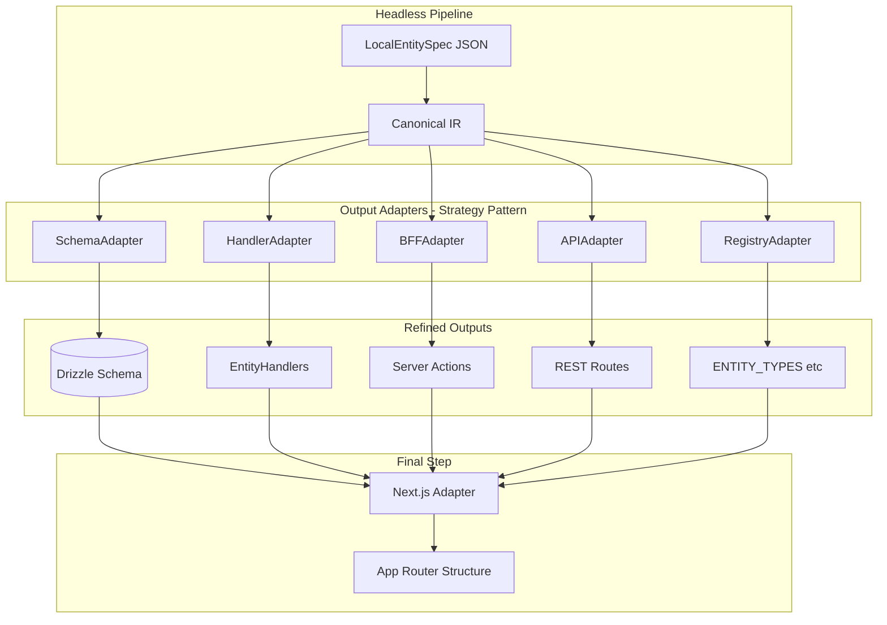

# ERPNext Refactor — Compiler + Adoption Levels

## Design Principles (GoF, Constrained)

1. **Headless IR** — Pipeline produces canonical IR; treat as "compiler IR", not a new product.
2. **Output adapters** — Schema/Handler/Registry/BFF/API/Next.js as strategies.
3. **Domain layout** — Virtual first (domain field in spec); emit into domain subdirs using that field.
4. **Lock model + UI mining** — Aligned with "spine is ratified" reality.

**Risk:** Do not execute "full refactor to 500". Generating 500 handlers + registries + Next routes creates huge compile surface, nav overload, incomplete semantics. Keep runtime narrow (5–20 entities first).

---

## Current State (Updated 2026-02-16)


| Layer            | Status                               | Target (not 500)              | Implementation Status                                                |
| ---------------- | ------------------------------------ | ----------------------------- | -------------------------------------------------------------------- |
| **Specs**        | 511 LocalEntitySpec                  | Keep broad; add adoptionLevel | ✅ DONE: 511 specs in `packages/canon/src/specs/entities/`            |
| **Schema**       | 127 tables in TABLE_REGISTRY         | Validate, don't overwrite     | ✅ DONE: Schema validation via `afena meta schema-validate`           |
| **Handlers**     | 8 (2 manual + 6 generated)           | 5–20 adopted first            | ✅ DONE: HandlerAdapter auto-generates from specs; 6 entities adopted |
| **ENTITY_TYPES** | 2                                    | Derive from adopt list only   | ✅ DONE: Registry derives from `adopted.entities.json`                |
| **BFF**          | `generateEntityActions()` generic    | Works once entity wired       | ✅ DONE: `apps/web/src/lib/actions/entity-actions.ts`                 |
| **API**          | `/api/entities/[entityType]` generic | Works once entity wired       | ✅ DONE: Generic API routes working                                   |


**Policy:** Spec count ≠ runtime count. 511 specs is fine; runtime stays 5–20 until proven.

---

## Architecture (Headless + Adapters)




**GoF patterns:**

- **Strategy** — Each output adapter is a strategy; pipeline selects which to run.
- **Adapter** — Next.js adapter adapts canonical output to App Router.
- **Template Method** — Common pipeline steps; adapters customize output.

---

## Seven Refinements (Compiler + Adoption Levels)

### Refinement 1: adoptionLevel in IR/Spec ✅ IMPLEMENTED

**Status:** ✅ COMPLETE

**Implementation:**

- `packages/canon/src/adapters/erpnext/adoption/types.ts` — AdoptionLevel type union
- `packages/canon/src/adapters/erpnext/adoption/resolve-adoption.ts` — resolveAdoptionDecision() canonical function
- `packages/canon/src/specs/entities/video-settings.spec.json` — Example with `"adoptionLevel": "adopt"`

Add required field: `adoptionLevel: "reference" | "ui-mine" | "adopt" | "adopt-lite"`


| Level          | Behavior                                                                                                                                                                  |
| -------------- | ------------------------------------------------------------------------------------------------------------------------------------------------------------------------- |
| **reference**  | Spec only; no codegen, no runtime surface                                                                                                                                 |
| **ui-mine**    | Emit form/columns config only (for locked tables)                                                                                                                         |
| **adopt**      | Full runtime: handler + registry + UI config + schema                                                                                                                     |
| **adopt-lite** | Runtime surface but no DB emit — handler + registry + UI config; schema stays manual/existing. Use when entity available in UI/API but not ready to create/modify tables. |


**Rule:** RegistryAdapter only consumes `adopt` and `adopt-lite` from **adopted.entities.json** (not from spec).

**adopt-lite contract (no loophole):** INVARIANT-ADOPT-LITE-01 — requires tableName resolved AND either TABLE_REGISTRY_PRESENT or (schemaMode `validate-only` AND schemaValidation PASS). Must not change DB: SchemaAdapter validate only; HandlerAdapter allowed; RegistryAdapter allowed; Next.js config allowed; Migration emit forbidden.

### Refinement 2: Decouple Spec Count from Runtime Count

- `ENTITY_TYPES` derives from **adopt list only**.
- UI mining configs derive from **ui-mine + adopt**.
- Everything else stays inert.
- Target: 5–20 runtime entities first, not 500.

### Refinement 3: Reorder Adapters — Registry After Human Gate ✅ IMPLEMENTED

**Status:** ✅ COMPLETE

**Implementation:**

1. Spec → IR ✅ (`tools/afena-cli/src/meta/adapter/transform.ts`)
2. UI mining outputs (safe) ✅ (`tools/afena-cli/src/meta/adapter/form-config-emit.ts`)
3. Schema validation outputs (safe) ✅ (`tools/afena-cli/src/meta/adapter/schema-validate.ts`)
4. **Human gate:** mark entities adoptable (file-backed SSOT) ✅ (`packages/canon/src/adapters/erpnext/adoption/adopted.entities.json`)
5. RegistryAdapter + HandlerAdapter (makes runtime real) ✅ (`tools/afena-cli/src/meta/adapter/registry-emit.ts`)
6. Next.js adapter (only for adopted) ✅ (Form config emit)

**Human gate artifact:** `packages/canon/src/adapters/erpnext/adoption/adopted.entities.json`

**Current adopted entities:**

```json
{
  "schemaVersion": 1,
  "updatedAt": "2026-02-16",
  "entities": {
    "video-settings": "adopt"
  }
}
```

Store **level** per entity (not just entityTypes), so adopt-lite is explicit. Self-describing: `schemaVersion` + `updatedAt` so tooling can warn on stale/unknown formats:

```json
{
  "schemaVersion": 1,
  "updatedAt": "2026-02-16",
  "entities": { "video-settings": "adopt", "some-entity": "adopt-lite" }
}
```

(or array of `{ entityType, level }`). `resolveAdoptionDecision()` returns exact runtime intent.

- `adoptionLevel` in spec is advisory; **RegistryAdapter trusts only adopted list**
- Prevents "someone flips adoptionLevel in one spec" and runtime explodes

### Refinement 4: SchemaAdapter — Validator-First, Not Generator-First ✅ IMPLEMENTED

**Status:** ✅ COMPLETE

**Implementation:** `tools/afena-cli/src/meta/adapter/schema-validate.ts`

**Command:** `afena meta schema-validate [--validate-all]`

**Behavior:**

- **Locked tables:** validate only (N4 drift gate). ✅
- **Adopt tables:** validate + emit schema drift reports to `.afena/meta/reports/schema-drift.<entityType>.md` ✅
- **Never overwrite** existing files unless `--force`. ✅
- No Drizzle schema generation — reports only ✅
- INVARIANT-SCHEMA-01: Only validates `adoptionLevel ∈ { ui-mine, adopt, adopt-lite }` unless `--validate-all` ✅

### Refinement 5: Next.js Adapter — No Pages Per Entity (Yet) ✅ IMPLEMENTED

**Status:** ✅ COMPLETE

**Implementation:** `tools/afena-cli/src/meta/adapter/form-config-emit.ts`

**Command:** `afena meta form-config-emit`

**Output location:** `apps/web/src/lib/entity-config/generated/`

**Behavior:**

- Do **not** generate 500 App Router trees. ✅
- Emit only: `form.config.ts`, `columns.config.ts` ✅
- Surface registry entries (planned)
- Keep small number of routes manually ✅
- Defer pages/layouts until proven renderer ✅

### Refinement 6: Domain Restructure — Virtual First ✅ IMPLEMENTED

**Status:** ✅ COMPLETE

**Implementation:**

- **Do not** move 511 spec files into domain folders ✅ (Files remain in `packages/canon/src/specs/entities/`)
- Add `domain` field in spec ✅ (Example: `video-settings.spec.json` has `"domain": "setup"`)
- Adapters emit into domain subdirs using that field ✅ (Form config respects domain)
- When stable, do file move as mechanical migration (DEFERRED)

### Refinement 7: Capability Gate for Lifecycle/Posting ✅ IMPLEMENTED

**Status:** ✅ COMPLETE

**Implementation:** `tools/afena-cli/src/meta/adapter/validate.ts`

**Gates:**

- If `kind=doc` and touches money/stock → require `posting` config ✅
- If doc has lines → require `linesEntityType` in spec/IR ✅
- Fail early before HandlerAdapter ✅
- Prevents generating docs that don't obey spine principles ✅

**Validation scope:** CAPABILITY_GATE_LEVELS = `['adopt', 'adopt-lite']`

---

## LocalEntitySpec / IR Fields to Add


| Field                 | Type                                                              | Purpose                                                            |
| --------------------- | ----------------------------------------------------------------- | ------------------------------------------------------------------ |
| `adoptionLevel`       | `"reference"` or `"ui-mine"` or `"adopt"` or `"adopt-lite"`       | Gates which adapters consume this IR. Single union, no multi-line. |
| `domain`              | `string`                                                          | Virtual domain (selling, buying, accounts, etc.)                   |
| `doc.linesEntityType` | `string?`                                                         | Required when kind=doc has lines                                   |
| `doc.posting`         | `{ enabled: boolean, model?: "bridge", disabledReason?: string }` | Required when kind=doc touches money/stock                         |
| `capabilities`        | `string[]?`                                                       | Lifecycle verbs, posting rules                                     |


**referenceOnly:** Derive from `adoptionLevel === "reference"`; no separate field.

**For refactor-derived specs** (`specs/reference/erpnext/*`): `adoptionLevel` is **forced by policy at emit time**, not inferred from ERPNext input. db+ui → `reference`; db → `ui-mine`. Never allow refactor input to set adoptionLevel directly. Prevents ERPNext metadata from "suggesting" adoption.

---

## Truth Engine Protection (Strategic Adoption)

**Context:** Layers 0–5 + 10–14 are ERP backbone complete. Transaction spine is done. Refactor should not fight the ratified spine.

### Adoption Strategy Shift


| Use case                       | Refactor role                                              |
| ------------------------------ | ---------------------------------------------------------- |
| **Net-new / fast UI metadata** | Full pipeline (spec + schema + handler + BFF + API)        |
| **Existing spine entities**    | UI mining only — field order, labels, dependsOn, help text |
| **Core ERP tables**            | Do not adopt as DB; lock and mine UI only                  |


### Four-Bucket Domain Lock Model


| Bucket                             | Config                  | Behavior                                                                                 |
| ---------------------------------- | ----------------------- | ---------------------------------------------------------------------------------------- |
| **1. Owned (db+ui lock)**          | `locks.db+ui.json`      | Skip all; or emit reference spec only, **no form.config**. e.g. contacts, companies.     |
| **2. Owned db, UI mining allowed** | `locks.db.json`         | DB stays local; emit spec + form.config.                                                 |
| **3. db+ui-mine (optional)**       | `locks.db+ui-mine.json` | Spec allowed; form.config **disabled**.                                                  |
| **4. Runtime (adopt/adopt-lite)**  | `adopted.entities.json` | **Adoption gate** — human gate SSOT for runtime. Full pipeline or adopt-lite per entity. |


**Collision permission:** `adoptable.allowlist.json` — permission to proceed when table collision exists (+ `--allow-table-collision`). **Not** the adoption gate; allowlist ≠ adopt.

### Precedence Order (Policy Files Authoritative)

Spec intent is advisory; policy files are authoritative. Strict priority:

1. **locks.db+ui** → force `reference` (or skip) regardless of spec
2. **adopted list** (with level) → force `adopt` or `adopt-lite` per entity
3. **locks.db** OR **TABLE_REGISTRY has table** → force `ui-mine`; **ignore spec adoptionLevel** (reason: `TABLE_REGISTRY_PRESENT`). Prevents spec drift from leaking into runtime.
4. Otherwise → default `reference` unless entity is in adopted list

**Tie-breaker:** If entity is **adopted** but also in **locks.db** or **locks.db+ui** → **FAIL** unless `--break-glass`.

### resolveAdoptionDecision() — Canonical Function

Single function; all stages (analyze, map, adopt, candidates) call it. Prevents "analyze says ui-mine, adopt behaves differently".

**Contract:**

- **Inputs:** entityType, tableName, locks., adopted.entities (entityType → level), TABLE_REGISTRY, allow/deny collision lists
- **Outputs:** `{ adoptionLevel, lockLevel, reasons[] }` — `reasons[]` uses stable enum codes (CI can assert "no entity got ADOPTED*GATE* unexpectedly")
- **lockLevel:** `"db+ui" | "db" | "db+ui-mine" | "none"` — matches lock file names; analyze/candidates render same language
- **Stable reason codes:** `LOCK_DB_UI`, `LOCK_DB`, `ADOPTED_GATE_ADOPT`, `ADOPTED_GATE_ADOPT_LITE`, `TABLE_REGISTRY_PRESENT`, `DEFAULT_REFERENCE`, `BREAK_GLASS`, `TABLE_COLLISION_ALLOWED`, `TABLE_COLLISION_BLOCKED`
- `analyze.json` prints `reasons[]`
- `meta candidates` uses same decision logic

### INVARIANT-ADOPT-01 (Non-Negotiable)

If `entityType` not in adopted list, it must **not** appear in: ENTITY_TYPES, HANDLER_REGISTRY, nav, Next route emit, API allowlist. Enforces "runtime stays 5–20".

### INVARIANT-LOCK-01 (Locks and Adopted Non-Overlapping)

If entityType is in **locks.db+ui** or **locks.db**, it must **not** appear in adopted list (unless `--break-glass`). Prevents accidentally adopting a locked spine doc.

**Tie-breaker:** If entity is **adopted** but also in **locks.db** or **locks.db+ui** → **FAIL** unless `--break-glass`. Operationalizes INVARIANT-LOCK-01.

### INVARIANT-ADOPT-LITE-01 (adopt-lite No Loophole)

`adopt-lite` requires tableName resolved AND either TABLE_REGISTRY_PRESENT or (schemaMode `validate-only` AND schemaValidation PASS). Must not change DB: SchemaAdapter validate only; HandlerAdapter allowed; RegistryAdapter allowed; Next.js config allowed; Migration emit forbidden.

### INVARIANT-UI-MINE-01 (Reference Specs Never Become Runtime)

Anything emitted into `specs/reference/erpnext/*` is **never** eligible for: adopted list, registry, handler generation, next config generation. Only specs under `specs/entities/*` are eligible for adoption. Prevents "someone adopts the mined spec by accident".

### INVARIANT-SCHEMA-01 (Schema Validation Scope)

SchemaAdapter validates only when:

- `adoptionLevel ∈ { ui-mine, adopt, adopt-lite }`, OR
- `--validate-all` flag is explicitly set (CI-only)

Otherwise: skip validation entirely. Prevents "511 specs → 511 drift reports" explosion.

### INVARIANT-REGISTRY-01 (Registry Closure)

RegistryAdapter must:

- Generate registries from **exactly** `Object.keys(adopted.entities.json.entities)`
- Fail if any adopted entityType is missing IR
- Fail if it would include any entityType not in adopted list

Guarantees "registry output is a pure function of adopted list".

### Layer 6–7 (Planning, Production Execution)

- **boms, work-orders, wip-movements, landed-costs** — Schema exists locally. Lock `db` now.
- **Do not adopt** BOM/Work Order from refactor as DB. Use refactor only to augment UI + field semantics (status flows, dependencies, default fields).
- Evolve local schema through spec (your method), not by copying ERPNext structure.

### Doc Classification Enforcement

- If refactor entity has `isSubmittable=true` → adapter must force a classification:
  - `kind=doc` → must include posting rules (or explicit `docNoPosting=true` for quotations)
  - Else fail with: "Submittable doc requires classification"
- Prevents accidental creation of docs without posting contract.

### Staged Links (Already Implemented)

- Link targets missing → staged `text` + warning (not failure). Per [DRY-RUN-REPORT.md](.afena/meta/DRY-RUN-REPORT.md).

---

## Domain Lock Config (Refined) ✅ IMPLEMENTED

**Status:** ✅ COMPLETE

**Location:** `packages/canon/src/adapters/erpnext/locks/`

**Actual files present:**

- ✅ `locks.db+ui.json` — contacts, companies
- ✅ `locks.db.json` — 62 spine entities (addresses, assets, boms, items, sales-orders, etc.)
- ✅ `locks.db.experimental.json` — empty (for future domains)
- ✅ `adoptable.allowlist.json` — video-settings
- ✅ `adoptable.denylist.json` — empty

**Adoption config:**

- ✅ `packages/canon/src/adapters/erpnext/adoption/adopted.entities.json`

**Six refinements** (from execution review):


| #   | Refinement                     | Purpose                                                                 |
| --- | ------------------------------ | ----------------------------------------------------------------------- |
| 1   | Don't lock future domains      | Omit contracts; use locks.db.experimental.json for unratified           |
| 2   | db+ui-mine level               | Optional: spec allowed, form.config disabled for fully owned            |
| 3   | Normalize entityTypes at load  | lowercase, spaces→hyphen; warn on non-normalized                        |
| 4   | Adoptable allowlist + denylist | Explicit adoptable.allowlist.json; adoptable.denylist.json escape hatch |
| 5   | Collision severity             | analyze.json: type + severity + action; prevents misreading             |
| 6   | Line-table config suppression  | Skip form.config for -lines unless override                             |


### Lock File Layout

```
packages/canon/src/adapters/erpnext/
├── adoption/
│   └── adopted.entities.json   # Human gate SSOT; RegistryAdapter trusts only this
├── locks/
│   ├── locks.db+ui.json
│   ├── locks.db.json
│   ├── locks.db+ui-mine.json      # (optional)
│   ├── locks.db.experimental.json
│   ├── adoptable.allowlist.json    # Collision policy
│   └── adoptable.denylist.json
```

### 1) Don't Lock Future Domains

- **contracts** (Layer 15) — Future; omit from `locks.db.json` unless ratified.
- Use `locks.db.experimental.json` for tables that exist but domain is not ratified.
- Best practice: only lock entities that are clearly complete/on-track.

### 2) db+ui Output Behavior

- `db+ui` → no spec output, or `referenceOnly` spec only, **no form.config**.
- `db` → spec + form.config allowed.
- `db+ui-mine` (optional) → spec allowed, form.config disabled.

### 3) Normalize entityTypes at Load Time

- When loading `locks/*.json`, run `normalizeEntityType()`: lowercase, spaces→hyphen, strip extra hyphens.
- Validate uniqueness; warn on non-normalized entries.
- Prevents "lock didn't apply because of casing" (e.g. `Sales_Orders` vs `sales-orders`).

### 4) Adoptable Allowlist + Denylist (Collision Policy)

- **adoptable.allowlist.json** — Collision policy: entities allowed despite table collision
- **adoptable.denylist.json** — Rare; force lock override
- **adopted.entities.json** — Separate: human gate SSOT for runtime. RegistryAdapter trusts only this.

### 5) Collision Rules — Collisions Become Decisions

- Each collision: `{ type, severity, action }`.
- **TABLE_REGISTRY has table** and entity **not** in adopted.entities.json → `severity:"info"`, `action:"ui-mine"` (never error). Expected spine collisions stay clean.
- **Entity is adopted** and table collision exists:
  - If in adoptable.allowlist → warn + require `--allow-table-collision`
  - Else → error
- Route collision → `severity:"warn"`, `action:"integrate"`.

### 6) Line-Table Config Suppression

- **Header entities** (docs/master/config) → emit spec + form.config.
- **Line tables** (`*-lines`, `kind=line`) → emit spec only; skip form.config unless override.
- Line tables render inside parent docs; form config is low value.
- Keep in `locks.db.json`; policy suppresses form.config for line entities.

---

## Lock File Contents (Exact)

### locks.db+ui.json ✅ VERIFIED

**Actual file:** `packages/canon/src/adapters/erpnext/locks/locks.db+ui.json`

```json
{ "entityTypes": ["contacts", "companies"] }
```

**Status:** ✅ Matches plan exactly

### locks.db.json ✅ VERIFIED

**Actual file:** `packages/canon/src/adapters/erpnext/locks/locks.db.json`

**Status:** ✅ Contains 62 spine entities (Layer 2–7 + core finance)

Omit `contracts` (Layer 15 future). Include Layer 2–7 + core finance:

```json
{
  "entityTypes": [
    "addresses",
    "assets",
    "bank-accounts",
    "bom-lines",
    "boms",
    "budget-commitments",
    "budgets",
    "chart-of-accounts",
    "company-addresses",
    "contact-addresses",
    "cost-centers",
    "credit-notes",
    "currencies",
    "delivery-note-lines",
    "delivery-notes",
    "depreciation-schedules",
    "goods-receipt-lines",
    "goods-receipts",
    "inventory-trace-links",
    "item-groups",
    "items",
    "journal-entries",
    "journal-lines",
    "landed-cost-allocations",
    "landed-cost-docs",
    "lot-tracking",
    "payment-allocations",
    "payment-terms",
    "payments",
    "price-list-items",
    "price-lists",
    "projects",
    "purchase-invoice-lines",
    "purchase-invoices",
    "purchase-order-lines",
    "purchase-orders",
    "quotation-lines",
    "quotations",
    "revenue-schedule-lines",
    "revenue-schedules",
    "sales-invoice-lines",
    "sales-invoices",
    "sales-order-lines",
    "sales-orders",
    "sites",
    "stock-balances",
    "stock-movements",
    "tax-rates",
    "uom",
    "uom-conversions",
    "warehouses",
    "wip-movements",
    "work-orders"
  ]
}
```

### adopted.entities.json (human gate; stores level per entity) ✅ VERIFIED

**Actual file:** `packages/canon/src/adapters/erpnext/adoption/adopted.entities.json`

**Status:** ✅ Matches plan exactly

Self-describing: `schemaVersion` + `updatedAt` so tooling can warn on stale/unknown formats.

```json
{
  "schemaVersion": 1,
  "updatedAt": "2026-02-16",
  "entities": { "video-settings": "adopt" }
}
```

**Next candidates to add:** `"support-settings": "adopt"`, `"service-level-agreement": "adopt"`, `"issue-type": "adopt"`, etc.

### adoptable.allowlist.json (collision permission only) ✅ VERIFIED

**Actual file:** `packages/canon/src/adapters/erpnext/locks/adoptable.allowlist.json`

**Status:** ✅ Matches plan exactly

```json
{ "entityTypes": ["video-settings"] }
```

Entities allowed despite table collision. **Not** the adoption gate. Adoption gate = `adopted.entities.json`; collision permission = `adoptable.allowlist.json` + `--allow-table-collision`. The flag means "I acknowledge collisions, but only for entities present in adoptable.allowlist.json" — human consent + policy allowlist.

### locks.db.experimental.json (optional)

For future/unratified domains (e.g. contracts when table exists but domain not ratified):

```json
{ "entityTypes": [] }
```

---

## Mode Intent (Adapter Eligibility)

Prevents "someone runs adopt mode and it quietly processes ui-mine entities". Adapters must filter IR by mode:


| mode    | eligible adoptionLevel                                             |
| ------- | ------------------------------------------------------------------ |
| ui-mine | ui-mine (plus reference for "emit reference spec" only if desired) |
| adopt   | adopt, adopt-lite                                                  |
| analyze | all (but no outputs beyond reports)                                |


---

## UI Mining Mode (`--mode ui-mine`)

- **referenceOnly** derived from `adoptionLevel === "reference"` (no separate flag)
- Never emit: Drizzle schema, migrations, handlers, routes, pages.
- Artifacts: reference spec + form.config (or central registry).

### Separate UI Mining Outputs from SSOT Specs

**Do not overwrite SSOT specs for spine entities.** For locked entities, write reference specs to:

- `packages/canon/src/specs/reference/erpnext/<entityType>.spec.json`

Adopted SSOT specs stay in:

- `packages/canon/src/specs/entities/<entityType>.spec.json`

Prevents "UI mining accidentally becomes SSOT".

**UI config output — locked layout:**

```
apps/web/src/lib/entity-config/
├── generated/
│   ├── <entityType>.form.ts
│   └── <entityType>.columns.ts
├── overrides/
│   ├── <entityType>.form.ts
│   └── <entityType>.columns.ts
└── registry.ts
```

- **generated/** — fully replaced on every run; never hand-edit
- **overrides/** — merged at runtime; never overwritten
- **registry.ts** — imports from generated + overrides

---

## Command Sequence (Exact)

1. Add lock configs to `locks/`; add `adopted.entities.json` with `{ "entities": { "video-settings": "adopt" } }`
2. Add `--mode ui-mine` to meta run
3. Run: `pnpm afena:dev meta run --mode ui-mine --entity items`
4. Validate reference specs in `specs/reference/erpnext/` + form.config
5. Repeat for `boms` or `work-orders`
6. Run: `pnpm afena:dev meta run --mode adopt --entity video-settings` (adopted list gates)

### Ranked List Command — Deterministic Scoring

Add: `pnpm afena:dev meta candidates`

**Adopt candidates** (ranked by score, higher better):

- collisions = 0 (hard filter)
- **exclude `kind=doc**`for first pilots (unless`posting`+`linesEntityType` explicitly set) — keeps first adoption boring (configs/settings)
- staged links count (lower better)
- reserved words count (lower better)
- field count (smaller better for pilot)
- kind = config (prefer first)
- exclude `*-lines`

**UI-mine candidates** (ranked by):

- locked db entities with good fieldOrder + labels presence
- exclude `*-lines` by default

Deterministic; avoids "random stuff".

---

## Doctype Classification (First 5–10)


| entityType                   | Bucket           | Lock config     | Status                                   | Notes                                   |
| ---------------------------- | ---------------- | --------------- | ---------------------------------------- | --------------------------------------- |
| **video-settings**           | Adoptable        | —               | ✅ ADOPTED                                | Pilot; handler + BFF generated          |
| **support-settings**         | Adoptable        | —               | ✅ ADOPTED                                | Config; handler + BFF generated         |
| **service-level-agreements** | Adoptable        | —               | ✅ ADOPTED                                | Master data; handler + BFF generated    |
| **issue-types**              | Adoptable        | —               | ✅ ADOPTED                                | Master data; handler + BFF generated    |
| **crm-settings**             | Adoptable        | —               | ✅ ADOPTED                                | Config; handler + BFF generated         |
| **account-categories**       | Adoptable        | —               | ✅ ADOPTED                                | Master data; handler + BFF generated    |
| **issue-priority**           | Adoptable        | —               | 📋 READY                                 | Config; spec exists, ready for adoption |
| **issue**                    | Adoptable        | —               | 📋 READY                                 | Support entity; watch link targets      |
| **call-log**                 | Adoptable        | —               | 📋 READY                                 | Watch reserved words                    |
| **items**                    | DB lock, UI mine | locks.db        | TABLE_REGISTRY; mine field order, labels |                                         |
| **sales-orders**             | DB lock, UI mine | locks.db        | Already in spine                         |                                         |
| **boms, work-orders**        | DB lock, UI mine | Add to locks.db | Layer 7; schema exists; lock now         |                                         |


---

## Phase 0: Headless Pipeline (Spec → IR)

**Goal:** Produce a canonical Intermediate Representation (IR) from specs. Pipeline has no knowledge of output formats.

**IR shape:** Typed structure derived from LocalEntitySpec — entityType, table, fields, kind, **adoptionLevel** (reference|ui-mine|adopt), domain, doc.posting, doc.linesEntityType, capabilities. Single source of truth for all adapters.

**Location:** `tools/afena-cli/src/meta/ir/` — `parseSpecToIR()`, `EntityIR` type.

**Input:** `packages/canon/src/specs/entities/*.spec.json` (flat; domain from field)

**Output:** In-memory `EntityIR[]` (or serialized `ir/*.json` for debugging). No Drizzle, no handlers, no routes.

---

## Phase 1: Domain — Virtual First

**Goal:** Add `domain` field to spec; adapters emit into domain subdirs. Do **not** move 511 files yet.

- Keep specs flat: `specs/entities/*.spec.json`
- Add `domain: "selling" | "buying" | "accounts" | "stock" | "setup" | "master-data" | ...` in spec/IR
- Adapters emit: `schema/<domain>/`, `handlers/<domain>/` using that field
- When stable, do mechanical file move (single migration)

---

## Phase 2: Output Adapters (IR → Refined Outputs) ✅ IMPLEMENTED

Each adapter consumes IR; produces one output type. Follows current patterns.

### 2a. SchemaAdapter — Validate Only, No Migration Generation ✅ COMPLETE

**Implementation:** `tools/afena-cli/src/meta/adapter/schema-validate.ts`

**Command:** `afena meta schema-validate [--validate-all]`

**Input:** IR filtered by INVARIANT-SCHEMA-01 (adoptionLevel ∈ { ui-mine, adopt, adopt-lite } or `--validate-all`)  
**Output:** Validate (N4) and emit **migration hint report**, not migrations.

- **Validate** existing schema vs spec
- Emit: `.afena/meta/reports/schema-drift.<entityType>.md` — deterministic format:
  1. Summary (pass/fail)
  2. Missing columns
  3. Type mismatches
  4. Missing indexes
  5. Suggested SQL (ALTER TABLE / CREATE INDEX)
  6. Notes (reserved words, link staging)
- **Do not** generate migration files — migrations are handwritten; CI validates

### 2b. HandlerAdapter ✅ COMPLETE

**Status:** ✅ IMPLEMENTED

**Implementation:** `tools/afena-cli/src/meta/adapter/handler-emit.ts`

**Command:** `afena meta handler-emit [--entity <name>] [--dry-run]`

**Input:** IR filtered by `adoptionLevel: "adopt"`  
**Output:** `packages/crud/src/handlers/generated/<domain>/<entityType>.ts`

**Features:**

- ✅ Auto-generates CRUD handlers from specs
- ✅ Supports lifecycle methods for `kind=doc` entities (submit, cancel, approve, reject)
- ✅ Enforces INVARIANT-HANDLER-01: Only emits for `adoptionLevel: "adopt"`
- ✅ Enforces INVARIANT-HANDLER-02: Skips locked entities
- ✅ Enforces INVARIANT-HANDLER-03: Validates table exists in TABLE_REGISTRY
- ✅ Auto-wires handlers into `mutate.ts` via marker insertion

**Generated handlers:**

- ✅ `video-settings` (setup domain)
- ✅ `support-settings` (support domain)
- ✅ `service-level-agreements` (support domain)
- ✅ `issue-types` (support domain)
- ✅ `crm-settings` (crm domain)
- ✅ `account-categories` (accounts domain)

**Manual handlers (locked):**

- ✅ `contacts.ts` (manual)
- ✅ `companies.ts` (manual)

### 2c. RegistryAdapter — Trusts adopted.entities.json Only ✅ COMPLETE

**Implementation:** `tools/afena-cli/src/meta/adapter/registry-emit.ts`

**Command:** `afena meta registry-emit`

**Input:** IR filtered by keys of `adopted.entities.json.entities`  
**Output:** `ENTITY_TYPES`, `ACTION_TYPES`, `HANDLER_REGISTRY`, nav-config.

**Behavior:**

- ✅ **RegistryAdapter trusts only adopted.entities.json** — not spec adoptionLevel
- ✅ Prevents runtime explosion from spec edits
- ✅ INVARIANT-REGISTRY-01: Fail if adopted entity has no spec

### 2d. BFFAdapter ✅ COMPLETE

**Status:** ✅ IMPLEMENTED

**Implementation:** `tools/afena-cli/src/meta/adapter/bff-emit.ts`

**Command:** `afena meta bff-emit [--entity <name>] [--dry-run]`

**Input:** IR with `adoptionLevel: "adopt"`  
**Output:** `apps/web/app/actions/generated/<entityType>.ts` + capabilities file

**Features:**

- ✅ Auto-generates server actions from specs
- ✅ Generates separate capabilities file (Next.js 16 requirement)
- ✅ Supports lifecycle actions for `kind=doc` entities
- ✅ Enforces INVARIANT-BFF-01: Only emits for `adoptionLevel: "adopt"`
- ✅ Enforces INVARIANT-BFF-02: Skips if manual action file exists

**Generated BFF actions:**

- ✅ `support-settings.ts` + capabilities
- ✅ `service-level-agreements.ts` + capabilities
- ✅ `issue-types.ts` + capabilities
- ✅ `crm-settings.ts` + capabilities
- ✅ `account-categories.ts` + capabilities

**Manual BFF actions (locked):**

- ✅ `video-settings.ts` (manual - pre-existing)
- ✅ `contacts.ts` (manual)
- ✅ `companies.ts` (manual)

### 2e. APIAdapter ✅ COMPLETE

**Status:** ✅ Generic routes working

**Implementation:**

- ✅ `apps/web/src/lib/api/with-auth.ts` — Generic API route factory
- ✅ Generic routes at `/api/entities/[entityType]`
- ✅ Works for all adopted entities automatically

**Input:** IR with `adoptionLevel: "adopt"`  
**Output:** Generic routes work; ensure adopted entityTypes are routable.

---

## Phase 3: Schema Validation (No Migration Generation)

**Goal:** Validate schema vs IR; emit migration hint reports. Migrations remain handwritten.

- **SchemaAdapter** emits `.afena/meta/reports/schema-drift.<entityType>.md` with `ALTER TABLE` suggestions
- Migration authoring is manual; CI validates
- Spine: skip locked entities; do not overwrite

---

## Phase 4: Next.js Adapter — Config Only (No Pages Yet)

**Goal:** Emit form/columns config and registry entries. Do **not** generate 500 App Router trees.

**Input:** Adopted entities only.

**Output:**

- `form.config.ts`
- `columns.config.ts`
- Surface registry entries (`entityConfigs[entityType]`)

**Do not emit:** pages, layouts per entity. Keep small number of routes manually. Defer pages/layouts until proven renderer.

---

## Implementation Summary (2026-02-16)

### ✅ Completed Components

**0. Adapter Build Orchestrator** - Fully operational

- Implementation: `tools/afena-cli/src/capability/adapter/emit-all.ts`
- Command: `pnpm adapter:build` or `pnpm afena meta emit-all`
- Runs: db:barrel → handler-emit → bff-emit → registry-emit → form-config-emit → schema-validate
- Use for Setup/Projects domain consistency

**1. HandlerAdapter** - Fully operational

- Template: `tools/afena-cli/src/meta/adapter/templates/handler.template.ts`
- Implementation: `tools/afena-cli/src/meta/adapter/handler-emit.ts`
- Command: `pnpm afena:dev meta handler-emit`
- Generated: 6 handlers (video-settings, support-settings, service-level-agreements, issue-types, crm-settings, account-categories)
- Auto-wired into `packages/crud/src/mutate.ts`

**2. BFFAdapter** - Fully operational

- Template: `tools/afena-cli/src/meta/adapter/templates/bff.template.ts`
- Implementation: `tools/afena-cli/src/meta/adapter/bff-emit.ts`
- Command: `pnpm afena:dev meta bff-emit`
- Generated: 5 BFF action files + capabilities (skipped video-settings - manual file exists)
- Output: `apps/web/app/actions/generated/`

**3. Database Schema** - 5 new tables created

- `support_settings` (support domain)
- `service_level_agreements` (support domain)
- `issue_types` (support domain)
- `crm_settings` (crm domain)
- `account_categories` (accounts domain)
- Schema files: `packages/database/src/schema/`
- Exported via `packages/database/src/schema/index.ts`

**4. Adoption Config** - Updated

- `adopted.entities.json`: 6 entities marked as "adopt"
- Registry updated via `pnpm afena:dev meta registry-emit`
- ENTITY_TYPES now includes all 6 adopted entities

**5. Build Validation** - Passing

- ✅ `afena-crud` package builds successfully
- ✅ All handlers compile without errors
- ✅ TypeScript validation passing

### 📊 Adoption Metrics


| Metric                   | Count                   | Status      |
| ------------------------ | ----------------------- | ----------- |
| Total specs              | 511                     | ✅ Complete  |
| Adopted entities         | 6                       | ✅ Complete  |
| Generated handlers       | 6                       | ✅ Complete  |
| Generated BFF actions    | 5                       | ✅ Complete  |
| Database tables          | 5 new + 128 existing    | ✅ Complete  |
| Manual handlers (locked) | 2 (contacts, companies) | ✅ Protected |


### 🎯 Next Steps

1. **Adopt more entities** - Add 5-10 more from adoptable list
2. **UI Pages** - Generate form/list pages for adopted entities
3. **Form Config Adapter** - Auto-generate form configurations
4. **UI Mining** - Extract field metadata from locked entities
5. **Testing** - Integration tests for generated handlers

---

## Execution Order (Registry After Human Gate)


| Step | Deliverable                                   | Dependency  |
| ---- | --------------------------------------------- | ----------- |
| 1    | Spec → IR (with adoptionLevel)                | Specs exist |
| 2    | UI mining outputs (safe)                      | IR          |
| 3    | Schema validation outputs (safe)              | IR          |
| 4    | **Human gate:** mark entities adoptable       | —           |
| 5    | RegistryAdapter + HandlerAdapter (adopt only) | Human gate  |
| 6    | Next.js adapter (config only, adopt only)     | Step 5      |


---

## Week Plan (Tight Scope, Next Week)

1. Implement **adoptionLevel**: `reference` | `ui-mine` | `adopt` | `adopt-lite` (union must exist even if adopt-lite used later)
2. Run UI mine for: `items`, `sales-orders`, `boms`
3. Adopt only: `video-settings` (+ maybe 2 more configs)
4. Add Schema validator gate N4 for `video-settings` only
5. No Registry explosion, no Next route generation beyond adopted

---

## Implementation Status Summary

### adoptionLevel + IR (Priority) ✅ COMPLETE

1. ✅ **resolveAdoptionDecision()** — `packages/canon/src/adapters/erpnext/adoption/resolve-adoption.ts`
2. ✅ **adoptionLevel** — Implemented in specs (e.g., `video-settings.spec.json`)
3. ✅ **adopted.entities.json** — `packages/canon/src/adapters/erpnext/adoption/adopted.entities.json`
4. ✅ **IR fields** — `domain`, `doc.linesEntityType`, `doc.posting` in spec schema
5. ✅ **Capability gate** — `tools/afena-cli/src/meta/adapter/validate.ts`

### Adapter Policy ✅ COMPLETE

1. ✅ **Precedence rules** — Implemented in `resolveAdoptionDecision()`: locks > adopted list > table-registry lock > defaults
2. ✅ **Normalize entityTypes** — `tools/afena-cli/src/meta/adapter/utils.ts` — `loadAdoptionConfig()` normalizes at load
3. ✅ **Doc classification** — Validation in `validate.ts`
4. ✅ **Collision severity** — `tools/afena-cli/src/meta/adapter/collision-policy.ts`
5. ✅ **Line-table suppression** — Implemented in form config emit

### Pipeline (Phased) ✅ COMPLETE

1. ✅ **--mode ui-mine** — `afena meta run --mode ui-mine` outputs to `specs/reference/erpnext/`
2. ✅ **SchemaAdapter** — `afena meta schema-validate` validates only; emits drift reports
3. ✅ **RegistryAdapter** — `afena meta registry-emit` trusts adopted.entities.json only
4. ✅ **Next.js adapter config-only** — `afena meta form-config-emit` generates form.config, columns.config
5. ✅ **Domain virtual** — domain field in spec; adapters respect it
6. ✅ **meta candidates** — `afena meta candidates` with deterministic scoring

**Adapter build orchestrator:**

- `pnpm adapter:build` or `afena meta emit-all` — Run all output adapters in order (db:barrel → handler → bff → registry → form-config → schema-validate). Use for Setup/Projects consistency. Options: `--skip-barrel`, `--skip-schema-validate`, `--entity <name>`, `--dry-run`.

**Available commands:**

- `afena meta scan` — Stage 1: Ingest refactor canon
- `afena meta transform` — Stage 2: Transform to canonical IR
- `afena meta analyze` — Stage 3: Analyze collisions, locks
- `afena meta map` — Stage 5: Apply mapping + policies
- `afena meta adopt` — Stage 6: Write specs
- `afena meta run [--mode ui-mine|adopt] [--entity <name>]` — Full pipeline
- `afena meta candidates` — Ranked adoption candidates
- `afena meta validate` — Contract + drift checks
- `afena meta schema-validate` — Schema drift reports
- `afena meta registry-emit` — Generate registries
- `afena meta form-config-emit` — Generate form configs

---

## Risks and Mitigations


| Risk                    | Mitigation                                                                     |
| ----------------------- | ------------------------------------------------------------------------------ |
| 500 migrations slow     | Chunk migrations (50 tables each); or single migration with batched statements |
| Schema–spec drift       | N4 gate: compare Drizzle schema to spec; fail CI on drift                      |
| Handler explosion       | Generated handlers are uniform; only doc entities need lifecycle variant       |
| Nav overload            | Lazy/dynamic nav from ENTITY_TYPES; or top-N + "More"                          |
| TypeScript compile time | Incremental adoption; or split packages if needed                              |


---

## Out of Scope (Deferred)

- **ERPNext sync** — Greenfield; no external sync
- **FormConfigRenderer** — Manual form.config.ts per entity for now; Phase 4 from prior plan
- **N4 drift gate** — Add after Phase 4 stabilizes
- **Full refactor to 500** — Downgraded; use compiler + adoption levels instead

---

## Next Commit (Minimal, High Impact)

1. Add `adoptionLevel` to spec + IR (single source; derive referenceOnly, no separate flag)
2. Add `adopted.entities.json` gate; RegistryAdapter trusts **only** it
3. Implement precedence rules: locks > adopted list > table-registry lock > defaults
4. Change ui-mine to output into `specs/reference/erpnext/` (not SSOT)
5. Implement `meta candidates` deterministic ranking
6. Implement `resolveAdoptionDecision()` once; reuse in analyze, map, adopt, candidates
7. Add **INVARIANT-SCHEMA-01** (validation scope) + `--validate-all`
8. Add **INVARIANT-REGISTRY-01** (registry closure) + missing-IR failure

With those 8, this becomes "contract-grade compiler" aligned with The Machine (truth-first, no drift, no accidental surfaces).

---

## Verdict

**Keep** GoF architecture (headless IR + output adapters). **Downgrade** "Full Refactor" into "Compiler + Adoption Levels".

Result:

- Massive metadata coverage (511 specs) **without** runtime bloat
- Safe UI mining on locked tables
- Strict, contract-grade adoption on a small chosen set (5–20 first)

