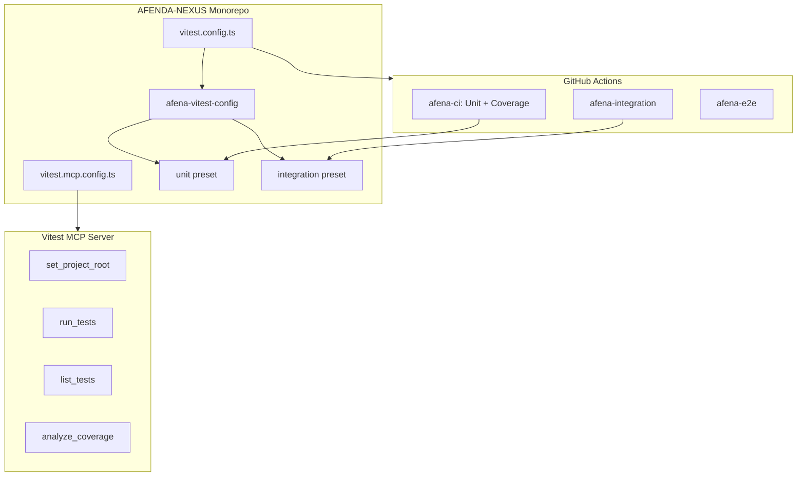

# Vitest Best Practices Configuration Plan

**Ratification-grade** plan for AFENDA-NEXUS (monorepo + tiered presets). Refined with [Vitest official docs](https://vitest.dev/guide/) and vitest-mcp.

**Gotchas called out**: `configDefaults.exclude` (prevents surprise discovery); explicit `github-actions` when customising reporters; no `test.dir` (projects provide scoping); MCP merge from start (avoid drift). **Critical trap**: In projects mode, root config does not behave as a project — `pool`, `setupFiles`, `exclude`, etc. in root won't affect workspace projects; put them in presets.

**Factual clarifications**:
- **github-actions reporter**: Auto-enabled only with default reporter; once you add `junit`, you must add `github-actions` explicitly. ([vitest.dev/reporters](https://vitest.dev/guide/reporters))
- **Coverage provider**: Vitest defaults to `v8`; keep it explicit for clarity, not "switch to." ([vitest.dev/coverage](https://vitest.dev/guide/coverage))
- **Node version**: vitest-mcp supports Node 18+; Vitest itself requires ^20. For AFENDA-NEXUS CI matrix use **Node 20 + 22** (skip 18). ([vitest-dev/vitest package.json](https://github.com/vitest-dev/vitest/blob/main/package.json))

**Advice summary**:
- Keep: `configDefaults.exclude`, explicit `github-actions` when customising reporters
- MCP: Start with merge (Option B); minimal overrides to reduce drift
- Avoid: `test.dir` globally unless discovery is measured bottleneck

---

## 1. Repository Validation Summary

### laurigates/claude-plugins

- **Purpose**: Collection of 31 Claude Code plugins (285+ skills, 14 agents) for development workflows
- **Relevant plugins**:
  - **testing-plugin** (15 skills): Test execution, TDD workflow, Vitest patterns, tiered execution (unit &lt; 30s, integration &lt; 5min, E2E &lt; 30min)
  - **configure-plugin** (42 skills): `configure-tests`, `configure-coverage`, `configure-integration-tests`, CI/CD standards
  - **github-actions-plugin** (8 skills): Workflow design, auth, MCP config, inspection, flaky test identification
- **Validation**: Production-ready, MIT license, modular skill-based architecture

### djankies/vitest-mcp

- **Purpose**: MCP server for Vitest with LLM-optimized output, safety guards, and coverage analysis
- **Key features**: `set_project_root`, `run_tests`, `list_tests`, `analyze_coverage`; monorepo support; `vitest.mcp.config.ts`; safety guards (no full runs, no watch mode)
- **Requirements**: Node 18+ (MCP server itself), Vitest 0.34+, `@vitest/coverage-v8` — [GitHub](https://github.com/djankies/vitest-mcp)
- **Validation**: Production-ready, MIT license, CI badge

### vitest-dev/vitest (official)

- **Source**: [github.com/vitest-dev/vitest](https://github.com/vitest-dev/vitest)
- **Node**: ^20.0.0 || ^22.0.0 || >=24.0.0 ([package.json](https://github.com/vitest-dev/vitest/blob/main/package.json))
- **Monorepo**: pnpm workspaces, 15+ packages
- **CI**: `CI=true` for test runs; matrix (node 20, 22, 24; ubuntu, macos, windows); concurrency + cancel-in-progress; pnpm cache; `fail-fast: false`
- **Projects example**: Minimal root config `projects: ['packages/*']` ([examples/projects](https://github.com/vitest-dev/vitest/tree/main/examples/projects))

---

## 2. Current AFENDA-NEXUS Vitest Setup


| Component           | Location                                             | Status                                                |
| ------------------- | ---------------------------------------------------- | ----------------------------------------------------- |
| Root config         | [vitest.config.ts](vitest.config.ts)                 | Projects, coverage, junit, setup                      |
| Presets             | `packages/vitest-config/presets/`                    | unit (threads, 5s), integration (forks, 30s)          |
| Per-package configs | `packages/*/vitest.config.ts`, `tools/afena-cli`     | Merge with unit/integration preset                    |
| Setup               | [vitest.setup.ts](vitest.setup.ts)                   | Loads `apps/web/.env`                                 |
| CI                  | [.github/workflows/ci.yml](.github/workflows/ci.yml) | Unit, integration (conditional), E2E, coverage upload |


**Strengths**: Tiered presets, monorepo projects, coverage thresholds (70%), JUnit reporter, env loading.

**Gaps**: No `configDefaults` for exclude (risk of surprise test discovery); no explicit `github-actions` reporter (required once you add `junit`). Per-package configs correctly use `defineProject` + `mergeConfig` with presets. No CI concurrency (official Vitest uses cancel-in-progress).

---

## 3. Best Practices from Vitest Official Docs

### Config and Projects ([vitest.dev/config](https://vitest.dev/config/), [vitest.dev/guide/projects](https://vitest.dev/guide/projects))

- **configDefaults**: Use `exclude: [...configDefaults.exclude, 'custom-pattern']` to extend Vitest defaults instead of replacing them
- **Root vs project config**: `reporters`, `coverage`, `resolveSnapshotPath` are root-only; projects do not inherit from root unless `extends: true` or shared config + `mergeConfig`
- **defineProject**: Use `defineProject` (not `defineConfig`) in project configs for type safety; `reporters` in a project config will error
- **Project names**: Must be unique; default to `package.json` name or folder name when using globs
- **Negation patterns**: `projects: ['packages/*', '!packages/excluded']` to exclude folders

### Performance ([vitest.dev/guide/improving-performance](https://vitest.dev/guide/improving-performance))

- **pool**: `threads` is faster than `forks`; use `forks` only when needed (native modules, segfaults, hanging processes)
- **isolate**: Set `isolate: false` for pure unit tests (node env) to speed up; keep `true` when tests have side effects
- **fileParallelism**: `fileParallelism: false` reduces startup time if parallelism overhead is high
- **test.dir**: Avoid globally unless discovery is measured bottleneck; projects already provide scoping
- **Sharding**: Use `--reporter=blob --shard=1/n` + `--merge-reports` for large suites across multiple CI runners

### Coverage ([vitest.dev/guide/coverage](https://vitest.dev/guide/coverage))

- **V8 provider**: Vitest defaults to `v8`; keep it explicit for clarity (faster, lower memory; since v3.2 AST-based remapping matches Istanbul accuracy)
- **coverage.include**: Explicitly list source patterns (e.g. `packages/*/src/**`, `tools/*/src/**`) to include uncovered files in report
- **coverage.exclude**: Exclude test utilities, mocks, config, build helpers
- **Vitest UI**: Add `html` to `coverage.reporter` for interactive coverage in Vitest UI

### Reporters ([vitest.dev/guide/reporters](https://vitest.dev/guide/reporters))

- **github-actions**: Auto-enabled with `default` when `GITHUB_ACTIONS === 'true'`; add explicitly if using non-default reporters in CI
- **outputFile**: Use `outputFile: { junit: './test-results/junit.xml', json: './json-report.json' }` for multiple reporters
- **Blob reporter**: Required for `--merge-reports` after sharded runs

---

## 4. Best Practices from External Sources

### From vitest-mcp

- Use `vitest.mcp.config.ts` for MCP-specific settings (JSON reporter, coverage dir) so AI tools get structured output without changing dev workflow
- For monorepos: `set_project_root` once, then `run_tests({ target: "./packages/crud" })` with optional `project` param
- Coverage thresholds in config (not MCP params); `analyze_coverage` reports gaps
- Exclude: `**/node_modules/**`, `**/dist/**`, `**/coverage/**`, `**/*.config.*`

### From claude-plugins (testing-plugin)

- Tiered execution: unit (quick), integration (full), E2E (pre-commit)
- TDD: RED → GREEN → REFACTOR
- `/test:quick` for fast feedback; `/test:full --coverage` for full suite

### From claude-plugins (configure-plugin)

- `configure-tests`, `configure-coverage`, `configure-integration-tests` for standards
- CI/CD integration with coverage thresholds

### From vitest-mcp CI

- `npm ci` / `pnpm install --frozen-lockfile` for reproducible builds
- Coverage artifact upload

### From github-actions-plugin

- Path-filtered workflows for targeted runs
- Artifacts for coverage and test results
- `continue-on-error` for non-blocking E2E (already used)

### From vitest-dev/vitest (official repo)

- **CI=true**: Set for all test runs to ensure deterministic behaviour (no watch, run mode)
- **Node matrix**: Vitest itself requires ^20 || ^22 || >=24 ([package.json](https://github.com/vitest-dev/vitest/blob/main/package.json)); for AFENDA-NEXUS use **Node 20 + 22** (skip 18 unless pinned to older Vitest/Vite)
- **Concurrency**: Single highest ROI — `cancel-in-progress: true` saves minutes and avoids noisy double failures
- **fail-fast: false**: Let matrix jobs complete to see all failures
- **pnpm cache**: `cache: pnpm` in setup-node (AFENDA-NEXUS already has this)
- **Minimal projects config**: Root `vitest.config.ts` with `projects: ['packages/*']` is canonical
- **Test scripts**: `test:ci` runs with `CI=true`; `--sequential` for test packages to avoid resource contention

---

## 5. Recommended Configuration Changes

### 5.1 Root vitest.config.ts — "Boring + Correct"

**A. Extend defaults the right way** — Vitest v4 simplified exclude (defaults are lighter); use `configDefaults.exclude` + extensions to restore prior behavior. ([vitest.dev/guide/migration](https://vitest.dev/guide/migration)) **Place in presets/project configs**, not root — root exclude does not affect projects.

**B. Reporter logic** ([vitest.dev/guide/reporters](https://vitest.dev/guide/reporters)) — GitHub Actions reporter is auto-enabled only when you keep the default reporter; once you add `junit`, you must add `github-actions` explicitly:

```ts
reporters: process.env.GITHUB_ACTIONS === "true"
  ? ["default", "github-actions", "junit"]
  : ["default", "junit"],
outputFile: { junit: "./test-results/junit.xml" },
```

**C. Search scope** — Prefer project globs over `test.dir`. With `projects: ['packages/*', 'tools/afena-cli']`, the biggest wins come from tight excludes, not `test.dir` (which can fight with projects).

**D. Root-only vs project config (critical)** — In projects/workspace mode, the root config **does not behave as a project**. Vitest's Projects guide: root "will only influence global options such as `reporters` and `coverage`." ([vitest.dev/guide/projects](https://vitest.dev/guide/projects)) Per-test-runner knobs (`pool`, `fileParallelism`, `environment`, `globals`, `testTimeout`, `hookTimeout`, `passWithNoTests`, `setupFiles`, `exclude`) **do not affect workspace projects** when placed in root. Put them in presets / project configs. Root = projects + reporters + outputFile + coverage only.

### 5.2 Presets — Optional Performance Tweak

**Unit preset only**: Consider `isolate: false` if unit tests are pure and don't mutate globals. Reduces worker spin-up overhead. Keep `isolate: true` for integration (DB, env, etc.). If any tests monkeypatch globals/time/env, keep isolation on for those projects.

### 5.3 Coverage — Measure What You Think

Two monorepo pitfalls: (1) coverage only includes executed files (misses untested modules); (2) coverage pulls in build/config/test helpers. Actionable: set `coverage.include` to real source roots (`packages/*/src/**`, `tools/*/src/**`), exclude test utils, generated, config, dist. Keep provider `v8` (explicit for clarity; Vitest defaults to it). ([vitest.dev/guide/coverage](https://vitest.dev/guide/coverage))

### 5.4 Vitest MCP Server (Cursor)

Create or update [.cursor/mcp.json](.cursor/mcp.json):

```json
{
  "mcpServers": {
    "vitest": {
      "command": "npx",
      "args": ["-y", "@djankies/vitest-mcp"]
    }
  }
}
```

### 5.5 vitest.mcp.config.ts — Deterministic + Non-Invasive

Per [vitest-mcp](https://github.com/djankies/vitest-mcp), `vitest.mcp.config.ts` has highest config priority. Keep normal dev/CI behaviour in `vitest.config.ts`; make MCP always JSON reporter + dedicated coverage dir so AI tooling doesn't disturb the main workflow.

**Recommendation: Option B (merge) from the start** — monorepo projects are central. Otherwise you drift between "AI test runs" and "real test runs."

**Minimal overrides** — Keep JSON reporter + coverage dir; don't overwrite too much else. The more MCP overrides, the more drift risk.

```typescript
import { defineConfig, mergeConfig } from 'vitest/config';
import rootConfig from './vitest.config';

export default mergeConfig(rootConfig, defineConfig({
  test: {
    reporters: ['json'],
    coverage: { reportsDirectory: './coverage-mcp' },
    exclude: [...(rootConfig.test?.exclude ?? []), '**/coverage-mcp/**'],
  },
}));
```

### 5.6 .vitest-mcp.json — Minimal

Keep minimal: allowed paths + safe defaults. vitest-mcp supports a hierarchy of config sources. ([vitest-mcp CLAUDE.md](https://github.com/djankies/vitest-mcp/blob/main/CLAUDE.md))

```json
{
  "safety": { "allowedPaths": ["c:\\AI-BOS\\AFENDA-NEXUS"] },
  "testDefaults": { "format": "detailed", "timeout": 60000 }
}
```

### 5.7 GitHub Actions CI — Concurrency is Highest ROI

**Concurrency** — Add as standard. Saves minutes and avoids noisy double failures when new pushes cancel outdated runs. ([vitest-dev/vitest CI](https://github.com/vitest-dev/vitest/blob/main/.github/workflows/ci.yml))

```yaml
concurrency:
  group: ci-${{ github.event.pull_request.number || github.ref }}
  cancel-in-progress: true
```

**Other upgrades**: Upload `test-results/junit.xml` artifact; pnpm cache already present; if adding Node matrix (20 + 22), use `fail-fast: false`.

### 5.8 LLM Instructions (Cursor Rule or AGENTS.md)

Add guidance so the AI uses vitest-mcp tools instead of raw `vitest` commands when available:

- Prefer: `set_project_root` → `run_tests({ target: "..." })` or `analyze_coverage`
- Avoid: `npx vitest run` or `pnpm test` when debugging specific files (use MCP for scoped runs)

Reference: [vitest-mcp CLAUDE.example.md](https://github.com/djankies/vitest-mcp/blob/main/CLAUDE.example.md)

---

## 6. Final Form Patch (Root + Presets + MCP)

Single, clean patch with minimal churn. **Critical**: In projects mode, root only influences `reporters` and `coverage`; runner knobs must live in presets.

### vitest.config.ts (root) — global options only

```typescript
import { defineConfig } from 'vitest/config';

export default defineConfig({
  test: {
    projects: ['packages/*', 'tools/afena-cli'],
    reporters: process.env.GITHUB_ACTIONS === 'true'
      ? ['default', 'github-actions', 'junit']
      : ['default', 'junit'],
    outputFile: { junit: './test-results/junit.xml' },
    coverage: {
      provider: 'v8',
      include: ['packages/**/src/**/*.{js,jsx,ts,tsx}', 'tools/**/src/**/*.{js,jsx,ts,tsx}'],
      exclude: [
        '**/__tests__/**',
        '**/dist/**',
        '**/*.config.*',
        '**/setup/**',
        '**/*.d.ts',
        '**/node_modules/**',
      ],
      reporter: ['text-summary', 'lcov', 'html'],
      reportsDirectory: './coverage',
      thresholds: { global: { branches: 70, functions: 70, lines: 70, statements: 70 } },
    },
  },
});
```

Note: Vitest v4 recommends explicit `coverage.include`. Avoid excluding `**/index.ts` globally if barrel files contain real logic. ([vitest.dev/guide/migration](https://vitest.dev/guide/migration))

### packages/vitest-config/presets/unit.ts — runner knobs

```typescript
import { configDefaults } from 'vitest/config';

/**
 * Unit test preset — fast, no DB required.
 * - pool: 'threads' — ~30% faster than forks
 * - testTimeout: 5s — unit tests should be fast
 * - exclude: configDefaults + extensions (v4 simplified exclude; restore prior behavior)
 */
export const unitPreset = {
  test: {
    globals: true,
    environment: 'node',
    include: ['src/**/*.test.ts', 'src/**/*.test.tsx'],
    exclude: [
      ...configDefaults.exclude,
      'node_modules',
      'dist',
      '.next',
      'build',
      '**/coverage/**',
      '**/coverage-mcp/**',
      '**/playwright-report/**',
      '**/.next/**',
    ],
    testTimeout: 5_000,
    hookTimeout: 10_000,
    passWithNoTests: true,
    restoreMocks: false,
    unstubEnvs: true,
    unstubGlobals: true,
    pool: 'threads' as const,
    fileParallelism: true,
    isolate: true,
  },
};
```

### packages/vitest-config/presets/integration.ts — runner knobs + setupFiles

```typescript
import { configDefaults } from 'vitest/config';

/**
 * Integration test preset — real DB, full isolation.
 * - pool: 'forks' — child processes, better isolation for native PG driver
 * - setupFiles: load apps/web/.env (DATABASE_URL) — path relative to project
 */
export const integrationPreset = {
  test: {
    globals: true,
    environment: 'node',
    include: ['src/**/*.test.ts', 'src/**/*.test.tsx'],
    exclude: [
      ...configDefaults.exclude,
      'node_modules',
      'dist',
      '.next',
      'build',
      '**/coverage/**',
      '**/coverage-mcp/**',
      '**/playwright-report/**',
      '**/.next/**',
    ],
    testTimeout: 30_000,
    hookTimeout: 10_000,
    passWithNoTests: true,
    restoreMocks: true,
    unstubEnvs: true,
    unstubGlobals: true,
    pool: 'forks' as const,
    fileParallelism: true,
    isolate: true,
    setupFiles: ['../../vitest.setup.ts'],
  },
};
```

### vitest.mcp.config.ts (new)

```typescript
import { defineConfig, mergeConfig } from 'vitest/config';
import rootConfig from './vitest.config';

export default mergeConfig(rootConfig, defineConfig({
  test: {
    reporters: ['json'],
    coverage: { reportsDirectory: './coverage-mcp' },
  },
}));
```

Minimal overrides only; presets own exclude.

### .github/workflows/ci.yml — Concurrency (standard) + JUnit artifact

Add at top level (after `on:`):

```yaml
concurrency:
  group: ci-${{ github.event.pull_request.number || github.ref }}
  cancel-in-progress: true
```

Add after "Upload Coverage" step in afena-ci job:

```yaml
- name: Upload JUnit report
  if: ${{ !cancelled() }}
  uses: actions/upload-artifact@v4
  with:
    name: junit-report
    path: test-results/junit.xml
    retention-days: 7
    if-no-files-found: ignore
```

---

## 7. Architecture Diagram




---

## 8. Final Form Checklist (Ship It)

What to merge — minimal-diff patch set:

1. **Root `vitest.config.ts`** — global options only (projects, reporters, coverage)
   - `projects`, `reporters` + `outputFile`, `coverage` (include, exclude, reporter, thresholds)
   - Add `github-actions` reporter when `GITHUB_ACTIONS === 'true'`
   - No runner knobs (pool, setupFiles, exclude, etc.) — they don't affect projects

2. **Presets** — runner knobs live here
   - `configDefaults.exclude` + extensions in unit + integration presets
   - `setupFiles` in integration preset (`../../vitest.setup.ts`)
   - Coverage: `include` per v4 guidance; avoid excluding `index.ts` if barrels have logic

3. **MCP**
   - Add `.cursor/mcp.json` calling `@djankies/vitest-mcp`
   - Add `vitest.mcp.config.ts` using merge Option B (minimal overrides)

4. **CI**
   - Add `concurrency` cancel-in-progress
   - Upload `test-results/junit.xml` artifact

---

## 9. References

**Vitest official**

- [vitest-dev/vitest](https://github.com/vitest-dev/vitest) — source, [AGENTS.md](https://github.com/vitest-dev/vitest/blob/main/AGENTS.md), [CI workflow](https://github.com/vitest-dev/vitest/blob/main/.github/workflows/ci.yml)
- [Test Projects](https://vitest.dev/guide/projects) — root only influences reporters/coverage
- [Migration Guide](https://vitest.dev/guide/migration) — v4 coverage.include, exclude
- [Configuring Vitest](https://vitest.dev/config/)
- [Improving Performance](https://vitest.dev/guide/improving-performance)
- [Coverage](https://vitest.dev/guide/coverage)
- [Reporters](https://vitest.dev/guide/reporters)

**External**

- [vitest-mcp](https://github.com/djankies/vitest-mcp)
- [laurigates/claude-plugins testing-plugin](https://github.com/laurigates/claude-plugins/tree/main/testing-plugin)
- [laurigates/claude-plugins configure-plugin](https://github.com/laurigates/claude-plugins/tree/main/configure-plugin)
- [laurigates/claude-plugins github-actions-plugin](https://github.com/laurigates/claude-plugins/tree/main/github-actions-plugin)

