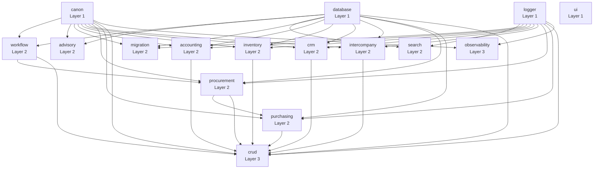
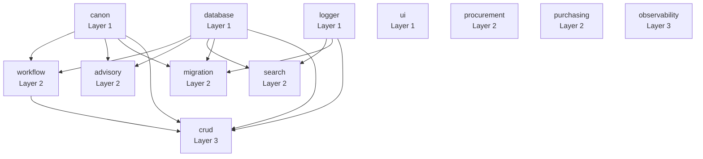
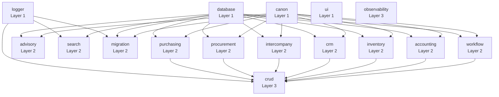

# AFENDA-NEXUS Architecture

## Overview

AFENDA-NEXUS is a monorepo-based ERP system built on a **layered architecture** with strict dependency rules. The architecture enforces separation of concerns through four distinct layers, ensuring maintainability, testability, and scalability as the codebase grows.

## Architecture Principles

### 1. Layered Architecture
The system follows a strict bottom-up dependency flow where lower layers have no knowledge of upper layers.

### 2. Single Responsibility
Each package has one clear purpose. Packages that grow too large are split into domain-specific packages.

### 3. Explicit Dependencies
All dependencies are declared in `package.json`. No implicit coupling through file system access.

### 4. Zero Circular Dependencies
The dependency graph must be acyclic (DAG). Circular dependencies are architectural violations.

### 5. Boundary Enforcement
Packages only access other packages through their public APIs (`src/index.ts` exports). Internal modules are private.

---

## Layer Hierarchy

```
┌─────────────────────────────────────────────┐
│  Layer 3: Application                       │
│  - crud          - observability            │
│  Orchestrates domain services, enforces     │
│  policies, manages entity lifecycle         │
└─────────────────────────────────────────────┘
                    ↓
┌─────────────────────────────────────────────┐
│  Layer 2: Domain Services                   │
│  - workflow      - advisory                 │
│  - search        - migration                │
│  - accounting    - inventory                │
│  - crm           - intercompany             │
│  - procurement   - purchasing               │
│  Business logic, rules, domain operations   │
└─────────────────────────────────────────────┘
                    ↓
┌─────────────────────────────────────────────┐
│  Layer 1: Foundation                        │
│  - canon         - database                 │
│  - logger        - ui                       │
│  Core primitives, schemas, data access      │
└─────────────────────────────────────────────┘
                    ↓
┌─────────────────────────────────────────────┐
│  Layer 0: Configuration                     │
│  - eslint-config - typescript-config        │
│  Shared tooling and configuration           │
└─────────────────────────────────────────────┘
```

---

## Package Descriptions

### Layer 0: Configuration
**No dependencies allowed**

#### `eslint-config`
Shared ESLint configurations for base, React, and Next.js projects.

#### `typescript-config`
Shared TypeScript compiler configurations.

---

### Layer 1: Foundation
**External dependencies only (no workspace dependencies)**

#### `canon`
**The single source of truth for types, schemas, and contracts.**
- 211+ entity type definitions
- Action types and verbs
- Policy types (permissions, scopes)
- Validation schemas (Zod)
- ERP adapter contracts
- Serialization utilities

**Purpose**: Defines the system's ubiquitous language. All packages reference canon for types.

**Key Rule**: Canon must remain dependency-free to prevent circular dependencies.

#### `database`
**Database schema definitions and ORM configuration.**
- 150+ Drizzle table definitions
- Schema helpers (base-entity, doc-entity, erp-entity)
- Governance rules (company-scope allowlist)
- DB utilities (retry, batch, tenant policy)
- Migration scripts
- Code generator (`entity-new`)

**Purpose**: Provides the data access layer with architectural governance.

**Key Rule**: Database must not import business logic—it's purely structural.

#### `logger`
**Centralized logging using Pino.**
- Structured JSON logging
- Log level management
- Performance-optimized

**Purpose**: Provides observability across all packages.

#### `ui`
**Shared React component library (shadcn/ui based).**
- 60+ reusable components
- Headless UI primitives (Radix)
- Hooks and utilities
- Design tokens

**Purpose**: Provides consistent UI across applications.

---

### Layer 2: Domain Services
**Depends on: Foundation + logger only**

Domain services implement business rules and domain-specific operations. Each service package focuses on a coherent domain area.

#### `workflow`
**Rules engine for orchestrating business processes.**
- Rule registry and evaluation
- Condition/action DSL
- Database-backed rule loading (cached)
- V2 envelope generator with DAG validation
- Edit window enforcement
- Workflow execution tracking

**When to use**: Define business rules that trigger actions based on entity state changes.

#### `advisory`
**Analytics and forecasting for financial advisories.**
- Anomaly detection (EWMA, CUSUM, MAD)
- Time-series forecasting (SES, Holt, Holt-Winters)
- Statistical scoring (Z-score, robust outliers)
- Rule-based checks (credit limits, aging)
- Evidence collection and fingerprinting

**When to use**: Generate insights, detect anomalies, forecast trends.

#### `search`
**Full-text search with PostgreSQL FTS.**
- Cross-entity search
- Search index backfill
- Search outbox worker pattern
- Entity-specific adapters

**When to use**: Enable full-text search across entities.

#### `migration`
**Data migration pipeline from legacy systems.**
- Lineage state machine (reservation-based concurrency)
- Structural query builders (PostgreSQL, MySQL, CSV)
- Entity-agnostic conflict detection
- Transform chain with ordered pipeline
- Snapshot capture for rollback
- Audit trail with canonical JSON
- Rate limiting

**When to use**: Import data from external ERP systems (ERPNext, Odoo, CSV).

**Documentation**: See [`packages/migration/IMPLEMENTATION.md`](packages/migration/IMPLEMENTATION.md) for comprehensive guide.

#### `accounting`
**Financial accounting domain services.** *(New package)*
- Tax calculation engine
- FX rate lookup and conversion
- Depreciation engine
- Revenue recognition
- Payment allocation
- Fiscal period/year management

**When to use**: Implement accounting-specific business logic.

#### `inventory`
**Inventory and manufacturing domain services.** *(New package)*
- Stock level management
- Unit of measure (UoM) conversion
- Lot tracking and recall
- Manufacturing BOM engine
- Landed cost allocation
- Three-way matching (PO/GRN/Invoice)

**When to use**: Manage inventory, manufacturing, procurement operations.

#### `crm`
**Customer relationship management services.** *(New package)*
- Pricing engine (tier-based, volume discounts)
- Payment terms management
- Credit limit enforcement
- Customer tiering and segmentation

**When to use**: Implement sales, pricing, and customer-specific logic.

#### `intercompany`
**Cross-entity operations and reconciliation.** *(New package)*
- Intercompany transaction matching
- Cross-entity reconciliation
- Transfer pricing

**When to use**: Handle transactions between related entities (group companies).

#### `procurement`
**Procurement and sourcing operations.** *(Implemented)*
- Purchase requisition management
- Vendor selection and qualification
- Sourcing workflows
- Contract management
- Spend analysis

**When to use**: Manage procurement workflows, requisitions, and vendor selection.

#### `purchasing`
**Purchase order management and execution.** *(Implemented)*
- Purchase order creation and tracking
- PO approval workflows
- Order acknowledgment
- Delivery schedule management
- Purchase analytics

**When to use**: Create and manage purchase orders, track deliveries.

---

### Layer 3: Application
**Depends on: All layers below**

#### `crud`
**Core CRUD operations with business rules enforcement.**
- Entity mutation (create, update, delete)
- Read operations with pagination
- Policy engine (authorization)
- Rate limiting & job quotas
- Metering & usage tracking
- Custom field validation
- Lifecycle management
- Audit logging
- Handler registry (entity-specific customizations)

**Purpose**: Orchestrates domain services, enforces policies, manages entity lifecycle.

**Architecture**: 
- Uses domain services (accounting, inventory, crm, intercompany) for business logic
- Delegates to workflow for rule evaluation
- Uses database for persistence
- Only 2 custom handlers (companies, contacts) + generic base handler for 209 entity types

**Key Rule**: CRUD is the **only** package that orchestrates domain services. Domain services should not call each other directly.

#### `observability`
**Observability and monitoring infrastructure.** *(Implemented)*
- OpenTelemetry integration
- Tracing and metrics collection
- Performance monitoring
- Error tracking
- Distributed tracing

**When to use**: Instrument application for monitoring, tracing, and observability.

---

## Dependency Rules

### ✅ Allowed Dependencies

| Layer | Can Depend On |
|-------|--------------|
| Layer 0 (Config) | External packages only |
| Layer 1 (Foundation) | Layer 0 + external packages |
| Layer 2 (Domain) | Layer 0, Layer 1, logger + external packages |
| Layer 3 (Application) | All layers |

### ❌ Prohibited Dependencies

1. **No circular dependencies** - All packages must form a DAG
2. **Foundation cannot depend on Domain/Application** - Keeps core clean
3. **Domain services cannot depend on CRUD** - Prevents coupling
4. **Domain services should not cross-depend** - Use CRUD for orchestration
5. **No direct database ORM access from Application** - Use database package utilities

### 🟡 Documented Exceptions

- **Advisory writes directly to database** - Performance optimization for analytics; documented as exception

---

## Dependency Graph

### Current State


### Target State (Future Roadmap)
See [Domain Roadmap](docs/roadmap/DOMAIN_ROADMAP.md) for additional proposed packages.


### Target State (After Domain Extraction)


---

## Future Roadmap

For proposed enterprise domain packages (treasury, fixed-assets, tax-compliance, etc.), see:
- [Domain Roadmap](docs/roadmap/DOMAIN_ROADMAP.md) - Complete enterprise ERP domain proposals

The roadmap includes proposed packages for:
- Financial Management (treasury, fixed-assets, tax-compliance)
- Procurement-to-Pay (receiving, payables)
- Order-to-Cash (order-management, shipping, receivables)
- Manufacturing (production-planning, shop-floor, quality-management)
- Warehouse & Logistics (warehouse-management, transportation)
- HR & Payroll (human-resources, payroll, time-attendance)
- And more...

---

## When to Create a New Package

Create a new package when:

1. **Domain Cohesion** - You have 5+ related services in a coherent domain (e.g., accounting)
2. **Reusability** - The functionality could be used independently or by multiple consumers
3. **Clear Boundary** - The domain has well-defined inputs/outputs and minimal cross-cutting concerns
4. **Size** - An existing package exceeds 2000 LOC and can be split coherently

Do NOT create a new package for:

1. **Single-use utilities** - Add to an existing package
2. **Entity-specific logic** - Use CRUD handlers instead
3. **One-off features** - Wait until the domain proves itself

---

## Build Strategy

### Compiled Packages (tsup)
These packages are built to `dist/` with CommonJS + ESM outputs:

- **`canon`** - External consumption (types used outside monorepo)
- **`ui`** - React components may be published to npm
- **`migration`** - CLI tool, may be consumed externally

**Rationale**: These packages may be published or consumed outside the monorepo. Compilation ensures compatibility and performance.

### Source Packages
These packages export `src/index.ts` directly:

- **`crud`, `workflow`, `advisory`, `search`**
- **`accounting`, `inventory`, `crm`, `intercompany`** (new)
- **`database`, `logger`**

**Rationale**: Internal-only packages benefit from faster iteration without build steps. TypeScript compilation happens at the application level (Next.js, tooling).

### Configuration Packages
These packages re-export configuration files as-is:

- **`eslint-config`**
- **`typescript-config`**

**Rationale**: ESLint and TypeScript consume configuration directly.

**See**: [`docs/BUILD_STRATEGY.md`](docs/BUILD_STRATEGY.md) for details.

---

## Package Structure Standards

All packages follow this structure:

```
packages/my-package/
├── src/
│   ├── index.ts          # Public API exports
│   ├── types.ts          # Type definitions
│   ├── services/         # Business logic (if applicable)
│   ├── utils/            # Internal utilities
│   └── ...
├── package.json
├── tsconfig.json
├── tsconfig.build.json   # (if compiled)
├── tsup.config.ts        # (if compiled)
├── README.md
└── vitest.config.ts      # (if has tests)
```

**Key Files**:
- `src/index.ts` - **Only** file that exports public API
- `README.md` - Must include: Purpose, When to Use, Key Concepts, API, Examples
- `package.json` - Must declare all dependencies explicitly

---

## Testing Strategy

- **Unit Tests** - All domain service functions (pure logic)
- **Integration Tests** - CRUD handlers, database interactions
- **E2E Tests** - Critical user workflows (in `apps/web/e2e/`)

**Coverage Goals**:
- Migration: >80% (enforced)
- Domain services: >70%
- CRUD handlers: >60%

---

## Related Documentation

- [Package Governance Rules](packages/GOVERNANCE.md)
- [Coding Standards](docs/CODING_STANDARDS.md)
- [Build Strategy](docs/BUILD_STRATEGY.md)
- [Migration Implementation Guide](packages/migration/IMPLEMENTATION.md)
- [CRUD Handler Guide](packages/crud/docs/HANDLER_GUIDE.md)
- [Adapter Pipeline](docs/adapter-pipeline.md)

---

## Validation

Run `pnpm run validate:deps` to check:
- ✅ No circular dependencies
- ✅ Layer rules enforced
- ✅ No boundary violations

---

**Last Updated**: February 17, 2026
