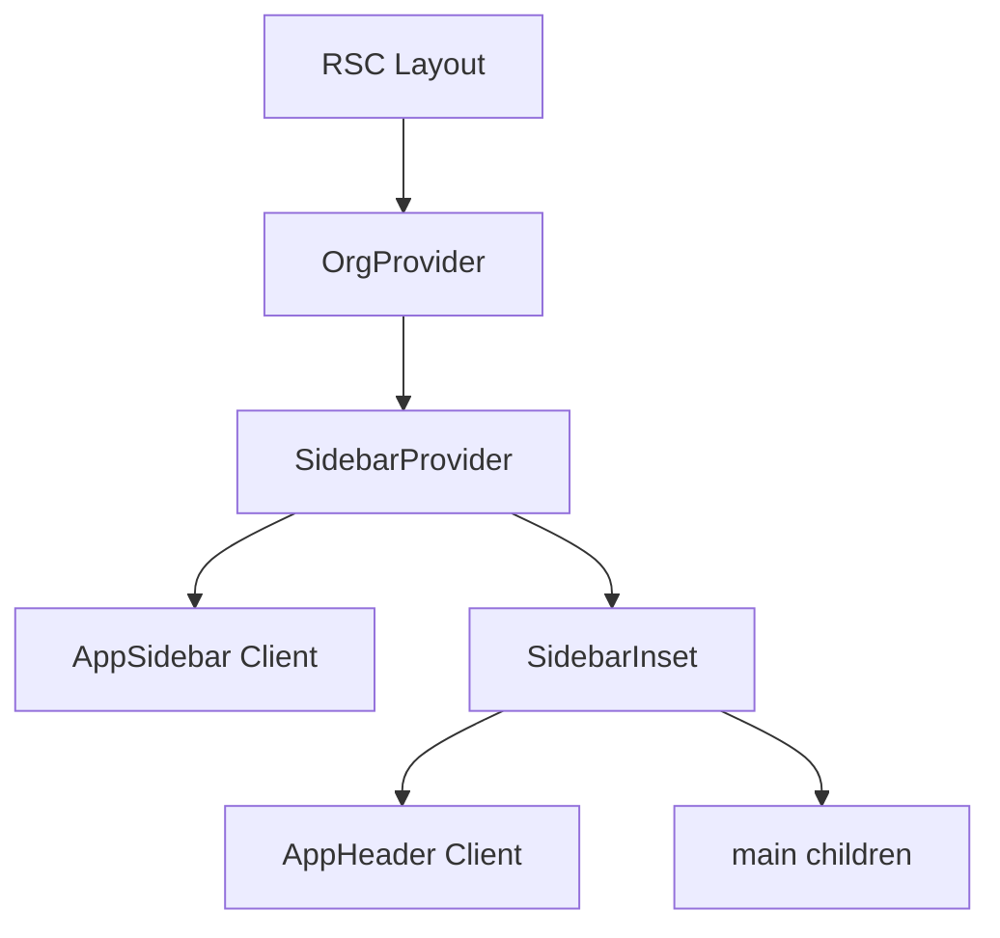

# ERP Architecture UI — Governance Spec

> **Human-authored.** ERP app-shell composition, nav SSOT, forms conventions, and quality gates.
> **Package:** `afenda-ui` (`packages/ui`)
> **Purpose:** North-star architecture spec that governs ERP UI long-term.

---

## Normative Terms

Use these terms consistently; they govern merge and review decisions:

| Term       | Meaning                                                                     |
| ---------- | --------------------------------------------------------------------------- |
| **MUST**   | Required for merge. No exception without documented rationale and approval. |
| **SHOULD** | Required unless there is a documented exception. Default is compliance.     |
| **MAY**    | Optional. At implementer's discretion.                                       |

---

## Scope / Non-Scope

**In-scope (this document governs):**

- ERP App Shell composition for org routes (`(app)/org/[slug]/**`)
- Nav config SSOT and breadcrumb/command palette derivation
- Enterprise forms conventions (RHF + Zod + field primitives)
- RSC boundary rules and client isolation
- Accessibility testable criteria and quality gates

**Out-of-scope:**

- Visual branding guide (tokens already define in `ui.architecture.md`)
- Business domain semantics (belongs to Canon / domain packages)

---

## 1. Architecture Overview

- ERP App Shell: `SidebarProvider` + `SidebarInset` + `AppSidebar` + `AppHeader` + `main`
- Org-scoped layout: `(app)/org/[slug]/layout.tsx` composes shell; server-only context resolution
- Data flow: Layout (RSC) → OrgProvider → SidebarProvider → Client components (AppSidebar, AppHeader)
- Reusability: Same shell pattern for any org-scoped route group; nav config drives sidebar and breadcrumbs

---

## 2. Key Design Decisions

| Decision                        | Rationale                                                                                      |
| ------------------------------- | ---------------------------------------------------------------------------------------------- |
| Nav config SSOT                 | `NAV_ITEMS`/`NAV_GROUPS` in one file drives sidebar, breadcrumbs, command palette              |
| `href: (slug) => string`        | Nav items are functions; org slug injected at render; supports `orgEntity(slug, entityType)`   |
| `@entity-gen:nav-items`         | Marker for CLI to inject generated nav items                                                   |
| App-sidebar as client component | Uses `usePathname`, `useState`; layout stays RSC                                               |
| Field/Form from afenda-ui       | Enterprise field set (`FieldSet`, `FieldLegend`, `FieldGroup`, `FieldLabel`) with CVA variants |

---

## 3. App Shell Composition



**Reference:** [apps/web/app/(app)/org/[slug]/layout.tsx](../../apps/web/app/(app)/org/[slug]/layout.tsx)

---

## 4. Nav Config Pattern

**File:** [apps/web/app/(app)/org/[slug]/_components/nav-config.ts](../../apps/web/app/(app)/org/[slug]/_components/nav-config.ts)

**Canonical types (interface sketch):**

```ts
interface NavItem {
  label: string;
  href: (slug: string) => string;  // pure function
  icon: LucideIcon;
  group: 'main' | 'system';
  commandPaletteAction?: string;
}
interface NavGroup {
  label: string;
  items: NavItem[];
}
```

**Groups:** `main` (navigation), `system` (trash, workflows, settings)

**Breadcrumb:** `getBreadcrumbLabel(segment)` resolves label from NAV_ITEMS

**Nav SSOT Invariants (non-negotiable):**

| ID         | Invariant                                                                                       |
| ---------- | ----------------------------------------------------------------------------------------------- |
| **NAV-01** | `NAV_ITEMS` is the only authoritative label source for sidebar + breadcrumbs + command palette. |
| **NAV-02** | Breadcrumb labels MUST be resolved from nav config (no duplicate per-route label maps).         |
| **NAV-03** | `href` MUST be a pure function `(slug) => string` and MUST NOT read hooks/env/time.             |
| **NAV-04** | Generated items MUST be inserted only inside `@entity-gen:nav-items` region.                    |
| **NAV-05** | `NAV_GROUPS` MAY reference only items declared in `NAV_ITEMS` (no inline items in groups).      |

---

## 5. RSC Boundary Contract

| ID         | Rule                                                                                                |
| ---------- | --------------------------------------------------------------------------------------------------- |
| **RSC-01** | `layout.tsx` and `page.tsx` under `(app)/org/[slug]/**` MUST remain Server Components. |
| **RSC-02** | `AppSidebar` and `AppHeader` MUST be Client Components; they are the UI boundary.                   |
| **RSC-03** | Nav config modules MUST be "data-only" (no hooks, no `window`, no `document`, no async IO).         |
| **RSC-04** | Any client component imported by RSC MUST be leaf-level and MUST NOT re-export server-only modules. |

---

## 6. Dependency & Import Rules

- `apps/web` MUST import UI primitives from `afenda-ui/...` (or `@/components/...` only if it re-exports `afenda-ui`).
- No deep imports into internal folders (e.g. `packages/ui/src/components/sidebar/...`); use public API only.

---

## 6a. shadcn-Only Constraint (Zero Drift)

To avoid UI drift and maintain consistency:

| ID         | Rule                                                                 |
| ---------- | -------------------------------------------------------------------- |
| **UI-COMP-01** | All interactive UI (buttons, inputs, selects, textareas, dialogs, etc.) MUST use afenda-ui components (shadcn-based). |
| **UI-COMP-02** | Raw HTML form elements (`<input>`, `<select>`, `<button>`, `<textarea>`) are PROHIBITED; use `Input`, `Select`, `Button`, `Textarea` from afenda-ui. |
| **UI-COMP-03** | New components MUST be added via `pnpm ui:add [component]` (shadcn CLI) into `packages/ui`; no custom reimplementation of shadcn patterns. |
| **UI-COMP-04** | `packages/ui` components MUST be built on Radix UI primitives (`radix-ui` package) as shadcn does; no alternate UI libraries for primitives. |

**Rationale:** Single source of truth (shadcn/ui + afenda-ui) prevents style drift, ensures accessibility patterns, and keeps maintenance burden low.

---

## 7. Component Usage Conventions

All UI MUST use shadcn-based components from afenda-ui (see Section 6a). No raw HTML form elements.

**Sidebar:** Use `Sidebar`, `SidebarHeader`, `SidebarContent`, `SidebarGroup`, `SidebarMenu`, `SidebarMenuButton`, `SidebarFooter`, `SidebarRail` from `afenda-ui/components/sidebar`

**Forms:** Use `Form` (RHF) + `Field`, `FieldSet`, `FieldGroup`, `Input`, `Select`, `Textarea`, `Button` from afenda-ui; RHF + Zod + @hookform/resolvers (form-builder skill). Never use raw `<input>`, `<select>`, `<textarea>`, `<button>`.

**Data display:** `DataTable`, `Chart` for lists and analytics

**Import path:** `afenda-ui/components/` or `@/components/` (apps/web alias)

**Accessibility Conventions:**

- Landmarks: `role="navigation"` for sidebar, `role="main"` for content
- Sidebar: `aria-current="page"` or equivalent for active item
- Forms: `aria-describedby` for errors; `aria-invalid` when invalid
- DataTable: `<th scope="col|row">` for headers; caption where helpful
- Icons: `aria-hidden="true"` with adjacent visible label or `aria-label`

---

## 8. ERP Form Architecture Contract

| ID          | Rule                                                                                                                                                |
| ----------- | --------------------------------------------------------------------------------------------------------------------------------------------------- |
| **FORM-01** | All entity CRUD forms MUST use RHF + Zod + resolvers.                                                                                               |
| **FORM-02** | Grouping MUST use `FieldSet`/`FieldLegend`/`FieldGroup` for consistent semantics.                                                                   |
| **FORM-03** | Every field MUST render: label (visible), description (optional), error message (text, not color-only), `aria-invalid` + `aria-describedby` wiring. |
| **FORM-04** | Required fields MUST be indicated in text (not only asterisk color).                                                                                |
| **FORM-05** | Submit buttons MUST reflect pending state and disable safely.                                                                                       |

**Canonical examples (structure only):**

- **Simple entity form:** `FieldGroup` → `Field` (name) + `Field` (status select). Single `FormField` wrapper per control.
- **Complex form:** Multiple `FieldSet` with `FieldLegend`; `FieldGroup` per logical block; conditional fields via Zod `.superRefine` or `.refine`; grouped sections for "Basic info", "Settings", etc.

---

## 9. Auto-Generation Compatibility

| Hook                      | Location      | Purpose                                 |
| ------------------------- | ------------- | --------------------------------------- |
| `@entity-gen:nav-items`   | nav-config.ts | Insert nav items for new entities       |
| `engine:generate`         | packages/ui   | Regenerate CSS from tailwindengine.json |
| `pnpm ui:add [component]` | shadcn CLI    | Add components to packages/ui           |

---

## 10. Quality Gates (CI-Mappable)

All gates are implemented in `tools/ci-ui-gates.mjs` and run via `pnpm ci:ui-gates` (see [tools/README.md](../../tools/README.md#ci-ui-gates)).

| Gate ID         | Check                                                                                       | CI Enforceable | Notes                 |
| --------------- | ------------------------------------------------------------------------------------------- | -------------- | --------------------- |
| **UI-ARCH-01**  | `packages/ui/erp-architecture.ui.md` exists; `.architecture/ui.architecture.md` links to it | Yes            | Doc exists and linked |
| **UI-RSC-01**   | No `'use client'` in layout.tsx or page.tsx under `(app)/org/[slug]/**`                       | Yes            | Fail on match         |
| **UI-NAV-01**   | `@entity-gen:nav-items` exists in nav-config file                                           | Yes            | SSOT marker present   |
| **UI-TOKEN-01** | No `#hex`, `rgb(`, `hsl(` in apps/web + packages/ui (exceptions below)                      | Yes            | No hardcoded colors   |
| **UI-A11Y-01**  | Shell renders `<nav>` and `<main>` (or role equivalents) in relevant components             | Yes            | Required landmarks    |

**UI-TOKEN-01 exceptions:** `hsl(var(...))` (semantic tokens) is allowed. Allowlisted paths: `globals.css`, `tailwind.config`, `tailwindengine.json`, `engine/generate.ts`, `lib/color.ts`, test files; data-viz/diagram: `chart.tsx`, `node-palette.tsx`, `workflow-node.tsx`, `flow-types.ts`, `quality-dashboard-enhanced`, `app/tools/analytics`, `app/api/badges/`. Migrate allowlisted files to semantic tokens when feasible.

---

## 11. Enterprise Quality Checklist

**Styling & Theming:** No hardcoded colors (Gate: UI-TOKEN-01); `data-slot` for styling hooks

**Component Source:** shadcn-only (Section 6a); no raw HTML form elements; all UI from afenda-ui

**RSC & Architecture:** No `'use client'` in layout/page (Gate: UI-RSC-01); nav config data-only; breadcrumb from nav config

**Accessibility (Testable Criteria):**

| Criterion          | Requirement                                                         | Verified by                                             |
| ------------------ | ------------------------------------------------------------------- | ------------------------------------------------------- |
| **A11Y-KEYBOARD**  | All interactive elements reachable by Tab; menus support Arrow keys | Keyboard-only pass on Sidebar + Command Palette + forms |
| **A11Y-FOCUS**     | No element removes focus outline without replacement                | Visual check + lint rule                                |
| **A11Y-TABLES**    | DataTable headers use `<th scope>`; caption where helpful           | Code review                                             |
| **A11Y-LANDMARKS** | Shell renders `<nav>` and `<main>`                                  | Gate: UI-A11Y-01                                        |
| **A11Y-CONTRAST**  | WCAG 4.5:1 text, 3:1 large text                                     | Contrast checker                                        |
| **A11Y-ALT**       | All images/icons have `alt` or `aria-hidden` + visible label        | Code review                                             |
| **A11Y-SKIP**      | "Skip navigation" before nav; visible on focus                      | Manual pass                                             |
| **A11Y-LANG**      | `lang` on `<html>`; dynamic `<title>` per page                      | Code review                                             |
| **A11Y-MOTION**    | `prefers-reduced-motion` respected                                  | Code review                                             |
| **A11Y-FORMS**     | Form errors in text, not color alone                                | Code review                                             |

**Forms:** RHF + Zod + resolvers; FieldSet, FieldLegend, FieldGroup, FieldLabel (see Section 8)

**Next.js:** Mobile-first; `next/image`, `next/font`; `error.tsx`, `not-found.tsx`; `generateMetadata`

**Type Safety:** `VariantProps`, polymorphic components

---

## 12. Continuous Maintenance

- Re-verify color contrast on any new or changed UI
- Enforce alt text (or decorative marker) for all new media
- Re-test heading structure when adding sections
- Document any custom widgets' keyboard and screen-reader behavior
- **No drift:** Add new UI only via shadcn CLI (`pnpm ui:add`); do not introduce raw HTML or alternate component libraries

---

## 13. CI Gate Implementation

- **Script:** `tools/ci-ui-gates.mjs`
- **Command:** `pnpm ci:ui-gates` (from repo root `package.json`)
- **CI:** Runs in `.github/workflows/ci.yml` as step "UI gates (UI-RSC-01, UI-TOKEN-01)"
- **Exit code:** 0 = pass, 1 = fail (gates block merge when CI fails)

---

## 14. Cross-References (Source of Truth Direction)

| Document                             | Role                                      |
| ------------------------------------ | ----------------------------------------- |
| `.architecture/ui.architecture.md`   | System-wide UI layer taxonomy             |
| `packages/ui/erp-architecture.ui.md` | ERP primary; authoritative for org routes |
| `tools/ci-ui-gates.mjs`              | CI enforcement for all 5 gates             |
| `route.architecture.md`              | Routing and segments                      |
| `crud.architecture.md`               | Mutation and entity lifecycle             |

---

## Required Skill References

Implementers and reviewers should consult these skills when creating or updating ERP UI:

- [@accessibility](../../.agents/skills/accessibility/SKILL.md) — WCAG, semantic HTML, keyboard nav, focus
- [@shadcn-ui](../../.agents/skills/shadcn-ui/SKILL.md) — Component patterns, theming, forms
- [@form-builder](../../.agents/skills/form-builder/SKILL.md) — RHF + Zod conventions
- [@next-best-practices](../../.agents/skills/next-best-practices/SKILL.md) — RSC boundaries, file conventions
- [@optimized-nextjs-typescript](../../.agents/skills/optimized-nextjs-typescript/SKILL.md) — Performance, RSC-first
- [@afenda-architecture](../../.agents/skills/afenda-architecture/SKILL.md) — Layer rules for packages/ui
- [@package-development](../../.agents/skills/package-development/SKILL.md) — Package documentation standards
