# Security Scanning Guide

> **Automated vulnerability detection for AFENDA-NEXUS dependencies**

---

## 📋 Table of Contents

- [Overview](#overview)
- [How Security Scanning Works](#how-security-scanning-works)
- [Running Security Scans](#running-security-scans)
- [Understanding Scan Results](#understanding-scan-results)
- [CI/CD Integration](#cicd-integration)
- [Configuration Options](#configuration-options)
- [Remediation Guide](#remediation-guide)
- [Best Practices](#best-practices)
- [Troubleshooting](#troubleshooting)

---

## Overview

Security scanning automatically detects known vulnerabilities in project
dependencies using npm audit. Scans run on every pull request and can block
merges based on severity thresholds.

### What Gets Scanned

- ✅ **Direct dependencies** - packages in `package.json`
- ✅ **Transitive dependencies** - sub-dependencies
- ✅ **Development dependencies** - devDependencies
- ✅ **All workspace packages** - monorepo-wide scan

### Vulnerability Severity Levels

| Severity     | Description                       | Default Action |
| ------------ | --------------------------------- | -------------- |
| **Critical** | Immediate threat, active exploits | ❌ Block PR    |
| **High**     | Serious issue, high risk          | ❌ Block PR    |
| **Moderate** | Medium risk, should fix           | ⚠️ Warn        |
| **Low**      | Minor risk, nice to fix           | ℹ️ Info        |
| **Info**     | FYI, no immediate risk            | ℹ️ Info        |

---

## How Security Scanning Works

### Execution Flow

```mermaid
graph LR
    A[PR Opened] --> B[CI Triggers]
    B --> C[Run npm audit]
    C --> D[Parse JSON output]
    D --> E[Apply thresholds]
    E --> F{Violations?}
    F -->|Yes| G[❌ Fail & Comment]
    F -->|No| H[✅ Pass & Comment]
    G --> I[Block Merge]
    H --> J[Allow Merge]
```



### Implementation Details

1. **Audit Execution** (`security.ts`)
   - Runs `pnpm audit --json`
   - Captures all vulnerabilities
   - Parses JSON output

2. **Threshold Application**
   - Defaults: Fail on critical + high
   - Configurable via CLI flags
   - Counts by severity level

3. **Report Generation**
   - Text format for console
   - JSON format for tooling
   - Markdown format for PR comments

4. **PR Feedback** (GitHub Actions)
   - Posts comment with summary
   - Lists all vulnerabilities
   - Provides remediation steps

---

## Running Security Scans

### Command-Line Usage

#### Basic Scan (Fail on Critical + High)

```bash
pnpm --filter quality-metrics security
```

**Exit codes**:

- `0` - No critical/high vulnerabilities
- `1` - Critical/high vulnerabilities found

#### Fail on Moderate Too

```bash
pnpm --filter quality-metrics security --fail-moderate
```

**Use case**: Stricter security posture

#### Don't Fail on High (Not Recommended)

```bash
pnpm --filter quality-metrics security --no-fail-high
```

**Use case**: Legacy code with known issues being addressed

#### Don't Fail on Critical (Dangerous!)

```bash
pnpm --filter quality-metrics security --no-fail-critical
```

**Warning**: Only use for local testing, never in CI!

### Output Formats

#### Text (Default, Console)

```bash
pnpm --filter quality-metrics security
```

**Output**:

```
🔒 Security Scan Results

❌ CRITICAL (1):
  - lodash@4.17.20: Prototype Pollution
    Fixed in: 4.17.21
    More info: https://github.com/advisories/GHSA-xxxx

⚠️  HIGH (2):
  - minimist@1.2.5: Prototype Pollution
    Fixed in: 1.2.6
  - node-fetch@2.6.6: Information Exposure
    Fixed in: 2.6.7

✅ MODERATE (0)
✅ LOW (0)

FAILED: 1 critical, 2 high vulnerabilities
```

#### JSON (For Tooling)

```bash
pnpm --filter quality-metrics security --format=json
```

**Output** (`.quality-metrics/security-report.json`):

```json
{
  "timestamp": "2026-02-17T10:30:00Z",
  "summary": {
    "critical": 1,
    "high": 2,
    "moderate": 0,
    "low": 0,
    "info": 0,
    "total": 3
  },
  "vulnerabilities": [
    {
      "severity": "critical",
      "package": "lodash",
      "version": "4.17.20",
      "title": "Prototype Pollution",
      "url": "https://github.com/advisories/GHSA-xxxx",
      "fixedIn": "4.17.21",
      "cwe": "CWE-1321",
      "cvss": 9.8
    }
  ],
  "passed": false,
  "violations": ["1 critical vulnerabilities"],
  "warnings": ["2 high vulnerabilities"]
}
```

#### Markdown (For PR Comments)

```bash
pnpm --filter quality-metrics security --format=markdown
```

**Output** (`.quality-metrics/security-report.md`):

```markdown
## 🔒 Security Scan Results

### ❌ FAILED

**Violations (1)**:

- 1 critical vulnerabilities

**Warnings (2)**:

- 2 high vulnerabilities

### Vulnerability Details

#### Critical Severity (1)

- **lodash@4.17.20**: Prototype Pollution
  - **Fixed in**: 4.17.21
  - **CVSS**: 9.8 (Critical)
  - **More info**: [GHSA-xxxx](https://github.com/advisories/GHSA-xxxx)
  - **Remediation**: `pnpm update lodash@^4.17.21`

#### High Severity (2)

...
```

---

## Understanding Scan Results

### Vulnerability Fields

#### Package Name & Version

```
lodash@4.17.20
└─┬────┘
  └── Version with vulnerability
└── Package name
```

#### Severity Classification

**Critical** (CVSS 9.0-10.0):

- Remote code execution
- Privilege escalation
- Data exfiltration

**High** (CVSS 7.0-8.9):

- Authentication bypass
- SQL injection
- Cross-site scripting (XSS)

**Moderate** (CVSS 4.0-6.9):

- Information disclosure
- Denial of service (DoS)
- Weak cryptography

**Low** (CVSS 0.1-3.9):

- Minor information leaks
- Edge-case issues

#### Fixed Version

```
Fixed in: 4.17.21
```

- Version that patches the vulnerability
- May require major version upgrade
- Check breaking changes before upgrading

#### CWE (Common Weakness Enumeration)

```
CWE-1321: Prototype Pollution
```

- Standard classification of weakness type
- Useful for research and tracking
- Link: https://cwe.mitre.org/data/definitions/1321.html

#### CVSS (Common Vulnerability Scoring System)

```
CVSS: 9.8 (Critical)
```

- 0.0-10.0 scale
- Calculated from impact metrics
- Industry-standard severity rating

### Interpreting Scan Results

#### Clean Scan

```
✅ PASSED: No vulnerabilities found

Summary:
  Critical: 0
  High: 0
  Moderate: 0
  Low: 0
```

**Action**: None required, great job! 🎉

---

#### Critical/High Vulnerabilities

```
❌ FAILED: 1 critical, 2 high vulnerabilities

VIOLATIONS:
  - 1 critical vulnerabilities

WARNINGS:
  - 2 high vulnerabilities
```

**Action**: Fix immediately before merging PR!

---

#### Moderate/Low Only

```
✅ PASSED (with warnings)

Summary:
  Critical: 0
  High: 0
  Moderate: 3
  Low: 5
```

**Action**: Plan to fix in future PR, not blocking

---

## CI/CD Integration

### GitHub Actions Workflow

Security scanning is integrated in `.github/workflows/quality-gates.yml`:

```yaml
- name: Security Scan
  id: security
  run: pnpm --filter quality-metrics security --format=markdown
  continue-on-error: true

- name: Read Security Report
  if: github.event_name == 'pull_request'
  id: security_report
  run: |
    if [ -f ".quality-metrics/security-report.md" ]; then
      echo "report<<EOF" >> $GITHUB_OUTPUT
      cat .quality-metrics/security-report.md >> $GITHUB_OUTPUT
      echo "EOF" >> $GITHUB_OUTPUT
    fi

- name: Post PR Comment
  if: github.event_name == 'pull_request'
  uses: actions/github-script@v7
  with:
    script: |
      const report = `${{ steps.security_report.outputs.report }}`;
      // Post comment with report...

- name: Fail if security scan failed
  if: steps.security.outcome == 'failure'
  run: exit 1
```

### PR Comment Example

The workflow posts a comment like this:

```markdown
## Quality Gates & Security Report

### 🔒 Security Scan: ❌ FAILED

**Violations**:

- 1 critical vulnerabilities

**Details**:

#### Critical (1)

- **lodash@4.17.20**: Prototype Pollution
  - Fix: `pnpm update lodash@^4.17.21`
  - [Advisory](https://github.com/advisories/GHSA-xxxx)

---

<details>
<summary>Full Report</summary>

[Full vulnerability details...]

</details>
```

### Automated Actions

1. **PR Status Check**: Shows ❌ if vulnerabilities found
2. **Merge Blocking**: Branch protection prevents merge
3. **Notifications**: GitHub sends email to PR author
4. **Artifacts**: Report saved for 30 days

---

## Configuration Options

### CLI Flags

| Flag              | Description                          | Default |
| ----------------- | ------------------------------------ | ------- |
| `--fail-critical` | Fail on critical severity            | `true`  |
| `--fail-high`     | Fail on high severity                | `true`  |
| `--fail-moderate` | Fail on moderate severity            | `false` |
| `--format=<type>` | Output format (text\|json\|markdown) | `text`  |

### Threshold Combinations

#### Strictest (Zero Tolerance)

```bash
pnpm --filter quality-metrics security --fail-moderate
```

Blocks PR if any moderate+ vulnerability exists.

**Use case**: Financial, healthcare, security-critical apps

---

#### Standard (Default)

```bash
pnpm --filter quality-metrics security
```

Blocks PR on critical/high, warns on moderate/low.

**Use case**: Most production applications

---

#### Relaxed (Not Recommended)

```bash
pnpm --filter quality-metrics security --no-fail-high
```

Only blocks on critical, allows high/moderate/low.

**Use case**: Legacy apps with planned remediation

---

### Environment Variables

```bash
# Disable audit completely (not recommended)
SKIP_AUDIT=1 pnpm --filter quality-metrics security

# Custom npm registry (for proxied environments)
npm_config_registry=https://registry.npmjs.org pnpm audit
```

---

## Remediation Guide

### Step-by-Step Fix Process

#### 1. Identify Vulnerable Package

From scan output:

```
lodash@4.17.20: Prototype Pollution
Fixed in: 4.17.21
```

#### 2. Check if Direct or Transitive

```bash
# List all packages depending on lodash
pnpm why lodash
```

**Output**:

```
lodash 4.17.20
...
Dependencies:
  afenda-crud -> lodash
  afenda-accounting -> some-package -> lodash
```

#### 3. Update Package

**If direct dependency**:

```bash
# Update to fixed version
pnpm update lodash@^4.17.21

# Or manually in package.json
"lodash": "^4.17.21"
```

**If transitive dependency**:

```bash
# Update parent package
pnpm update some-package

# Or use overrides in package.json
"pnpm": {
  "overrides": {
    "lodash": "^4.17.21"
  }
}
```

#### 4. Verify Fix

```bash
# Run security scan again
pnpm --filter quality-metrics security

# Should show vulnerability resolved
```

#### 5. Test Application

```bash
# Run full test suite
pnpm test

# Check for breaking changes
pnpm type-check
pnpm lint
```

#### 6. Commit Fix

```bash
git add pnpm-lock.yaml package.json
git commit -m "fix(security): update lodash to 4.17.21 (GHSA-xxxx)"
git push
```

### Common Remediation Scenarios

#### Scenario 1: Simple Update

**Issue**: Patch version fix available

**Solution**:

```bash
pnpm update <package>@<fixed-version>
```

**Example**: `lodash@4.17.20` → `4.17.21`

---

#### Scenario 2: Major Version Upgrade

**Issue**: Fix requires next major version

**Solution**:

1. Review CHANGELOG for breaking changes
2. Update code to handle API changes
3. Update package version
4. Run full test suite

**Example**: `minimist@1.2.5` → `minimist@2.0.0`

---

#### Scenario 3: No Fix Available

**Issue**: Vulnerability disclosed, no patch yet

**Solutions**:

**Option A - Replace package**:

```bash
# Find alternative package
pnpm remove vulnerable-package
pnpm add alternative-package
```

**Option B - Wait for fix**:

```bash
# Temporarily disable audit for this package
# Add to .npmrc (not recommended for prod)
audit-level=moderate
```

**Option C - Fork and patch**:

```bash
# Fork repository, apply patch, use fork
"dependencies": {
  "vulnerable-package": "github:yourorg/vulnerable-package#patched"
}
```

---

#### Scenario 4: False Positive

**Issue**: Vulnerability doesn't affect your usage

**Solutions**:

**Option A - Suppress specific advisory**:

```bash
# Create .npmrc
audit-exclude=GHSA-xxxx
```

**Option B - Document exception**:

```markdown
## Security Exceptions

- **GHSA-xxxx** (lodash Prototype Pollution)
  - **Reason**: We don't use affected methods
  - **Risk**: Low
  - **Plan**: Migrate to lodash-es in Q2 2026
```

---

## Best Practices

### Prevention

1. **Regular updates**: Run `pnpm update` weekly
2. **Audit on install**: Fails fast if new vulnerability introduced
3. **Renovate bot**: Auto-creates PRs for dependency updates
4. **Use LTS versions**: More security backports

### Monitoring

1. **Weekly scans**: Schedule via cron or GitHub Actions
2. **Dashboard tracking**: Monitor vulnerability trends
3. **Subscribe to advisories**: GitHub Security Advisories
4. **CVE monitoring**: Track CVE database for your stack

### Response

1. **Triage immediately**: Critical/high within 24h
2. **Plan remediation**: Moderate/low within 1 week
3. **Communicate**: Inform security team of critical issues
4. **Document**: Track exceptions and remediation plans

### Tooling Stack

**npm audit** (Current):

- ✅ Built-in, no setup
- ✅ Fast, reliable
- ❌ Limited to npm registry advisories

**Future enhancements**:

- Snyk: More comprehensive database
- GitHub Dependabot: Auto-creates fix PRs
- OWASP Dependency-Check: Broader ecosystem

---

## Troubleshooting

### Common Issues

#### Audit Fails with Network Error

**Symptom**:

```
ERR_PNPM_AUDIT_NETWORK Request to registry failed
```

**Solutions**:

1. **Check internet connection**
2. **Verify registry access**:
   ```bash
   curl https://registry.npmjs.org
   ```
3. **Check proxy settings** (if behind proxy)
4. **Retry** (transient network issues)

---

#### False Positives for Dev Dependencies

**Symptom**: Vulnerabilities in devDependencies fail scan

**Solution**: Dev dependencies are scanned for completeness. If truly not a
risk:

```bash
# Audit production only
pnpm audit --prod
```

Or update devDependency to fix the vulnerability.

---

#### Scan Passes Locally, Fails in CI

**Symptom**: Different results between local and CI

**Cause**: Different lockfile state

**Solution**:

1. **Ensure lockfile committed**:

   ```bash
   git add pnpm-lock.yaml
   git commit -m "chore: update lockfile"
   ```

2. **Clear local cache**:

   ```bash
   rm -rf node_modules pnpm-lock.yaml
   pnpm install
   ```

3. **Run CI command exactly**:
   ```bash
   pnpm --filter quality-metrics security
   ```

---

#### Audit Takes Too Long

**Symptom**: `pnpm audit` hangs or times out

**Solutions**:

1. **Check network** (audit hits npm registry)
2. **Increase timeout**:
   ```bash
   npm_config_fetch_timeout=60000 pnpm audit
   ```
3. **Use local cache**:
   - Subsequent runs are much faster

---

## Additional Resources

- **npm audit docs**: https://docs.npmjs.com/cli/v10/commands/npm-audit
- **CVSS calculator**: https://www.first.org/cvss/calculator/3.1
- **CVE database**: https://cve.mitre.org/
- **GitHub Advisories**: https://github.com/advisories
- **OWASP Top 10**: https://owasp.org/www-project-top-ten/

### Related Guides

- [Quality Gates Configuration](./QUALITY-GATES-CONFIG-GUIDE.md)
- [Dashboard User Guide](./QUALITY-DASHBOARD-GUIDE.md)
- [Quick Start Guide](../QUALITY-GUIDE.md)

---

**Last Updated**: February 17, 2026\
**Version**: 1.0.0\
**Maintainer**: AFENDA-NEXUS Tools Team
